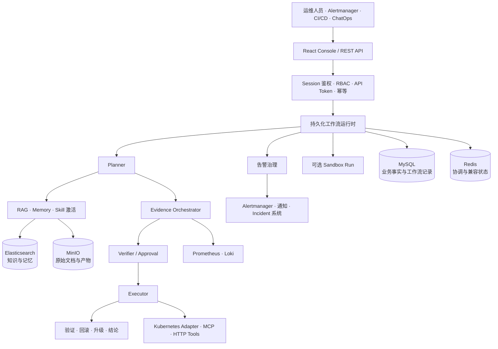

# KubeOnCall

<p align="center">
  <picture>
    <source media="(prefers-reduced-motion: reduce)" srcset="assets/readme/kubeoncall/wordmark.svg">
    
  </picture>
</p>

<p align="center">
  <a href="https://github.com/oxygen914/kubeoncall/actions/workflows/ci.yml"></a>
</p>

[English](./README.md) | 简体中文

KubeOnCall 是一个面向 Kubernetes 和基础设施的证据驱动 AI 运维控制平面。它把运维问题、
告警、监控数据、Runbook、历史记忆、Skill 与外部工具编排为持久化、可审计的
Planner → Verifier → Executor 工作流。

当前仓库包含 Spring Boot 后端、React 运维控制台、Go Sandbox Controller、部署资源、
可观测组件和验收脚本。KubeOnCall 负责诊断与受控操作的编排，但不替代 Kubernetes、
Prometheus、Loki、工单平台或模型服务。

> [!IMPORTANT]
> KubeOnCall 仍在持续开发，当前源码版本为 `0.0.1-SNAPSHOT`。Docker Compose 与 Helm
> Quickstart 用于开发和验收，不代表高可用生产部署。仓库目前没有 `LICENSE` 或
> `SECURITY.md`；源码公开不等于已获得开源许可。

## KubeOnCall 提供什么

- **持久化 AI 运维工作流**：`POST /api/v1/executions` 以幂等方式创建异步执行，将任务和节点
  记录写入 MySQL，不把长流程绑定在一次 HTTP 请求上。
- **先收集证据，再形成结论**：受范围约束的 Prometheus、Loki 采集器分别持久化证据、冲突、
  置信度、结论和建议动作，避免把模型文本直接当作事实。
- **Planner、Verifier、Executor 与 Closure**：规划、风险校验、工具执行、人工审批、操作后
  验证、回滚和升级均是显式工作流阶段。
- **完整告警生命周期治理**：覆盖 Alertmanager 接入、标准化、指纹、去重、聚合、抑制、
  确认、恢复、升级、策略回放和审计。
- **知识、记忆与 Skill**：支持多格式知识导入、混合检索、重排、长期运维记忆，以及带
  工具白名单和风险上限的 Markdown Skill。
- **运维控制台与版本化 API**：React 页面覆盖监控、执行、证据、告警、审批、知识、记忆、
  Skill、工具、集成、审计、用户和 API Token。
- **可扩展执行平面**：内置 HTTP Adapter、MCP、Kubernetes 与 Prometheus 工具，并提供
  可选的隔离 Sandbox Runtime。

## 架构



### 控制平面

Spring Boot 后端负责 API 契约、身份与 RBAC、工作流提交、策略评估、证据和结论持久化、
审批状态、审计与能力声明。React 控制台使用版本化 `/api/v1` 接口，不自行猜测可选能力是否
已启用。

### 工作流平面

推荐的 Ask 主链路是异步执行：

```text
POST /api/v1/executions
  → 持久化 execution 与 task
  → Planner query/think
  → 受范围约束的证据采集
  → Verifier 与审批决策
  → Executor
  → operation closure
  → 持久化 evidence、conclusion、node 与 audit
```

`POST /api/ask` 和 `POST /api/v1/ask` 仍作为只读兼容入口。新集成应使用带用户 Session 和
`Idempotency-Key` 的 `/api/v1/executions`。

### 数据与执行边界

| 组件                            | 职责                                                                             |
| ------------------------------- | -------------------------------------------------------------------------------- |
| MySQL 8                         | 用户、角色、Session、API Token、工作流执行、异步任务、证据、结论和已迁移业务事实 |
| Redis 7                         | 协调、短期状态、旧接口兼容、租约、去重及部分工作流状态                           |
| Elasticsearch 8.14              | 知识 Chunk、混合检索和长期记忆索引                                               |
| MinIO                           | 原始知识文档和 Sandbox 产物                                                      |
| Prometheus / Loki               | 指标与日志证据；查询由服务端构造并检查作用域                                     |
| Kubernetes / MCP / HTTP Adapter | 外部事实与动作；是否可用取决于部署配置                                           |
| Sandbox Controller              | 为显式启用的 Runtime 模式创建隔离 Kubernetes Job                                 |

控制平面存在不代表每个外部集成都已接通。工作流成功只说明流程已完成，不自动代表故障已解决
或结论拥有充分证据。

## 使用 Docker Compose 快速开始

Docker Compose 是最短的本地评估路径。

### 前置条件

- Docker Engine 和 Docker Compose v2
- 完整本地栈建议准备 4 vCPU、8 GiB 内存和 30 GiB 可用磁盘
- Linux 主机需要为 Elasticsearch 设置 `vm.max_map_count=262144`
- 真实模型规划、Embedding 或 Rerank 需要阿里云百炼 API Key

```bash
sudo sysctl -w vm.max_map_count=262144
```

### 1. 准备配置

```bash
cp .env.example .env
chmod 600 .env
```

替换所有 `CHANGE_ME`。至少配置相互独立的 MySQL 密码、MinIO 密码、Grafana 密码、旧 API
角色 Token，以及只使用一次的初始管理员：

```dotenv
MYSQL_PASSWORD=YOUR_APP_PASSWORD
MYSQL_MIGRATION_PASSWORD=YOUR_MIGRATION_PASSWORD
MYSQL_ROOT_PASSWORD=YOUR_ROOT_PASSWORD
MINIO_ROOT_PASSWORD=YOUR_MINIO_PASSWORD
GRAFANA_ADMIN_PASSWORD=YOUR_GRAFANA_PASSWORD

KUBEONCALL_BOOTSTRAP_ADMIN_ENABLED=true
KUBEONCALL_BOOTSTRAP_ADMIN_USERNAME=admin
KUBEONCALL_BOOTSTRAP_ADMIN_PASSWORD=YOUR_STRONG_ADMIN_PASSWORD
```

选择一种 Planner 模式。

使用真实模型并在启动时失败关闭：

```dotenv
ALIYUN_API_KEY=YOUR_ALIYUN_API_KEY
KUBEONCALL_PLANNER_MODE=REAL_MODEL
KUBEONCALL_PLANNER_CANARY_ENABLED=true
KUBEONCALL_PLANNER_CANARY_FAIL_FAST=true
```

不调用模型的本地规则降级：

```dotenv
KUBEONCALL_PLANNER_MODE=RULE_FALLBACK
KUBEONCALL_PLANNER_CANARY_ENABLED=false
```

Evidence 采集默认失败关闭。在数据源和作用域白名单配置完成前保持关闭：

```dotenv
KUBEONCALL_EVIDENCE_PROMETHEUS_ENABLED=false
KUBEONCALL_EVIDENCE_LOKI_ENABLED=false
KUBEONCALL_EVIDENCE_K8S_EVENTS_ENABLED=false
KUBEONCALL_EVIDENCE_POD_LOGS_ENABLED=false
```

### 2. 启动并验证

```bash
docker compose config --quiet
docker compose up -d --build
docker compose ps

curl --fail http://127.0.0.1:8080/actuator/health
curl --fail http://127.0.0.1:8081/healthz
```

默认会启动 Backend、Console、MySQL、Redis、Elasticsearch、MinIO、Prometheus、Loki、
Alloy 和 Grafana。Alertmanager 与 Node Exporter 是可选组件：

```bash
docker compose --profile alerting up -d --build
```

打开 <http://127.0.0.1:8081>，使用初始管理员登录。首次账户创建后，将
`KUBEONCALL_BOOTSTRAP_ADMIN_ENABLED=false`，从 `.env` 删除初始用户名和密码，再重建后端：

```bash
docker compose up -d --force-recreate kubeoncall
```

### 3. 创建持久化 Ask 执行

控制台是推荐的首次操作入口。对应 API 流程需要使用登录返回的 Session 和 CSRF Cookie：

```bash
curl --fail \
  -c /tmp/kubeoncall-cookies \
  -H "Content-Type: application/json" \
  -d '{"username":"admin","password":"YOUR_STRONG_ADMIN_PASSWORD"}' \
  http://127.0.0.1:8080/api/v1/auth/login

CSRF_TOKEN="$(
  awk '$6 == "KOC_CSRF" { print $7 }' /tmp/kubeoncall-cookies
)"

curl --fail \
  -b /tmp/kubeoncall-cookies \
  -H "X-CSRF-Token: ${CSRF_TOKEN}" \
  -H "Idempotency-Key: quickstart-000001" \
  -H "Content-Type: application/json" \
  -d '{
    "question": "检查 payment 服务最近的错误信号",
    "sessionId": "quick-start",
    "cluster": "local",
    "environment": "development",
    "namespace": "default",
    "resourceKind": "Deployment",
    "resourceName": "payment"
  }' \
  http://127.0.0.1:8080/api/v1/executions
```

接口会返回已接受的 execution/task 投影。可以在控制台查看进度，也可以使用同一 Session Cookie
查询 `GET /api/v1/executions/{executionId}`。

## 核心工作流

### 证据驱动诊断

Planner 支持 `RULE_FALLBACK`、`RULE_ASSISTED` 和 `REAL_MODEL`。模型模式必须显式提供
Provider Key；启动 Canary 可在鉴权、模型可用性或结构化响应契约异常时失败关闭。

Prometheus Evidence 使用服务端固定查询模板；Loki 查询由服务端构造、限制范围并脱敏。
Cluster 和 Namespace 白名单控制采集范围。不可用的数据源会被显式标记为不可用，而不会被
转换为成功发现。

### 告警生命周期

Alertmanager Webhook 进入独立的告警治理链路，负责标准化、稳定指纹、Active 状态、去重、
聚合、抑制、维护窗口、确认、恢复、升级、策略 Dry Run/Replay 与审计。向真实人员或工单
系统发送消息仍需要配置专用外部 Adapter。

### 知识、记忆与 Skill

- 知识导入支持 JSONL、Runbook 和受支持的文档格式；原文进入 MinIO，Parent/Chunk 进入
  Elasticsearch。
- 检索支持 Keyword、Vector、Hybrid、RRF、可选 Rerank、Trace 和数据集版本控制。
- 长期记忆支持抽取、合并、陈旧状态处理、来源归因，以及向后续执行注入。
- 内部 Markdown Skill 在运行时匹配和激活，其 Prompt、工具白名单和最大风险共同约束
  工作流；Skill 不是无人值守修复脚本。

### 受控操作与 Sandbox

工具执行需要通过 Tool Catalog、Skill 限制、风险等级和审批策略校验。Operation Closure
会明确记录验证、回滚或人工升级结果。

可选 Go Sandbox Controller 为启用的 Runtime 模式创建隔离 Kubernetes Job。Sandbox 默认
关闭，启用前需要准备已发布 Runtime 镜像、HMAC、Namespace 隔离、资源上限和严格
NetworkPolicy。详见 [Sandbox 运行与验收手册](docs/guides/Sandbox运行与验收手册.md)。

## 配置

配置依次来自 Spring 默认值、Profile 覆盖、环境变量以及 Kubernetes Secret/Helm Values。

| 配置域   | 关键设置                                                  | 默认边界                                            |
| -------- | --------------------------------------------------------- | --------------------------------------------------- |
| Planner  | `KUBEONCALL_PLANNER_MODE`、Provider/Model、Canary 超时    | Compose 可使用规则降级；`.env.example` 选择真实模型 |
| Evidence | `KUBEONCALL_EVIDENCE_*`、允许的 Cluster/Namespace         | 关闭并失败关闭                                      |
| Identity | MySQL 凭据、初始管理员、Session Cookie、登录锁定          | 首次登录控制台前需要一次性引导                      |
| 旧 API   | `KUBEONCALL_API_*_TOKEN`、`KUBEONCALL_LEGACY_API_ENABLED` | 兼容面；优先使用 `/api/v1`                          |
| RAG      | Embedding、Rerank、增强、数据集版本                       | 外部模型调用需要 API Key                            |
| Memory   | 抽取、语义去重、Tokenizer                                 | 模型能力按需启用                                    |
| MCP      | Endpoint、鉴权、发现、允许工具                            | 关闭                                                |
| Sandbox  | Controller Endpoint、HMAC、Runtime 模式、资源上限         | 关闭                                                |
| 通知     | `ALERT_NOTIFICATION_WEBHOOK_ENDPOINT`、Incident Endpoint  | 未配置时不投递真实接收方                            |
| 网络     | 监听地址、CORS、Cookie `Secure`、NetworkPolicy            | Compose 默认只绑定 `127.0.0.1`                      |

完整配置与数据边界见[配置参考](docs/configuration.md)。

## 部署方式

| 方式                       | 适用场景             | 关键边界                                                  |
| -------------------------- | -------------------- | --------------------------------------------------------- |
| Docker Compose             | 本地开发与单机评估   | 不具备高可用                                              |
| Standalone Kubernetes YAML | Minikube 或测试集群  | 内置依赖并带本地持久化假设                                |
| Helm Quickstart            | Kind/Minikube 验收   | 临时基础设施，数据可能使用 `emptyDir`                     |
| Helm Production Values     | 已有 Kubernetes 平台 | 需要外部 MySQL、Redis、ES、MinIO、监控、Secret 和 Adapter |

Release 工作流会在 `vX.Y.Z` Tag 上构建多架构镜像和 OCI Helm Chart。部署前必须确认 Release
及不可变 Digest 实际存在；仅有 CI 配置不能证明制品已经发布。

部署文档：

- [安装指南](docs/installation.md)
- [Helm Chart 指南](deploy/helm/kubeoncall/README.md)
- [后端运行手册](docs/后端运行手册.md)
- [Kubernetes 指标接入](docs/guides/Kubernetes指标接入指南.md)
- [Kubernetes 操作闭环契约](docs/guides/Kubernetes操作闭环接入指南.md)

## 安全与运行边界

- 不要把 `.env`、API Key、Webhook Secret、密码、Cookie Secret、生产地址写入 Git 或公开日志。
- Compose 默认将端口绑定在 `127.0.0.1`。远程访问应使用 TLS 与带鉴权的反向代理，不要直接
  暴露 MySQL、Redis、Elasticsearch、MinIO、Prometheus 或 Loki。
- Session 鉴权使用 HttpOnly `KOC_SESSION` Cookie 和独立 `KOC_CSRF` Token；生产 HTTPS
  部署必须启用 Secure Cookie。
- 外部模型调用可能发送问题、检索知识、记忆或 Evidence，启用前需要评估数据边界。
- Kubernetes Evidence 与动作依赖单独部署且限制作用域的 Adapter。本机可以执行 `kubectl`
  不代表该集成已经完成。
- 通用 Webhook 不等于飞书、钉钉、PagerDuty 或工单系统专用 Adapter，完成配置也不等于真实
  接收方已经收到消息。
- Compose Volume 只提供基础持久化，不代表备份、灾备、容量规划或多节点可用性。

## 当前限制

- 生产 Kubernetes 故障注入、多节点发布/回滚、备份恢复、容量和高可用验收仍属于部署侧
  工作，本地测试不能证明这些能力。
- Kubernetes Events、Current/Previous Pod Logs、资源状态、版本化 SOP、告警、变更事件、
  CMDB 与拓扑依赖外部事实源，部署中可能不可用。
- 工作流可以成功完成，但当关键证据缺失时，结论仍可能是 `PARTIALLY_SUPPORTED` 或低置信度。
- Sandbox 是否可用取决于已经正式发布的 Runtime 镜像；未实现模式不会用占位镜像启用。
- 仓库尚未声明开源许可证或私密安全报告流程。

## 开发

环境要求：

- JDK 17
- Maven 3.9+（Wrapper 位于 `backend/`）
- Node.js 20+
- `sandbox-controller/go.mod` 声明的 Go 版本
- 集成测试与端到端测试需要 Docker

```bash
# 后端验证、前端测试和 Production Build
make test

# Spotless、Checkstyle、Prettier、ESLint、gofmt 和源码体积检查
make format-check

# 真实依赖集成测试
(cd backend && ./mvnw -Pintegration-test verify)

# 浏览器端到端测试
(cd frontend && npm run e2e)
```

前端生成类型来自 [`api/openapi.json`](api/openapi.json)：

```bash
(cd frontend && npm run api:check)
```

## 仓库结构

```text
kubeoncall/
├── backend/              # Spring Boot 控制平面、API、工作流与测试
├── frontend/             # React/TypeScript 运维控制台
├── sandbox-controller/   # Go Kubernetes Job Controller
├── sandbox-runtimes/     # 已发布和验收用 Runtime 资产
├── api/                  # 控制台使用的 OpenAPI 契约
├── deploy/               # Helm、Kubernetes、监控和集成资源
├── docs/                 # 架构、运行手册、指南、计划和验收记录
├── scripts/              # 验证、发布、备份、恢复和集成脚本
├── docker-compose.yml    # 本地完整拓扑
└── Makefile              # 常用验证入口
```

## 文档

- [文档索引](docs/README.md)
- [项目架构](docs/architecture/项目架构.md)
- [安装指南](docs/installation.md)
- [配置参考](docs/configuration.md)
- [AI 运维闭环验收记录](docs/plans/active/ai-operations/validation/2026-07-29本地真实模型与统一证据链验收记录.md)
- [贡献指南](CONTRIBUTING.md)

## 项目状态与许可证

KubeOnCall 正在持续重构和验证。自动化测试、本地真实模型联调和本地依赖验收只覆盖特定代码
与环境快照，不能据此宣称已达到生产可用。

仓库当前没有独立 `LICENSE`。在维护者补充许可证前，复制、再分发、修改源码或接收第三方
贡献均缺少明确的开源授权。
