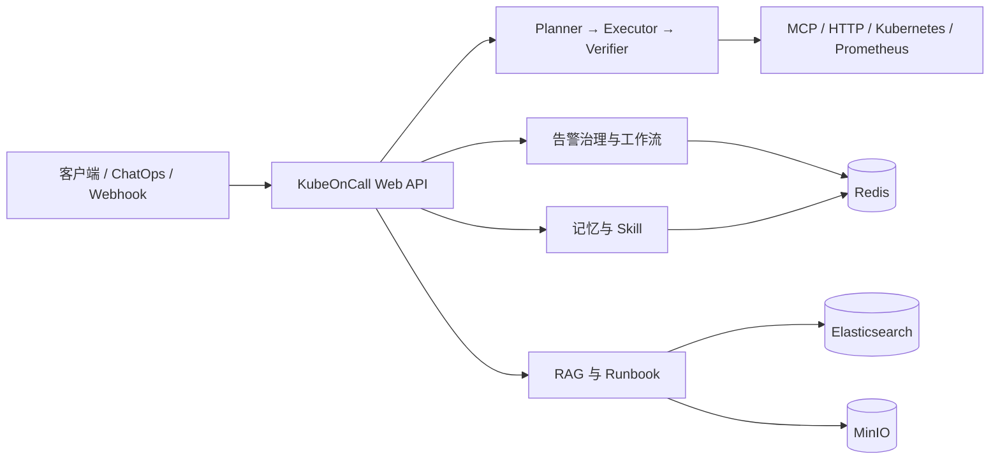

# KubeOnCall

<p align="center">
  <picture>
    <source media="(prefers-reduced-motion: reduce)" srcset="assets/readme/kubeoncall/wordmark.svg">
    
  </picture>
</p>

[](https://github.com/oxygen914/kubeoncall/actions/workflows/ci.yml)

KubeOnCall 是一个面向 Kubernetes 和云基础设施运维的多智能体服务，把告警接入、诊断编排、RAG、长期记忆、Skill、MCP/HTTP 工具、审批与审计连接成可追踪的工作流。

项目当前以 Spring Boot 单体服务承载核心能力，适合源码评估、单机 Docker Compose 演练和 Kubernetes 集成验证。

> [!IMPORTANT]
> 当前版本为 `0.0.1-SNAPSHOT`，仓库没有正式发布镜像和独立 `LICENSE`。Compose 默认是单机部署，不代表高可用生产架构；对外发布或生产使用前需要补充许可证、TLS、Secret 管理、备份和容量评估。

## 为什么使用 KubeOnCall

- **告警闭环**：接收 Alertmanager Webhook，完成标准化、指纹去重、聚合、策略、确认、恢复、升级和审计。
- **证据驱动诊断**：Planner → Executor → Verifier 工作流结合指标、工具输出、Runbook 和历史处置记录。
- **RAG 知识库**：支持文档/JSONL/Runbook 导入、Elasticsearch 关键词与向量检索、RRF 融合和 Cross Encoder 重排。
- **运维记忆**：支持会话压缩、长期记忆、结构化提取、证据归因、质量评分和统一 Token 预算。
- **可插拔能力**：从 Markdown Skill 和 MCP/HTTP 工具扩展能力，并提供 allowlist、版本冲突、动态发现和审批边界。
- **可观测与审计**：提供 Actuator、Prometheus 指标、Grafana Dashboard、执行审计和统一错误响应。

## 架构边界



KubeOnCall 本身不部署生产 Kubernetes 集群、工单系统或模型服务。它通过 HTTP、Webhook、Redis、Elasticsearch、MinIO 和外部模型接口连接这些系统。

## 快速开始

Docker Compose 是最快的本地或单机 Linux 启动方式。

### 1. 前置条件

- Docker Engine
- Docker Compose v2
- 完整 AI/RAG 能力所需的阿里云百炼 API Key

Linux 首次运行 Elasticsearch 前设置：

```bash
sudo sysctl -w vm.max_map_count=262144
```

### 2. 配置

```bash
cp .env.example .env
chmod 600 .env
```

编辑 `.env`，替换所有 `CHANGE_ME` 和 `YOUR_*` 值。至少需要设置：

- `ALIYUN_API_KEY`
- Viewer、Operator、Admin 三个 API Token
- MinIO 密码
- Alertmanager Token
- Grafana 密码

启用 Alertmanager 前，把同一个 Token 写入 credentials file：

```bash
mkdir -p deploy/alertmanager/secrets

sed -n 's/^ALERTMANAGER_WEBHOOK_TOKEN=//p' .env \
  > deploy/alertmanager/secrets/kubeoncall-webhook-token

chmod 600 deploy/alertmanager/secrets/kubeoncall-webhook-token
```

### 3. 启动

```bash
docker compose config --quiet
docker compose up -d --build
```

Compose 会启动：

- KubeOnCall
- Redis 7
- Elasticsearch 8.14
- MinIO 和一次性 bucket 初始化任务
- Prometheus
- Grafana

启动可选 Alertmanager 和 Node Exporter：

```bash
docker compose --profile alerting up -d --build
```

### 4. 验证

```bash
docker compose ps
docker compose logs --tail=200 kubeoncall
curl --fail http://127.0.0.1:8080/actuator/health
```

使用 Viewer Token 验证 API：

```bash
VIEWER_TOKEN="$(
  sed -n 's/^KUBEONCALL_API_VIEWER_TOKEN=//p' .env
)"

curl --fail \
  -H "Authorization: Bearer ${VIEWER_TOKEN}" \
  http://127.0.0.1:8080/api/status
```

预期响应：

```json
{"service":"KubeOnCall","status":"UP"}
```

发起一次运维问答：

```bash
curl --fail \
  -X POST http://127.0.0.1:8080/api/ask \
  -H "Authorization: Bearer ${VIEWER_TOKEN}" \
  -H "Content-Type: application/json" \
  -d '{
    "question": "检查 payment 服务最近的错误告警",
    "sessionId": "quick-start"
  }'
```

完整的 Linux、源码和 Kubernetes 安装步骤见[安装指南](docs/installation.md)。

## 部署方式

| 方式 | 适用场景 | 依赖范围 |
| --- | --- | --- |
| Docker Compose | 本地开发、单机 Linux、功能演练 | 仓库内编排应用和基础依赖 |
| Standalone YAML | Minikube 或测试集群 | 包含应用、Redis、ES、MinIO、PVC 和初始化 Job |
| Helm | 已有 Kubernetes 平台 | 只部署 KubeOnCall；外部依赖由平台提供 |

- Compose：[安装指南](docs/installation.md#2-docker-compose-快速安装)
- Standalone YAML：[后端运行手册](docs/后端运行手册.md#单文件-kubernetes-部署)
- Helm：[Chart 部署说明](deploy/helm/kubeoncall/README.md)

Compose 默认把所有端口绑定到 `127.0.0.1`，并使用命名卷保存数据。需要远程访问时优先使用 SSH 隧道或 TLS 反向代理，不要把 Redis、Elasticsearch 或 MinIO 直接暴露到公网。

## 配置

配置来源：

1. `src/main/resources/application.yml`：公共默认值。
2. `application-local.yml` / `application-docker.yml`：运行环境覆盖。
3. `.env`：Docker Compose 的本地 Secret 和开关，不提交 Git。
4. Helm values 与 Kubernetes Secret：集群部署配置。

主要配置组：

| 组 | 关键变量 | 默认策略 |
| --- | --- | --- |
| API 鉴权 | `KUBEONCALL_API_*_TOKEN` | Compose 示例启用三角色 Bearer |
| 模型 | `ALIYUN_API_KEY`、`SPRING_AI_*` | `qwen-plus` |
| RAG | `RAG_EMBEDDING_*`、`RAG_RERANK_*` | `text-embedding-v4` + `qwen3-rerank` |
| 记忆 | `MEMORY_*` | 外部 LLM/Tokenizer 默认关闭 |
| MCP | `MCP_*` | 默认关闭，配置真实端点后启用 |
| ChangeEvent | `CHANGE_EVENT_*` | 默认关闭 |
| 通知 | `ALERT_NOTIFICATION_WEBHOOK_ENDPOINT` | 未配置时只记录和诊断 |
| 网络 | `*_BIND_ADDRESS` | 默认只监听 `127.0.0.1` |

完整变量、数据边界和持久化说明见[配置参考](docs/configuration.md)。

## 节点告警闭环

仓库保留一条轻量化节点告警链路：

```text
Node Exporter → Prometheus → Alertmanager → KubeOnCall
```

默认规则覆盖节点不可达、CPU、内存、磁盘和 inode。需要 `NodeNotReady` 时再接入 kube-state-metrics。

验证规则和链路：

```bash
./scripts/verify-prometheus-rules.sh
./scripts/verify-alerting-e2e.sh
```

Compose 中的 Node Exporter 用于容器化演练；生产 Kubernetes 节点应使用 DaemonSet 或平台现有的节点监控。接入细节见 [Alertmanager 文档](deploy/alertmanager/README.md)。

## API 概览

| 接口 | 用途 |
| --- | --- |
| `GET /actuator/health` | 健康检查 |
| `GET /actuator/prometheus` | Prometheus 指标 |
| `GET /api/status` | 服务状态 |
| `POST /api/ask` | 运维问答和任务编排 |
| `POST /api/integrations/alertmanager/webhook` | Alertmanager Webhook |
| `POST /api/integrations/change-events/{provider}` | CI/CD 变更事件 |
| `POST /api/knowledge/ingest`、`/query` | 知识入库和检索 |
| `POST /api/memory/search` | 长期记忆检索 |
| `GET/POST /api/skills` | Skill 查询和治理 |
| `GET /api/tools` | 工具目录 |

启用通用 API 鉴权后，查询使用 Viewer，告警/审批等操作使用 Operator，管理写操作使用 Admin。Alertmanager 和 ChangeEvent Webhook 使用各自的签名或 Token。

## 文档

- [文档索引](docs/README.md)
- [安装指南](docs/installation.md)
- [配置参考](docs/configuration.md)
- [后端运行手册](docs/后端运行手册.md)
- [阿里云模型联调](docs/阿里云模型联调.md)
- [项目架构](项目架构.md)
- [贡献指南](CONTRIBUTING.md)

## 仓库结构

```text
kubeoncall/
├── .github/workflows/       # CI
├── config/                  # Checkstyle 等构建规则
├── deploy/                  # Compose 配套资源、Kubernetes、Helm、监控
├── docs/                    # 安装、配置、运行和模型联调文档
├── scripts/                 # 告警、模型、MCP、Helm 验证脚本
├── src/main/                # Spring Boot 业务代码与资源
├── src/test/                # 单元、架构和集成测试
├── .env.example             # 不含真实 Secret 的配置模板
├── docker-compose.yml       # 单机编排
├── Dockerfile               # Java 17 多阶段镜像构建
└── pom.xml                  # Maven 构建
```

## 开发

要求 JDK 17，使用 Maven Wrapper：

```bash
./mvnw verify
```

运行真实依赖集成测试：

```bash
docker compose up -d redis elasticsearch minio minio-init
./mvnw -Pintegration-test verify
```

CI 会执行 Maven 校验、Compose 静态渲染和 Docker 镜像构建。代码规范、提交前检查和架构边界见[贡献指南](CONTRIBUTING.md)。

## 项目状态与许可证

项目仍在持续重构和验证中，已实现的能力、待补测试和延期项以[当前重构进度](重构计划/当前重构进度.md)为准。

仓库当前没有独立 `LICENSE` 文件。这意味着代码尚未以明确的开源许可证对外授权；公开分发、二次使用或接受外部贡献前，应由维护者选择并添加许可证。
