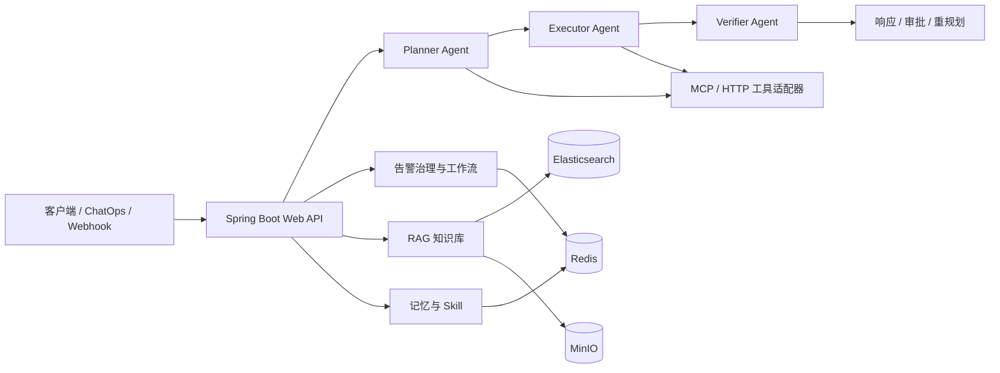

# KubeOnCall

KubeOnCall 是一个面向 Kubernetes/云基础设施运维场景的多智能体运维平台。它把自然语言问答、告警治理、知识库检索、长期记忆、可插拔 Skill、MCP/HTTP 工具调用、审批和审计串成一条可追踪的运维闭环。

项目当前以 Spring Boot 单体服务承载核心编排能力，外部系统通过 HTTP 接口、Alertmanager/CICD Webhook 以及 Redis、Elasticsearch、MinIO 等基础设施接入。

## 能力概览

- **智能问答与任务编排**：Planner → Executor → Verifier 三段式 Agent，支持工具选择、参数解析、执行、校验、失败重规划和人工审批。
- **告警治理**：告警标准化、指纹去重、聚合、抑制、维护窗口、升级、确认、恢复检查、恢复审计和死信重试。
- **RAG 知识库**：文档/JSONL/内置 Runbook 导入，Elasticsearch 关键词检索，支持向量召回、混合 RRF、交叉编码器重排和可选 LLM 增强。
- **运维记忆**：会话记忆、上下文压缩、长期记忆、记忆检索、质量评分、异步抽取与合并。
- **Skill 底座**：从 classpath 或项目目录加载 Markdown Skill，支持匹配、启停、版本冲突策略和上下文预算控制。
- **工具与集成**：Kubernetes、Prometheus、Alertmanager、设备、数据库、事件/工单等 HTTP 工具；支持静态 Bearer、OAuth 和动态 MCP 工具发现。
- **可观测性**：Actuator、Prometheus 指标、执行审计、操作审计、告警指标和统一错误响应。

## 架构



核心源码按职责划分在 `com.kubeoncall` 下：

| 模块 | 作用 |
| --- | --- |
| `agent` | Planner、Executor、Verifier 及 Graph 节点 |
| `alarm` / `workflow` | 告警接入、策略、状态、升级、恢复和工作流 |
| `rag` | 文档入库、检索、重排、索引版本和 Runbook |
| `memory` | 会话、长期记忆、抽取、压缩和 Token 预算 |
| `skill` | Skill 发现、加载、匹配、状态和版本治理 |
| `tool` | Agent 工具目录、HTTP 工具和 MCP 客户端 |
| `web` | REST API、Webhook、认证过滤器和异常处理 |
| `common/config` | `kubeoncall.*` 配置属性 |

更完整的模块说明见 [`项目架构.md`](项目架构.md)；运行手册见 [`docs/后端运行手册.md`](docs/后端运行手册.md)。

## 技术栈

- Java 17、Spring Boot 3.3.4、Maven 3.9+
- Spring AI OpenAI Starter（可连接 OpenAI 兼容接口，例如阿里云 DashScope）
- LangGraph4j 1.3.0
- Redis：会话、队列、锁、告警状态、审批和审计
- Elasticsearch 8：知识库与可选向量索引
- MinIO：知识文档对象存储
- Docker Compose、Helm、Kubernetes、Prometheus、Grafana、Alertmanager

## 快速开始

### 方式一：Docker Compose（推荐）

要求 Docker Engine 和 Compose 插件。Linux 主机首次运行 Elasticsearch 前设置：

```bash
sudo sysctl -w vm.max_map_count=262144
```

复制配置模板，替换密码和 API Key：

```bash
cp .env.example .env
chmod 600 .env
docker compose config --quiet
docker compose up -d --build
```

检查服务：

```bash
docker compose ps
curl --fail http://127.0.0.1:8080/actuator/health
docker compose logs -f app
```

Compose 会启动应用、Redis、Elasticsearch、MinIO 和一次性的 `minio-init` 初始化容器。默认只发布应用的 `8080` 端口，数据保存在 `redis-data`、`elasticsearch-data`、`minio-data` 命名卷中。

停止服务但保留数据：

```bash
docker compose down
```

不要在生产环境随意使用 `docker compose down -v`，它会删除上述数据卷。更多容器安全参数和单独运行镜像的说明见 [`DOCKER.md`](DOCKER.md)。

### 方式二：本地运行 Spring Boot

本地运行需要准备 Redis、Elasticsearch、MinIO（默认地址分别为 `localhost:6379`、`localhost:9200`、`localhost:9000`），并提供 `OPENAI_API_KEY`。本地 profile 会关闭告警恢复调度和记忆抽取 Worker，适合开发调试。

Linux/macOS：

```bash
export OPENAI_API_KEY=your-api-key
./mvnw spring-boot:run
```

Windows PowerShell：

```powershell
$env:OPENAI_API_KEY = "your-api-key"
.\mvnw.cmd spring-boot:run
```

默认启动在 `http://localhost:8080`，可通过 `SPRING_PROFILES_ACTIVE` 切换 profile：

| Profile | 用途 |
| --- | --- |
| `local` | 默认开发配置，依赖本机 Redis/Elasticsearch/MinIO |
| `container` | Docker Compose 使用，依赖服务名 `redis`、`elasticsearch`、`minio` |
| `docker` | 启用 Elasticsearch KNN、Embedding、重排和 Runbook bootstrap 等更完整能力 |

## 配置

基础配置在 [`src/main/resources/application.yml`](src/main/resources/application.yml)，profile 覆盖配置位于同目录的 `application-*.yml`。常用环境变量：

| 变量 | 说明 |
| --- | --- |
| `OPENAI_API_KEY` / `OPENAI_MODEL` | LLM 凭据和模型；支持 OpenAI 兼容服务 |
| `REDIS_HOST`、`REDIS_PORT`、`REDIS_PASSWORD` | Redis 连接 |
| `ELASTICSEARCH_URIS` | Elasticsearch 地址 |
| `MINIO_ENDPOINT`、`MINIO_ROOT_USER`、`MINIO_ROOT_PASSWORD`、`MINIO_BUCKET` | 对象存储配置 |
| `KUBEONCALL_API_AUTH_ENABLED` | 是否启用 API Bearer Token 认证 |
| `KUBEONCALL_API_VIEWER_TOKEN`、`KUBEONCALL_API_OPERATOR_TOKEN`、`KUBEONCALL_API_ADMIN_TOKEN` | Viewer/Operator/Admin 角色 Token |
| `MCP_ENABLED`、`MCP_ENDPOINT` | MCP 工具开关和地址 |
| `RAG_*` | Embedding、向量检索、重排、增强和数据集版本配置 |
| `MEMORY_*` | 记忆抽取、Tokenizer、语义去重和预算配置 |
| `CHANGE_EVENT_*`、`ALERTMANAGER_WEBHOOK_TOKEN` | CICD/Alertmanager Webhook 配置 |

不要把真实密钥提交到仓库；使用 `.env`、部署平台 Secret 或环境变量注入。

## REST API

服务默认端口为 `8080`。健康检查和指标：

```text
GET /actuator/health
GET /actuator/prometheus
GET /api/status
```

主要接口分组：

| 路径 | 说明 |
| --- | --- |
| `POST /api/ask` | 自然语言运维问答与任务执行 |
| `GET/POST /api/approvals/{executionId}` | 查询和处理人工审批 |
| `POST /api/alarms` | 接入并运行告警工作流 |
| `POST /api/alarms/acknowledgements` | 确认告警 |
| `POST /api/alarms/recovery-confirmations` | 确认恢复 |
| `POST /api/alarms/silence-approvals` | 处理告警静默审批 |
| `POST /api/integrations/alertmanager/webhook` | Alertmanager Webhook |
| `POST /api/integrations/change-events/{provider}` | GitHub/GitLab/Jenkins/Argo CD 变更事件 |
| `POST /api/knowledge/ingest`、`/query` | 知识文档入库和检索 |
| `POST /api/knowledge/import/jsonl` | JSONL 批量导入 |
| `POST /api/knowledge/runbooks/import` | 导入内置 Runbook |
| `GET/POST /api/knowledge/index/*` | 索引状态、准备、激活和回滚 |
| `POST /api/memory/search`、`/cleanup`、`/consolidate` | 记忆检索和维护 |
| `GET/POST /api/skills` | Skill 列表、重载、启用和禁用 |
| `GET /api/tools` | 查看 Planner/Executor/Verifier 工具目录 |
| `GET /api/stats` | 执行审计统计 |

示例：

```bash
curl -X POST http://localhost:8080/api/ask \
  -H 'Content-Type: application/json' \
  -d '{"question":"检查 payment 服务最近的错误告警","sessionId":"demo-session"}'
```

### API 认证

当 `KUBEONCALL_API_AUTH_ENABLED=true` 时，除集成 Webhook 外的 `/api/**` 接口需要：

```http
Authorization: Bearer <token>
```

GET 和只读查询通常需要 Viewer；审批、告警、变更事件和记忆抽取操作需要 Operator；其余写操作需要 Admin。Alertmanager 与 CICD Webhook 使用各自的 Token/签名校验，不复用通用 API Token。

## 告警与知识库资源

- 告警策略：`src/main/resources/alarm-policies.yml`、`alarm-policies-node-mvp.yml`
- 告警抑制规则：`src/main/resources/alarm-suppression-rules.yml`
- Runbook：`src/main/resources/runbooks/`
- Skill：`src/main/resources/skills/`
- Prometheus 规则与测试：`deploy/prometheus/rules/`、`deploy/prometheus/tests/`
- Helm/Kubernetes 资源：`deploy/helm/`、`deploy/kubernetes/`

通过 API 导入知识后，建议按“准备新索引 → 校验 → 激活别名”的顺序发布数据集，避免在线检索直接读取未完成的索引。

## 测试与质量检查

项目在 Maven `validate` 阶段启用 Enforcer、Spotless 和 Checkstyle；测试使用 Spring Boot Test、JUnit 5 和 ArchUnit。

```bash
./mvnw test
./mvnw verify
```

Windows 使用 `mvnw.cmd`。依赖外部服务的集成测试可使用 `integration-test` profile：

```bash
./mvnw -Pintegration-test verify
```

仓库还提供 Prometheus、Helm、Alerting、MCP、阿里云模型等验证脚本，位于 `scripts/`；脚本执行前请先阅读对应文件中的依赖和环境变量说明。

## 部署

- Docker 镜像：根目录 `Dockerfile`，使用 Maven/JRE 多阶段构建，并以 UID/GID `10001` 的非 root 用户运行。
- Compose：`docker-compose.yml`，适用于本地或单机依赖编排。
- Kubernetes：`deploy/kubernetes/kubeoncall-standalone.yaml`。
- Helm：`deploy/helm/kubeoncall/`，包含 ServiceMonitor 和 Grafana Dashboard 模板。
- 监控：`deploy/prometheus/`、`deploy/grafana/`、`deploy/alertmanager/`。

生产环境应固定镜像版本或 digest，使用 Secret 管理器注入凭据，并单独评估 Redis、Elasticsearch、MinIO 的备份、网络隔离和访问控制。

## 开发约定

- Java 代码目标版本为 17；提交前运行 `./mvnw verify`。
- 遵循 `config/checkstyle/checkstyle.xml` 与 Spotless 格式化规则。
- 新增外部工具时先补充工具定义、权限/审批属性、适配器和对应测试。
- 修改告警策略、RAG 索引或 Webhook 校验时，同时补充单元测试和验证脚本/配置示例。
- 不提交 `.env`、真实 Token、API Key 或生产数据。

## 许可证与项目状态

仓库当前未提供独立 LICENSE 文件；如需对外发布或二次分发，请先确认项目许可证和第三方依赖的使用条款。项目仍在持续演进，具体行为以当前源码、配置和测试为准。
