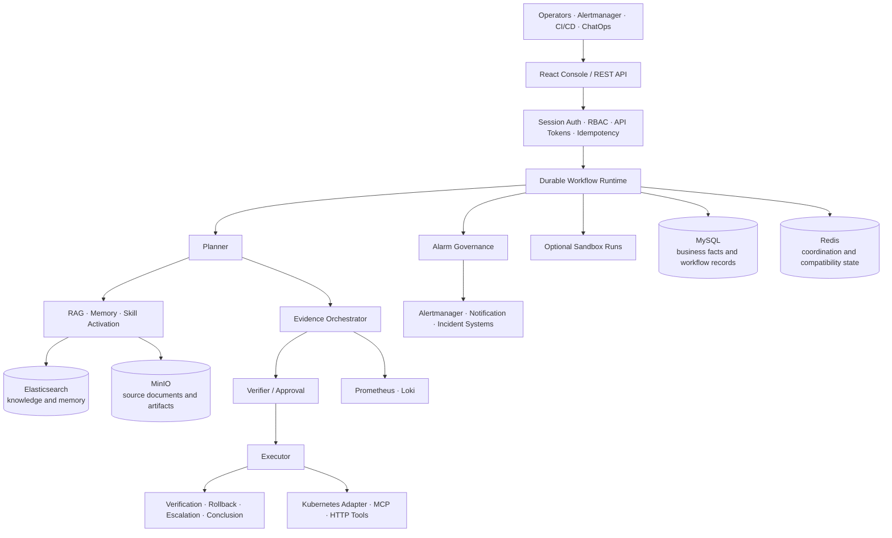

# KubeOnCall

<p align="center">
  <picture>
    <source media="(prefers-reduced-motion: reduce)" srcset="assets/readme/kubeoncall/wordmark.svg">
    
  </picture>
</p>

<p align="center">
  <a href="https://github.com/oxygen914/kubeoncall/actions/workflows/ci.yml"></a>
</p>

English | [简体中文](./README-CN.md)

KubeOnCall is an evidence-driven AI operations control plane for Kubernetes and infrastructure. It
turns operator questions, alerts, telemetry, runbooks, historical memory, Skills, and external tools
into durable and auditable Planner → Verifier → Executor workflows.

The repository contains a Spring Boot backend, a React operations console, a Go sandbox controller,
deployment assets, observability components, and validation scripts. KubeOnCall coordinates
diagnosis and controlled operations; it does not replace Kubernetes, Prometheus, Loki, an incident
platform, or a model provider.

> [!IMPORTANT]
> KubeOnCall is under active development. The current source version is `0.0.1-SNAPSHOT`.
> Docker Compose and Helm Quickstart are intended for development and acceptance testing, not for
> highly available production deployment. The repository currently has no `LICENSE` or
> `SECURITY.md`; source availability does not grant an open-source license.

## What KubeOnCall provides

- **Durable AI operations workflows** — `POST /api/v1/executions` creates an idempotent asynchronous
  execution backed by MySQL task and node records rather than tying the workflow to one HTTP request.
- **Evidence before conclusions** — scoped Prometheus and Loki collectors persist evidence,
  conflicts, confidence, conclusions, and recommended actions separately from model output.
- **Planner, Verifier, Executor, Closure** — planning, risk verification, tool execution, approval,
  post-operation verification, rollback, and escalation are represented as explicit workflow stages.
- **Alert lifecycle governance** — Alertmanager ingestion, normalization, fingerprinting, deduplication,
  aggregation, suppression, acknowledgement, recovery, escalation, policy replay, and audit.
- **Knowledge, memory, and Skills** — multi-format knowledge import, hybrid retrieval, reranking,
  long-term operational memory, and Markdown Skills with allowlists and risk limits.
- **Operator-facing console and API** — React pages for monitoring, executions, evidence, alarms,
  approvals, knowledge, memory, Skills, tools, integrations, audit, users, and API tokens.
- **Extensible execution plane** — built-in HTTP adapters, MCP integration, Kubernetes and Prometheus
  tools, plus optional isolated sandbox runtimes.

## Architecture



### Control plane

The Spring Boot backend owns API contracts, identity and RBAC, workflow submission, policy
evaluation, evidence and conclusion persistence, approval state, audit, and capability reporting.
The React console consumes the versioned `/api/v1` surface and does not infer whether an optional
capability is enabled.

### Workflow plane

The preferred Ask path is asynchronous:

```text
POST /api/v1/executions
  → durable execution and task
  → Planner query/think
  → scoped evidence collection
  → Verifier and approval decision
  → Executor
  → operation closure
  → persisted evidence, conclusion, nodes, and audit
```

`POST /api/ask` and `POST /api/v1/ask` remain read-only compatibility paths. New integrations should
use `/api/v1/executions` with a user-backed session and an `Idempotency-Key`.

### Data and execution boundaries

| Component                        | Responsibility                                                                                                           |
| -------------------------------- | ------------------------------------------------------------------------------------------------------------------------ |
| MySQL 8                          | Users, roles, sessions, API tokens, workflow executions, async tasks, evidence, conclusions, and migrated business facts |
| Redis 7                          | Coordination, short-lived state, legacy compatibility, leases, deduplication, and selected workflow state                |
| Elasticsearch 8.14               | Knowledge chunks, hybrid retrieval, and long-term memory indexes                                                         |
| MinIO                            | Original knowledge documents and sandbox artifacts                                                                       |
| Prometheus / Loki                | Metrics and log evidence; queries are constructed and scope-checked by the server                                        |
| Kubernetes / MCP / HTTP adapters | External facts and actions; availability depends on deployment configuration                                             |
| Sandbox Controller               | Optional Kubernetes Job isolation for explicitly enabled runtime modes                                                   |

The control plane is not proof that every external integration is connected. A successful workflow
means the workflow completed; it does not by itself mean the incident was resolved or that the
conclusion had sufficient evidence.

## Quick start with Docker Compose

Docker Compose is the shortest local evaluation path.

### Prerequisites

- Docker Engine and Docker Compose v2
- 4 vCPU, 8 GiB RAM, and 30 GiB free disk recommended for the full local stack
- On Linux, `vm.max_map_count=262144` for Elasticsearch
- An Aliyun Bailian/DashScope API key for real-model planning, embedding, or reranking

```bash
sudo sysctl -w vm.max_map_count=262144
```

### 1. Prepare configuration

```bash
cp .env.example .env
chmod 600 .env
```

Replace every `CHANGE_ME` value. At minimum, set independent MySQL passwords, the MinIO password,
Grafana password, legacy API role tokens, and a one-time bootstrap administrator:

```dotenv
MYSQL_PASSWORD=YOUR_APP_PASSWORD
MYSQL_MIGRATION_PASSWORD=YOUR_MIGRATION_PASSWORD
MYSQL_ROOT_PASSWORD=YOUR_ROOT_PASSWORD
MINIO_ROOT_PASSWORD=YOUR_MINIO_PASSWORD
GRAFANA_ADMIN_PASSWORD=YOUR_GRAFANA_PASSWORD

KUBEONCALL_BOOTSTRAP_ADMIN_ENABLED=true
KUBEONCALL_BOOTSTRAP_ADMIN_USERNAME=admin
KUBEONCALL_BOOTSTRAP_ADMIN_PASSWORD=YOUR_STRONG_ADMIN_PASSWORD
```

Choose one Planner mode.

Real model with a fail-closed startup canary:

```dotenv
ALIYUN_API_KEY=YOUR_ALIYUN_API_KEY
KUBEONCALL_PLANNER_MODE=REAL_MODEL
KUBEONCALL_PLANNER_CANARY_ENABLED=true
KUBEONCALL_PLANNER_CANARY_FAIL_FAST=true
```

Local rule fallback without a model call:

```dotenv
KUBEONCALL_PLANNER_MODE=RULE_FALLBACK
KUBEONCALL_PLANNER_CANARY_ENABLED=false
```

Evidence collectors are fail-closed. Leave them disabled until their source and scope allowlists are
configured:

```dotenv
KUBEONCALL_EVIDENCE_PROMETHEUS_ENABLED=false
KUBEONCALL_EVIDENCE_LOKI_ENABLED=false
KUBEONCALL_EVIDENCE_K8S_EVENTS_ENABLED=false
KUBEONCALL_EVIDENCE_POD_LOGS_ENABLED=false
```

### 2. Start and verify

```bash
docker compose config --quiet
docker compose up -d --build
docker compose ps

curl --fail http://127.0.0.1:8080/actuator/health
curl --fail http://127.0.0.1:8081/healthz
```

The default stack starts Backend, Console, MySQL, Redis, Elasticsearch, MinIO, Prometheus, Loki,
Alloy, and Grafana. Alertmanager and Node Exporter are optional:

```bash
docker compose --profile alerting up -d --build
```

Open <http://127.0.0.1:8081> and sign in with the bootstrap administrator. After the first account is
created, set `KUBEONCALL_BOOTSTRAP_ADMIN_ENABLED=false`, remove the bootstrap username/password from
`.env`, and restart the backend:

```bash
docker compose up -d --force-recreate kubeoncall
```

### 3. Create a durable Ask execution

The console is the preferred first workflow. The equivalent API sequence uses the session and CSRF
cookies returned by login:

```bash
curl --fail \
  -c /tmp/kubeoncall-cookies \
  -H "Content-Type: application/json" \
  -d '{"username":"admin","password":"YOUR_STRONG_ADMIN_PASSWORD"}' \
  http://127.0.0.1:8080/api/v1/auth/login

CSRF_TOKEN="$(
  awk '$6 == "KOC_CSRF" { print $7 }' /tmp/kubeoncall-cookies
)"

curl --fail \
  -b /tmp/kubeoncall-cookies \
  -H "X-CSRF-Token: ${CSRF_TOKEN}" \
  -H "Idempotency-Key: quickstart-000001" \
  -H "Content-Type: application/json" \
  -d '{
    "question": "Inspect recent error signals for the payment service",
    "sessionId": "quick-start",
    "cluster": "local",
    "environment": "development",
    "namespace": "default",
    "resourceKind": "Deployment",
    "resourceName": "payment"
  }' \
  http://127.0.0.1:8080/api/v1/executions
```

The command returns an accepted execution/task projection. Follow progress in the Console or query
`GET /api/v1/executions/{executionId}` with the same session cookie.

## Core workflows

### Evidence-driven diagnosis

The Planner can run in `RULE_FALLBACK`, `RULE_ASSISTED`, or `REAL_MODEL` mode. Model-backed modes
require an explicit provider key. The startup canary can fail closed when authentication, model
availability, or the structured response contract is invalid.

Prometheus evidence uses fixed server-owned query templates; Loki queries are server-constructed,
bounded, and redacted. Cluster and namespace allowlists gate collection. Unavailable evidence sources
remain visible as unavailable instead of being converted into successful findings.

### Alert lifecycle

Alertmanager webhooks enter a separate alarm governance path that handles normalization, stable
fingerprints, active state, deduplication, aggregation, suppression, maintenance windows,
acknowledgements, recovery confirmations, escalation, policy dry-runs/replay, and audit. Dedicated
notification or incident delivery still requires a configured external adapter.

### Knowledge, memory, and Skills

- Knowledge import accepts JSONL, Runbook, and supported document formats, stores originals in
  MinIO, and indexes parent/chunk records in Elasticsearch.
- Retrieval supports keyword, vector, and hybrid strategies with RRF, optional reranking, trace, and
  dataset-version controls.
- Long-term memory supports extraction, consolidation, stale-state handling, provenance, and
  injection into later executions.
- Internal Markdown Skills are matched and activated at runtime. Their prompt, tool allowlist, and
  maximum risk constrain the workflow; they are not unattended repair scripts.

### Controlled operations and sandboxing

Tool execution is checked against catalog capabilities, Skill limits, risk, and approval policy.
Operation closure records verification, rollback, or escalation outcomes explicitly.

The optional Go Sandbox Controller creates isolated Kubernetes Jobs for enabled runtime modes.
Sandbox is disabled by default and requires released runtime images, HMAC configuration, namespace
isolation, resource ceilings, and restrictive network policy. See the
[Sandbox operations and acceptance guide](docs/guides/Sandbox运行与验收手册.md).

## Configuration

Configuration is resolved from Spring defaults, profile overlays, environment variables, and
Kubernetes Secrets/Helm values.

| Area          | Important settings                                                | Default boundary                                                  |
| ------------- | ----------------------------------------------------------------- | ----------------------------------------------------------------- |
| Planner       | `KUBEONCALL_PLANNER_MODE`, provider/model, canary timeouts        | Compose can fall back to rules; `.env.example` selects real model |
| Evidence      | `KUBEONCALL_EVIDENCE_*`, allowed clusters/namespaces              | Disabled and fail-closed                                          |
| Identity      | MySQL credentials, bootstrap admin, session cookie, login lockout | One-time bootstrap required for first Console login               |
| Legacy API    | `KUBEONCALL_API_*_TOKEN`, `KUBEONCALL_LEGACY_API_ENABLED`         | Compatibility surface; prefer `/api/v1`                           |
| RAG           | Embedding, rerank, augmentation, dataset version                  | External model calls require an API key                           |
| Memory        | extraction, semantic duplicate detection, tokenizer               | Model-backed features are opt-in                                  |
| MCP           | endpoint, auth mode, discovery, allowed tools                     | Disabled                                                          |
| Sandbox       | controller endpoint, HMAC, runtime modes, ceilings                | Disabled                                                          |
| Notifications | `ALERT_NOTIFICATION_WEBHOOK_ENDPOINT`, incident endpoint          | No real recipient delivery when unset                             |
| Network       | bind addresses, CORS, Cookie `Secure`, NetworkPolicy              | Compose binds host ports to `127.0.0.1`                           |

See the [configuration reference](docs/configuration.md) for the complete surface and data boundary.

## Deployment options

| Method                         | Intended use                                 | Important boundary                                                                      |
| ------------------------------ | -------------------------------------------- | --------------------------------------------------------------------------------------- |
| Docker Compose                 | Local development and single-host evaluation | Not highly available                                                                    |
| Standalone Kubernetes manifest | Minikube or test clusters                    | Bundled dependencies and local persistence assumptions                                  |
| Helm Quickstart                | Kind/Minikube acceptance                     | Temporary infrastructure; data may use `emptyDir`                                       |
| Helm production values         | Existing Kubernetes platform                 | External MySQL, Redis, Elasticsearch, MinIO, monitoring, secrets, and adapters required |

The release workflow is configured to build multi-architecture images and an OCI Helm Chart from
`vX.Y.Z` tags. Verify that a release and its immutable digests actually exist before deployment; CI
configuration alone is not release evidence.

Deployment details:

- [Installation guide](docs/installation.md)
- [Helm chart guide](deploy/helm/kubeoncall/README.md)
- [Backend operations guide](docs/后端运行手册.md)
- [Kubernetes metrics integration](docs/guides/Kubernetes指标接入指南.md)
- [Kubernetes operation closure contract](docs/guides/Kubernetes操作闭环接入指南.md)

## Security and operational boundaries

- Keep `.env`, API keys, webhook secrets, passwords, Cookie secrets, and production endpoints out of
  Git and public logs.
- Compose publishes ports on `127.0.0.1` by default. Use TLS and an authenticated reverse proxy for
  remote access; never expose MySQL, Redis, Elasticsearch, MinIO, Prometheus, or Loki directly.
- Session authentication uses an HttpOnly `KOC_SESSION` cookie and a separate `KOC_CSRF` token.
  Production deployments must enable secure cookies behind HTTPS.
- External model calls can transmit questions, retrieved knowledge, memory, or evidence. Enable each
  integration only after reviewing its data boundary.
- Kubernetes evidence and actions require a separately deployed, scoped adapter. Local `kubectl`
  access is not evidence that this integration is complete.
- Generic Webhook support is not the same as a dedicated Feishu, DingTalk, PagerDuty, or ticketing
  adapter, and configuration is not proof of real-recipient delivery.
- Compose volumes provide persistence, not backup, disaster recovery, capacity planning, or
  multi-node availability.

## Current limitations

- Production Kubernetes fault-injection, multi-node rollout/rollback, backup/restore, capacity, and
  high-availability acceptance remain deployment responsibilities and are not proven by local tests.
- Kubernetes Events, current/previous Pod logs, resource-state evidence, versioned SOPs, alerts,
  change events, CMDB, and topology depend on external sources that may be unavailable.
- A workflow can finish successfully while its conclusion remains `PARTIALLY_SUPPORTED` or low
  confidence because required evidence is missing.
- Sandbox availability depends on explicitly released runtime images; unsupported modes are not
  enabled with placeholder images.
- The repository has no declared open-source license or private security-reporting policy.

## Development

Requirements:

- JDK 17
- Maven 3.9+ (the wrapper is in `backend/`)
- Node.js 20+
- Go version declared by `sandbox-controller/go.mod`
- Docker for integration and end-to-end tests

```bash
# Backend verification, frontend tests, and production build
make test

# Spotless, Checkstyle, Prettier, ESLint, gofmt, and source-size checks
make format-check

# Real dependency integration tests
(cd backend && ./mvnw -Pintegration-test verify)

# Browser end-to-end tests
(cd frontend && npm run e2e)
```

The generated frontend API types come from [`api/openapi.json`](api/openapi.json):

```bash
(cd frontend && npm run api:check)
```

## Repository map

```text
kubeoncall/
├── backend/              # Spring Boot control plane, APIs, workflow, tests
├── frontend/             # React/TypeScript operations console
├── sandbox-controller/   # Go Kubernetes Job controller
├── sandbox-runtimes/     # Published and validation runtime assets
├── api/                  # OpenAPI contract consumed by the Console
├── deploy/               # Helm, Kubernetes, monitoring, and integration assets
├── docs/                 # Architecture, operations, guides, plans, validation records
├── scripts/              # Verification, release, backup, restore, and integration scripts
├── docker-compose.yml    # Local full-stack topology
└── Makefile              # Common validation entry points
```

## Documentation

- [Documentation index](docs/README.md)
- [Architecture](docs/architecture/项目架构.md)
- [Installation](docs/installation.md)
- [Configuration](docs/configuration.md)
- [AI operations validation record](docs/plans/active/ai-operations/validation/2026-07-29本地真实模型与统一证据链验收记录.md)
- [Contributing](CONTRIBUTING.md)

## Project status and license

KubeOnCall is being actively refactored and validated. Automated tests, local real-model integration,
and local dependency acceptance cover specific code and environment snapshots; they do not establish
production readiness.

No standalone `LICENSE` file is currently present. Until the maintainers add one, copying,
redistributing, modifying, or accepting third-party contributions does not have an explicit
open-source grant.
