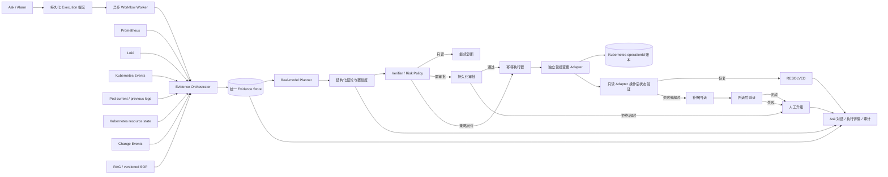

# KubeOnCall“独立解决运营问题”能力收口实施计划

> 版本：v1.10
> 日期：2026-07-30
> 当前状态：VALIDATING（M0～M6 代码级收口完成；本地真实模型、版本化 v2 SOP、
> Prometheus、Kubernetes 资源状态/Events/current/previous logs 和持久化 Ask 已贯通；
> Node Lease/受影响对象、OOM 内存时间线、同窗告警/变更、稳定窗口、闭环事实及独立受控
> 变更 Adapter 已补入代码；操作标记、未知执行结果收敛、回滚 fencing/有界轮询及独立
> Kubernetes 断路器也已完成，但尚未使用
> 新版本重新完成实景演练；真实审批/变更、重启/故障
> 注入、每场景三轮和生产灰度仍待验收）
> 目标阶段：从“可回答、可生成计划”收口到“可诊断、可受控执行、可验证、可回滚、可升级”
> 适用范围：Kubernetes Pending、CrashLoopBackOff、OOMKilled、Node NotReady/Unavailable
> 关联文档：[监控能力重构实施计划](../monitoring/KubeOnCall监控能力重构实施计划.md)、[Kubernetes 操作闭环接入指南](../../../guides/Kubernetes操作闭环接入指南.md)、[Kubernetes 指标接入指南](../../../guides/Kubernetes指标接入指南.md)
>
> 最近更新：2026-07-30，在既有四类 Minikube 首轮验收基础上完成代码级补缺：Node
> Evidence 增加 Lease、允许 Namespace 内受影响 Pod/owner/PDB/容量；Pod Evidence 增加
> requests/limits 和节点 MemoryPressure；previous-log 错误语义、OOM working
> set/RSS/limit 时间线、Ask 范围刷新恢复、同窗告警/变更、独立变更端点、稳定 operationId、
> MySQL Closure/Escalation 事实和稳定窗口均已实现并通过自动化。随后补齐独立
> `kubernetes-mutation-adapter`：独立 Token/RBAC、显式 action/Namespace/config key
> allowlist、UID/Generation 防漂移、ConfigMap 幂等账本、确定性超时重试，以及
> scale/restart/undo/受控环境变量 patch；同一 operation 并发串行、终态账本不可逆、
> 终态过期清理、镜像与发布流水线和本地清单同步就绪。每次变更还会向 Deployment 写入由
> `operationId` 派生的操作标记；后端只有在标记、预期状态及 rollout 收敛同时成立时才确认
> 成功，最终 5xx/超时按未知结果进入独立验证，明确拒绝记为 `DISPATCH_REJECTED`。回滚
> 使用同一稳定 rollback operationId 重试未知响应，并通过 `rollbackOfOperationId` 与
> Deployment 标记 fencing 后按 deadline 轮询复验；错误的限流/超时/保留期配置会拒绝
> Adapter 启动，健康探针不占用业务并发槽。只读与变更调用分别接入 `kubernetes` 和
> `kubernetes-mutation` 断路器。本地最终门禁已通过，远程 CI 和新版本实景部署尚未执行。原始实景结果见
> [四类 Kubernetes 故障 SOP 真实环境验收记录](validation/2026-07-30四类Kubernetes故障SOP真实环境验收记录.md)；
> 新代码尚未重新部署执行四类实景与真实变更，因此仍不能宣称真实变更闭环或生产自主运维
> 能力完成。

## 1. 执行摘要

KubeOnCall 当前已经具备 Planner、Verifier、Executor、RAG、Skill、审批、异步任务、执行事实、
审计、SSE 和基础操作闭环代码，但尚不能据此宣称已经具备“独立解决运营问题”的能力。

本计划的核心不是继续增加一个聊天入口，而是把以下链路收敛成同一个可追踪、可恢复的执行：

```text
真实问题
  -> 真实模型理解
  -> 日志 / Events / 指标 / 资源状态 / SOP 统一取证
  -> 结论与置信度
  -> 风险决策
  -> 持久化执行
  -> 审批或策略放行
  -> 幂等操作
  -> 状态验证
  -> 成功结束 / 超时回滚 / 人工升级
  -> 全链路证据展示与审计
```

计划完成后，“独立解决”应理解为**受治理的自主闭环**，而不是让 AI 无限制操作生产集群：

- 只读诊断可以自动完成。
- 低风险操作只有在策略明确允许时才能自动执行。
- 重启、扩缩容、配置修改、节点操作等默认进入现有审批机制。
- 高风险操作不得因为模型置信度高而绕过审批。
- 操作失败、验证超时、回滚失败或证据矛盾时必须升级人工。
- 系统必须明确区分真实模型、规则降级、模拟结果和真实集群结果。

## 2. 目标能力和完成口径

### 2.1 能力分级

| 等级 | 能力 | 完成口径 |
| --- | --- | --- |
| L0 问答 | 根据输入生成文本 | 仅能回答，不视为运维闭环 |
| L1 诊断 | 自动采集并关联真实证据 | 结论可回溯到日志、Events、指标和 SOP |
| L2 决策 | 生成结构化处置方案 | 包含目标、风险、前置条件、验证和回滚策略 |
| L3 受控执行 | 通过持久化工作流执行操作 | 幂等、审批、权限和审计完整 |
| L4 恢复闭环 | 验证结果并自动收敛异常 | 成功确认；失败时超时、回滚、复验和升级 |

本期目标是：在**专用测试集群**的四类目标场景中达到 L4；在生产环境先以 L1/L2 灰度，
变更操作是否进入 L3/L4 由环境策略和审批决定。

### 2.2 “独立解决”的必要条件

一次问题只有同时满足以下条件，才允许标记为 `RESOLVED`：

1. 使用真实数据源定位了明确的集群、Namespace、资源类型和资源 UID。
2. 至少存在一条直接状态证据，并有日志、Events、指标或变更事件中的相关证据支持。
3. 采用的 SOP 有稳定 ID、版本、来源和命中片段。
4. Planner 来源、模型名称、模型版本和是否降级均可见。
5. 所有变更经过权限、风险策略和必要的人工审批。
6. 操作具有稳定 `operationId`，重试不会重复修改集群。
7. 操作后状态达到预期并持续满足稳定窗口。
8. 验证失败时已经完成回滚和回滚后验证，或明确升级人工。
9. 执行、审批、证据、结论、操作和恢复记录使用同一个 `executionId` 关联。
10. Console 能展示结论依据，而不是只展示一段不可解释的 AI 文本。

以下情况不得标记为“已解决”：

- 只有 HTTP 200，没有核对响应语义。
- 只有 Planner 生成了操作计划，没有真实执行。
- 只有执行器返回成功，没有操作后状态验证。
- 只有模拟、Mock 或规则结果，却标记成 AI/真实集群结论。
- 证据源不可用时把“未知”解释成“正常”。
- 回滚请求已发出，但未验证回滚后的状态。
- 已创建人工工单，但没有明确显示当前仍未恢复。

## 3. 启动基线能力审计

下表记录 2026-07-29 开始实施前的基线，用于说明本轮改造的出发点；当前实现进度见 3.1。

| 能力 | 当前事实 | 判断 | 本计划处理 |
| --- | --- | --- | --- |
| 真实模型 | `application.yml` 打开 `planner-llm-enabled`，但 Compose 默认关闭 Spring AI Chat，并排除 OpenAI 自动配置；缺少 `ChatClient` 时 `PlannerLlmService` 返回空 | 未启用 | 建立显式模型开关、启动校验、健康探针和真实联调门禁 |
| Planner fallback | 模型关闭、Bean 缺失、空响应或异常时会回落规则；规则未知请求默认映射为 `QUERY_LOGS`，未知目标使用 `unknown-service` | 有静默误判风险 | 引入明确运行模式和降级状态；禁止规则降级触发变更 |
| Loki | Compose 已部署 Loki、Alloy 和 Grafana Logs；当前 Alloy 只采集 Docker 容器日志 | 部分具备 | 增加受控 Loki 查询客户端，并接入测试集群 Pod 日志标签 |
| Kubernetes Events | Kubernetes 工具已有资源描述、Pod 和日志相关动作，但没有统一 Events 取证契约 | 缺失 | 增加 Events 查询动作、规范化和证据时窗 |
| Pod 日志 | `kubernetes.queryLogs` 只是外部工具契约，真实适配器和返回证据未在当前仓库内完成验收 | 待联调 | Loki 为主、Kubernetes API current/previous logs 为补充 |
| 持久化执行 | `POST /api/v1/executions`、`WorkflowSubmissionService`、异步 Worker 和 MySQL 执行事实已经存在 | 后端骨架已具备 | `/ask` 前端改接持久化入口，并贯通任务、审批、恢复和 SSE |
| 当前 `/ask` | `AskPage` 调用同步 `POST /api/v1/ask`，页面也明确说明未进入统一执行列表 | 未收口 | 新请求只走持久化入口；同步接口保留兼容但限制用途 |
| 操作闭环 | `OperationClosureService` 已实现变更前快照、轮询验证、回滚、回滚验证和 Incident 升级，且有单元测试 | 代码级部分完成 | 将闭环事实持久化，并完成真实适配器、进程重启和故障注入验收 |
| 证据展示 | `PlannerSummary` 有粗粒度 `evidenceSources`，Console 主要展示 `details` 原始 JSON | 不满足可解释性 | 定义结构化 Evidence/Conclusion 契约，按日志、指标、Events、SOP 分区展示 |
| 真实场景 | 监控计划仍将 Pending/NodeNotReady 演练列为待完成，尚无四类场景完整证据包 | 未完成 | 建设可重复的专用测试集群场景和验收报告 |

结论：当前应描述为“具备自主运维闭环的部分工程基础”，不能描述为“已经能够独立解决真实
Kubernetes 运营问题”。

### 3.1 第一批实施进度（更新至 2026-07-30）

本轮先完成代码与本地自动化验证。仓库默认配置仍保持失败关闭；本地联调实例通过仓库外 Secret
启用真实模型、Loki 和 Prometheus，规则降级仍只读，不直接开放真实 Kubernetes 变更。

| 工作包 | 当前实现 | 代码状态 | 仍需验收 |
| --- | --- | --- | --- |
| M0 开关和能力状态 | 新增 AI Operations 配置、Planner/Evidence/持久化 Ask/Closure/UI 独立开关；能力接口和集成状态暴露实际模式 | 已实现 | 在目标环境核对所有开关组合、Secret 注入和关闭回退 |
| M1 真实模型边界 | 新增 `REAL_MODEL`、`RULE_ASSISTED`、`RULE_FALLBACK`、`SIMULATION`、`UNAVAILABLE`；显式创建 `ChatClient`，真实模式缺 Key 时启动失败；校验结构化 Schema、响应大小、调用状态和 Token 指标；模型输入先脱敏 | 本地真实模型 canary 与错误 Key 失败关闭已通过 | 继续执行 429、5xx、超时、非法 JSON 和配额演练；测试/生产使用独立 Secret |
| M2 统一证据 | 新增 Evidence/Conclusion 领域契约、确定性置信度、冲突检测、范围白名单、Loki `query_range`、固定 Prometheus 查询；独立只读 Kubernetes Adapter 支持资源状态、Events、current/previous logs、Node Lease、允许 Namespace 内受影响 Pod/owner/PDB/容量、Pod requests/limits 和所在节点 MemoryPressure；Pod 指标补充有界 working set/RSS/limit 时间线；本地告警和变更读模型按同一 evidence window 关联 | 代码完成；既有 Minikube 已实证基础资源/Event/log/Prometheus 链路；新增规范化、Node/OOM 和告警/变更关联通过单元及 Go 全量测试 | 重新部署后复验新增证据；接通 Kubernetes Pod 到 Loki 的真实采集；Topology/CMDB 仍按可选外部依赖验收 |
| M3 Planner 降级门禁 | 所有降级原因显式记录；Verifier 和 Executor 双重禁止降级/模拟模式执行变更；同步 `/api/v1/ask` 永久限制为只读；复合请求中的后续变更必须拆成独立 execution | 已实现 | 用真实模型故障注入证明降级时不存在变更旁路 |
| M4 持久化 Ask | Console 改用 `POST /api/v1/executions`；传递集群、环境、Namespace 和资源范围；幂等提交、轮询终态、刷新恢复、task/execution 关联和审批入口已接通；监控范围写入本地存储并在刷新后先恢复、再用实时目录校验；兼容同步接口保持只读 | 代码完成；登录用户的真实模型 + 真实 Kubernetes 只读 E2E 已通过；前端刷新恢复有回归测试 | 验证 Planner、执行、审批阶段进程重启恢复；补充 SSE 主通道与跨设备会话恢复 |
| M5 操作闭环 | 读写 Adapter 端点、进程、ServiceAccount、RBAC 和凭据彻底分离；独立变更 Adapter 具有显式 allowlist、UID/Generation guard、持久化 `operationId` 请求哈希/结果、同 operation 并发串行、终态不可逆、确定性超时 reconcile、终态账本保留/清理和 scale/restart/undo/受控环境变量 patch；每次变更写入 Deployment 操作标记，restart 同时标记 Pod Template；未配置变更端点时 503 失败关闭；原始 PREPARED 快照在同 operation 重试时复用；最终 5xx/超时作为未知外部结果进入独立验证，明确拒绝记为 `DISPATCH_REJECTED`；成功必须同时满足操作标记、预期状态和稳定窗口，涉及 rollout 时还必须满足 observedGeneration/updated replicas；显式 `HEALTHY` 不能替代这些确定性条件；回滚使用稳定独立 ID 重试未知响应，以 `rollbackOfOperationId` 和原操作/本次回滚标记做 fencing，并有界轮询复验；限流/超时/保留期等安全配置严格解析，探针绕过业务并发限流；只读和变更依赖分别进入独立断路器；Redis 保留可续跑图状态，MySQL V20 持久化 Closure/Escalation 审计读投影 | 代码完成；Adapter 四类 action、operationId 冲突/并发、账本写失败/终态保护/清理、未知超时恢复、回滚 fencing、严格配置、探针可用性、目标漂移及读写 Token 隔离均有 Go 自动化；闭环成功/稳定窗口/Pending/未知响应/操作标记/确定性健康校验/回滚重试与轮询/断路器/持久化失败关闭/升级有后端单测；真实 MySQL 8 已验证 V1～V20 | 在专用测试集群执行真实审批、变更、进程重启、响应丢失、验证超时、回滚和 Incident 故障注入；生产前评审 action/Namespace/config key allowlist、最大副本数和账本保留期 |
| M6 可解释前端 | Ask 页面展示回答、执行状态、Planner 模式/降级、置信度、Evidence、SOP、关联结论和推荐动作；执行详情展示闭环阶段、稳定 `operationId` 和人工升级状态，并按验证、回滚、升级语义区分状态；不提供绕过审批的直接执行入口 | 代码完成 | 使用真实长日志、无权限、冲突证据、断线和移动/窄屏场景验收 |
| M7 四场景验收 | Pending、CrashLoopBackOff、OOMKilled、Node NotReady 已各完成 1 次旧版本真实只读诊断；Node 完成人工停机/恢复；原验收暴露的 Node Lease/影响面、OOM 时间线和 previous-log 语义已在代码中修复；验收清单增加独立最小 RBAC 的健康 `remediation-target` Deployment，供真实 scale/restart/undo/patch 演练 | VALIDATING | 使用新版本重新执行并每场景补足 3 次；完成真实变更、超时、回滚和人工升级演练 |

本轮新增的关键安全约束：

1. 规则、模拟、模型不可用和模型错误都必须显示实际 `plannerMode` 与 `degradedReason`。
2. 降级路径可以生成只读诊断，但 Verifier 与 Executor 都会拒绝变更工具。
3. 真实知识库没有返回稳定 SOP ID、版本和来源时，不生成伪造 SOP；涉及变更时保持失败关闭。
4. Loki LogQL 由服务端根据已授权范围构造，限制查询时窗、行数、响应大小和总采集时限。
5. 日志、Events、工具证据和用户输入在进入模型或 Evidence 展示前脱敏，内部
   `plannerKnowledge` 不直接返回 Console。
6. 一个模型决策不能为同一请求中多个变更背书；后续变更必须分别提交、验证和审批。

### 3.2 当前自动化验证记录

以下结果证明当前提交候选代码在本地自动化环境可编译、可测试、契约一致；不替代真实模型和
测试集群验收。

| 验证项 | 结果 |
| --- | --- |
| 后端格式、规范、单元和契约测试 | 最终合并工作区 `verify -Popenapi-contract`：938 个测试通过，0 failure，0 error；Spotless、Checkstyle 通过 |
| MySQL 8 集成测试 | `WorkflowRuntimeIT`：4 个测试通过；Flyway V1～V20 从空库全部应用；Evidence/Conclusion、Closure/Escalation 幂等投影通过 |
| Sandbox Controller / Kubernetes Adapters | `go test ./...`、`go vet ./...`、`go build ./cmd/...` 全部通过；变更 Adapter 包另通过 race 检查；Node Lease、允许范围影响面、PDB/owner/容量、Pod 节点上下文，以及受控变更四类 action、幂等重放/并发、终态保护、目标漂移和超时恢复均有回归测试 |
| OpenAPI 契约 | `-Popenapi-contract verify` 通过；已基于最新 `api/openapi.json` 重新生成前端类型，并验证重复生成无差异 |
| 前端质量门禁 | format、源码体积、lint、typecheck、Vitest、production build 全部通过；36 个测试文件、96 个测试通过 |
| 浏览器 E2E | 12 个 Playwright Mock API 场景通过 |
| 镜像与部署静态门禁 | 只读/变更 Adapter 镜像均本地构建成功，缺少独立长 Token 时均拒绝启动；Helm lint/template、Compose config、CI/Release YAML 解析及三份 Kubernetes 清单离线 dry-run 通过；远程 CI 和真实部署未执行 |

真实依赖的联调结果必须另建验收报告，不得混入本地自动化结论。

### 3.3 本地真实依赖联调记录

2026-07-29 已完成一轮不含真实变更的本地联调：

- 真实 Planner：`REAL_MODEL / aliyun-dashscope / qwen-plus`，启动 canary 和应用级调用通过。
- 持久化执行：`exe_87de26623c904fb89605c53f436d69ff` 的 Execution、Task 和全部 7 个
  工作流节点均成功，Task 阶段为 `COMPLETED`。
- 统一证据：Loki `POD_LOG` 与 Prometheus `METRIC` 均为 `SUCCEEDED` 并写入 MySQL。
- 可信度：因为缺少资源 UID、Kubernetes 状态/Events、SOP 和告警，结论保持
  `PARTIALLY_SUPPORTED / LOW`，没有错误标记为 `RESOLVED`。
- 安全：Key 未进入仓库；临时最小权限联调 Token 已删除。

完整边界和证据见
[2026-07-29 本地真实模型与统一证据链验收记录](validation/2026-07-29本地真实模型与统一证据链验收记录.md)。

2026-07-30 在 `kubeoncall-monitoring` Minikube 测试集群追加完成 Kubernetes 只读证据联调：

- 集群是本机 Docker Driver 的真实单节点 Minikube，Kubernetes API、kubelet 和
  kube-state-metrics 正常；它不是生产或多节点集群。
- 独立 Adapter 使用专用 ServiceAccount，只允许目标 Namespace 的 Pod、Pod logs、Events、
  Deployment、StatefulSet、DaemonSet 读取，并只读 Node；变更 action 固定拒绝。
- Bearer Token、cluster 和 Namespace 三项均失败关闭；Token 只保存于 Kubernetes Secret，
  未进入仓库。
- 真实目标 Pod 返回 `Running`、容器 Ready、0 restart；读取到 Scheduled、Pulled、Created、
  Started 4 条 Events 和启动日志；没有历史容器时 previous logs 返回空集合。
- 从实际 KubeOnCall 后端容器经 Minikube Docker 网络、使用注入的 Bearer Token 成功读取同一
  Pod，证明不是仅在宿主机端口转发下通过。
- 后端能力状态为 `REAL_MODEL / aliyun-dashscope / qwen-plus / HEALTHY`，资源状态、Events、
  Pod logs、持久化 Ask 和证据 UI 开关均为 true。
- 使用现有登录用户从 Console `/ask` 提交持久化诊断，最终
  `executionId=exe_55756f2ec7f6408f9548ccea1ff1049b`、
  `taskId=tsk_fbd69887d7a947218ac1199cbbbf6b04`；Execution、Task 和 7 个节点全部成功。
- 同一 execution 下 Prometheus 指标、Kubernetes 资源状态、Readiness Event、current log
  均为 `SUCCEEDED` 并被 Conclusion 引用；previous log 为 `EMPTY/PREVIOUS_LOG_EMPTY`。
- 版本化 SOP、告警、拓扑和 CMDB 仍不可用，因此 Conclusion 为
  `PARTIALLY_SUPPORTED / LOW / 0.5300`，`sop_refs=[]`，没有冒充 `RESOLVED`。
- Planner 为 `REAL_MODEL / aliyun-dashscope / qwen-plus`，动作仅为 `QUERY_LOGS`，
  `requiresApproval=false`，审批记录为 0。
- Adapter 对 `rolloutRestart` 返回 `403 READ_ONLY_MODE`；验收前后 Pod UID、restartCount
  和 Deployment generation 均未变化。

完整边界和证据见
[2026-07-30 真实 Kubernetes 只读证据链验收记录](validation/2026-07-30真实Kubernetes只读证据链验收记录.md)。

### 3.4 四场景首轮验收后的代码收口

本节只记录 2026-07-30 首轮实景验收后完成的代码和自动化，不把尚未重跑的结果改写为实景
通过：

1. Node 资源证据直接读取 `kube-node-lease` Lease，并在配置允许的 Namespace 内关联目标
   节点 Pod、直接 owner、匹配 PDB、requests 和剩余 allocatable；返回值明确标记
   `coverage=ALLOWED_NAMESPACES`、`complete=false`，不冒充集群全量影响面。
2. Pod 资源证据包含 requests/limits 和所在 Node 的 Ready/MemoryPressure conditions；
   Prometheus 使用服务端固定模板、Pod 精确标签和有界采样生成 working set/RSS/limit 时间线。
3. previous-log 中“无历史容器”规范化为 `EMPTY/PREVIOUS_LOG_EMPTY`，kubelet/CRI 不可读文本
   规范化为 `UNAVAILABLE/PREVIOUS_LOG_UNAVAILABLE`，不再作为成功业务日志。
4. Evidence Orchestrator 从 MySQL 告警和变更读模型采集同一 execution、同一 evidence window
   的 `ALERT`/`CHANGE_EVENT`；告警 ID、变更 ID、时间及 diff 参与稳定证据标识，摘要相同的
   不同事实不会碰撞；本地读模型可用时不保留失败的重复外部 Alerts 证据。
5. Ask 使用的 cluster/environment/namespace 在浏览器刷新后恢复，并在提交前重新用实时目录
   校验；无效或已退场范围会被重置。
6. 只读 `KUBERNETES_TOOL_ENDPOINT` 与变更 `KUBERNETES_MUTATION_TOOL_ENDPOINT` 使用独立
   Token；未配置独立变更端点时所有 mutating action 失败关闭。仓库内独立变更 Adapter
   使用显式 action/Namespace/config key allowlist 和独立最小 RBAC；Backend 分别使用
   `kubernetes`、`kubernetes-mutation` 断路器隔离两条依赖链路。
7. Closure 在执行前生成稳定 `operationId`，健康状态必须持续满足可配置稳定窗口；Redis
   图状态负责续跑，MySQL V20 记录 PREPARED/VERIFYING/STABILIZING/VERIFIED/
   ROLLING_BACK/ROLLED_BACK/ESCALATED 等事实和人工升级投影。
8. Incident Tool 缺失或投递失败不会丢失升级事实；Execution 详情页可直接查看 Closure
   阶段、脱敏事实、错误以及 `PENDING_MANUAL/DISPATCHED/DISPATCH_FAILED` 状态。
9. 变更 Adapter 在 Kubernetes ConfigMap 中先写 `operationId` 请求哈希，再执行确定性
   mutation；不同参数复用 ID 时 409，响应未知时保持 PENDING 并按目标状态 reconcile。
   同一进程内相同 operation 并发请求先串行化，成功/失败终态不能被迟到结果反向覆盖；后端
   同一 operation 重试复用原 PREPARED 快照，不会用变更后状态覆盖回滚基线。
10. 所有变更都会在 Deployment metadata 写入 `ops.kubeoncall.io/operation-id` 哈希标记，
    restart 同时写入 Pod Template；只读 Adapter 回传该标记。后端不再凭通用
    `healthy=true`、显式 `HEALTHY` 或一次 Adapter 成功响应确认恢复，而是同时验证本次标记、
    目标状态和稳定窗口，涉及 rollout 时再验证 generation/updated replicas。最终 5xx/超时
    先按未知执行结果独立核验。回滚 5xx/超时使用同一 rollback operationId 有界重试，
    `rollbackOfOperationId` 为必填 fencing guard；Adapter 只允许资源保留原操作标记或已写入
    本次回滚标记时继续，随后按 deadline 轮询状态与回滚标记。明确拒绝则持久化
    `DISPATCH_REJECTED`。所有 duration、请求大小、并发、最大副本及配置值限制采用严格解析，
    非法值拒绝启动；业务并发饱和不阻塞 `/healthz`、`/readyz`。

剩余项均为真实环境门禁：部署并验证变更 Adapter 的 RBAC/Secret/账本、审批后真实变更、
Worker/Backend/Adapter 重启恢复、验证超时/回滚/Incident 故障注入、四场景各三轮、新代码
实景复验和生产灰度。未完成这些门禁前，本计划保持 `VALIDATING`。

## 4. 目标架构



### 4.1 统一关联键

全链路必须携带以下键：

| 字段 | 用途 |
| --- | --- |
| `requestId` | 一次 HTTP 请求的追踪 |
| `traceId` | 跨服务调用追踪 |
| `sessionId` | Ask 多轮会话 |
| `executionId` | 一次诊断和处置闭环的主键 |
| `taskId` | 异步任务主键 |
| `approvalId` | 审批事实 |
| `operationId` | 外部变更幂等键 |
| `evidenceId` | 单条证据稳定引用 |
| `conclusionId` | 结构化结论稳定引用 |
| `resourceUid` | 防止同名 Kubernetes 资源被误关联 |

## 5. 不可破坏的设计约束

1. 模型不直接持有 Kubernetes 凭据，只能通过受控 ToolExecutor 调用。
2. 浏览器不直接访问 Prometheus、Loki 或 Kubernetes API。
3. 所有查询使用服务端模板、时间范围、结果数量和响应大小上限。
4. 日志在进入模型前完成 Secret、Token、Cookie、IP 和业务敏感字段脱敏。
5. 模型输出只能生成候选计划，不能自行扩大工具白名单和权限。
6. 规则 fallback 只能用于显式降级的只读诊断，不得生成可执行变更。
7. 模拟结果必须带 `simulation=true`，不能参与真实恢复判定。
8. 变更前必须校验资源 UID、Generation、当前状态和预期状态；Kubernetes Update 继续使用
   resourceVersion 提供并发冲突保护。
9. 执行成功不等于问题解决；必须经过独立的操作后验证。
10. 回滚也属于变更，必须幂等、审计并执行回滚后验证。
11. 高风险操作继续沿用审批，不以“AI 自主”为理由降低安全门槛。
12. 数据源缺失、证据冲突和低置信度必须明确显示，不得生成确定性结论。

## 6. 核心数据契约

### 6.1 EvidenceItem

建议把 Sandbox 的 `evidence-v1` 思路提升为 Agent 主链路的统一证据契约：

```json
{
  "evidenceId": "evd_01",
  "executionId": "exe_01",
  "type": "K8S_EVENT",
  "source": "kubernetes-api",
  "cluster": "test-01",
  "namespace": "payments",
  "resource": {
    "kind": "Pod",
    "name": "payment-api-7d8c",
    "uid": "8b7c..."
  },
  "observedAt": "2026-07-29T10:00:00Z",
  "window": {
    "start": "2026-07-29T09:45:00Z",
    "end": "2026-07-29T10:00:00Z"
  },
  "summary": "Pod scheduling failed because no node matched the requested memory.",
  "snippet": "0/3 nodes are available: 3 Insufficient memory",
  "locator": {
    "query": "involvedObject.uid=8b7c...",
    "sequence": "3912"
  },
  "freshnessSeconds": 8,
  "redacted": true,
  "contentHash": "sha256:...",
  "collectionStatus": "SUCCEEDED"
}
```

`type` 至少支持：

- `RESOURCE_STATE`
- `K8S_EVENT`
- `POD_LOG`
- `METRIC`
- `ALERT`
- `CHANGE_EVENT`
- `SOP`
- `OPERATION_RESULT`
- `VERIFICATION_RESULT`
- `ROLLBACK_RESULT`

证据正文较大时写入 MinIO，MySQL 只保存元数据、摘要、对象引用和 SHA-256；短片段可以直接
保存，但必须有长度上限和脱敏标记。

### 6.2 Conclusion

每个结论必须是结构化对象，而不是只保留模型自然语言：

```json
{
  "conclusionId": "con_01",
  "claim": "Pod Pending 的直接原因是内存请求超过可调度容量",
  "severity": "P2",
  "status": "SUPPORTED",
  "evidenceRefs": ["evd_event_01", "evd_metric_03", "evd_state_02"],
  "sopRefs": [
    {
      "sopId": "pod-pending-triage",
      "version": "1.3.0",
      "source": "runbook",
      "section": "Insufficient resources"
    }
  ],
  "confidence": {
    "score": 0.91,
    "label": "HIGH",
    "basis": {
      "directEvidence": 1.0,
      "sourceAgreement": 0.9,
      "freshness": 1.0,
      "sopSupport": 0.8,
      "missingSignalPenalty": 0.0,
      "conflictPenalty": 0.0
    }
  },
  "planner": {
    "mode": "REAL_MODEL",
    "model": "qwen-plus",
    "degraded": false
  },
  "recommendedAction": {
    "type": "PATCH_CONFIG",
    "requiresApproval": true
  }
}
```

### 6.3 置信度计算

不得直接把模型自报的 `confidence` 当作最终置信度。建议使用可解释的确定性评分：

```text
score =
  0.35 * directEvidence
+ 0.20 * sourceAgreement
+ 0.15 * freshness
+ 0.15 * sopSupport
+ 0.15 * targetCertainty
- missingSignalPenalty
- conflictPenalty
```

初始标签：

- `HIGH`：`score >= 0.80`
- `MEDIUM`：`0.55 <= score < 0.80`
- `LOW`：`score < 0.55`

强制封顶规则：

- 没有资源 UID 或直接状态证据：最高 `0.49`。
- 只有单一日志片段且没有其他来源印证：最高 `0.59`。
- 存在未解决的关键证据冲突：最高 `0.49`。
- 使用模拟数据：最高 `0.30`，且不能进入真实执行。
- 证据超出允许时效：按来源降低 freshness，过期证据不能作为恢复验证。
- SOP 缺失不阻止只读诊断，但阻止自动变更。

### 6.4 Planner 运行模式

新增显式 `plannerMode`：

| 模式 | 含义 | 是否允许变更 |
| --- | --- | --- |
| `REAL_MODEL` | 真实 ChatClient 成功产生并通过 Schema 校验的计划 | 通过 Verifier 和审批后允许 |
| `RULE_ASSISTED` | 规则只用于补充或校验真实模型结果 | 通过策略后允许 |
| `RULE_FALLBACK` | 模型不可用，完全由规则生成只读结果 | 禁止 |
| `SIMULATION` | Mock、样例或 Sandbox 仿真结果 | 禁止作用于真实集群 |
| `UNAVAILABLE` | 模型和安全降级均无法给出可信结果 | 禁止，返回明确错误 |

响应、执行记录、审计和 Console 必须展示该字段。禁止用普通 `SUCCESS` 掩盖降级。

### 6.5 执行状态

建议统一为：

```text
PENDING
  -> COLLECTING_EVIDENCE
  -> PLANNING
  -> VERIFYING_PLAN
  -> WAITING_APPROVAL
  -> EXECUTING
  -> VERIFYING_RECOVERY
  -> SUCCEEDED
  -> ROLLING_BACK
  -> VERIFYING_ROLLBACK
  -> ROLLED_BACK
  -> ESCALATED
  -> FAILED
  -> CANCELLED
```

`ROLLED_BACK` 表示操作目标没有达成，但系统已恢复到安全状态，不能映射为 `SUCCEEDED`。

## 7. 分阶段实施

## M0：基线、开关和验收资产

### 目标

建立可回归的基线，避免后续把既有缺陷、新增缺陷和真实环境问题混在一起。

### 工作项

1. 记录当前分支、提交、后端全量测试、前端 lint/test/build 和 OpenAPI 同步结果。
2. 为七条能力分别建立 Feature Flag：
   - `KUBEONCALL_PLANNER_MODE`
   - `KUBEONCALL_EVIDENCE_LOKI_ENABLED`
   - `KUBEONCALL_EVIDENCE_K8S_EVENTS_ENABLED`
   - `KUBEONCALL_EVIDENCE_POD_LOGS_ENABLED`
   - `KUBEONCALL_ASK_DURABLE_WORKFLOW_ENABLED`
   - `KUBEONCALL_OPERATION_CLOSURE_ENABLED`
   - `KUBEONCALL_CONCLUSION_EVIDENCE_UI_ENABLED`
3. 增加能力状态接口，返回模型、Loki、Prometheus、Kubernetes Tool、Incident Tool 的
   `CONFIGURED | HEALTHY | DEGRADED | UNAVAILABLE`，不返回密钥。
4. 建立验收结果目录，保存每次演练的机器可读 JSON 和人工签字 Markdown。
5. 对现有同步 `/api/v1/ask`、持久化 `/api/v1/executions` 和审批恢复接口冻结兼容基线。

### 验收

- 所有能力都能独立关闭并安全退化。
- 关闭任一真实执行能力时，不会回落为无验证执行。
- 基线测试结果和已知失败有时间戳、提交号和环境说明。

## M1：接入并启用真实模型

### 目标

让 Planner 确实调用已配置的真实模型，并能证明当前响应来自哪个模型，而不是仅把配置开关设为
`true`。

### 后端改造

1. 移除 Compose 中无条件排除 Chat 自动配置的做法，改为显式的模型 Profile 或条件配置。
2. 将 Planner 使用的 `ChatClient` 从反射查找收敛为显式依赖和启动期校验。
3. 增加配置：
   - Provider、Base URL、Model、API Key 引用。
   - 连接超时、响应超时、最大重试、并发上限。
   - Planner JSON Schema 版本。
   - 输入和输出 Token 上限。
4. 启动时只校验配置完整性；真实联网探针使用独立 readiness/canary，避免启动期间产生不可控费用。
5. Planner 输出必须通过严格 JSON Schema 校验；字段非法时不得直接进入 Executor。
6. 记录模型调用的 provider、model、latency、token usage、finish reason、request correlation，
   但不记录原始密钥和未脱敏完整日志。
7. 增加限流、熔断和成本预算；模型连续失败时切换为显式 `RULE_FALLBACK`。
8. 将 Prompt 注入防护加入 Tool/SOP 上下文：外部日志和文档只能作为数据，不得覆盖系统策略。

### 部署改造

1. 使用环境 Secret 注入 `ALIYUN_API_KEY` 或等价 Provider 凭据。
2. 本地、测试和生产使用不同 Key、配额和审计标签。
3. 提供一条不含业务数据的 canary 问题，验证响应确实来自目标模型。
4. 在 Console 集成状态页展示模型“已配置/可用/降级”，不展示 Key。

### 验收

- canary 响应包含真实 provider/model 和非零 token usage。
- 删除 Key、错误 Key、429、5xx、超时、非法 JSON 均有明确降级状态。
- 模型不可用时，任何变更任务都被阻止。
- 日志和审计中不存在 API Key、Authorization Header 或未脱敏业务日志。
- 真实模型联调结果与[阿里云模型联调](../../../阿里云模型联调.md)的协议保持一致。

## M2：Loki、Kubernetes Events 和 Pod 日志统一证据链

### 目标

形成一个供 Planner、Verifier、Response Composer、Console 和审计共同使用的证据模型。

### 2.1 Loki

1. 新增只读 `LokiQueryClient`，仅开放受控的 `query_range` 能力。
2. 服务端构造 LogQL，浏览器和模型不能直接提交任意 LogQL。
3. 强制限制：
   - 最大时间窗口。
   - 最大行数和最大响应字节。
   - 允许的 cluster/namespace/workload/pod/container 标签。
   - 查询超时和并发上限。
4. 扩展 Alloy 或集群日志采集配置，使测试集群 Pod 日志进入 Loki，并统一以下标签：
   - `cluster`
   - `namespace`
   - `workload`
   - `pod`
   - `container`
   - `stream`
5. 保留现有 Docker 日志采集，但与 Kubernetes Pod 日志明确区分。
6. Loki 不可用时返回 `UNAVAILABLE`，不能返回空数组并解释为“没有错误”。

### 2.2 Kubernetes Events

1. 在 Kubernetes Tool 契约中增加 `queryEvents`：
   - 按资源 UID 优先检索。
   - 支持 Namespace、Kind、Name、reason、时间窗。
   - 返回 event time、reason、type、message、count、source 和 involved object UID。
2. 处理 Events 聚合、重复计数和时间字段版本差异。
3. 默认只读，RBAC 仅授予 `get/list/watch events`。
4. 将 `FailedScheduling`、`BackOff`、`Unhealthy`、`Evicted`、`NodeNotReady` 等 reason
   规范化，但保留原始 reason 和 message。

### 2.3 Pod 日志

采用“两级读取”：

1. Loki 作为跨 Pod、跨副本、时间范围检索主路径。
2. Kubernetes API 作为实时补充，支持：
   - current logs
   - previous logs
   - container
   - sinceTime/sinceSeconds
   - tailLines
3. CrashLoopBackOff 和 OOMKilled 必须优先尝试 previous logs。
4. 日志采集失败时保留错误类型，例如 `POD_NOT_FOUND`、`CONTAINER_NOT_FOUND`、
   `LOKI_DELAYED`、`RBAC_DENIED`，不能统一成空结果。

### 2.4 Evidence Orchestrator

1. 根据资源类型和场景生成证据采集计划。
2. 并行采集 Prometheus、Loki、Events、资源状态、告警、变更和 SOP。
3. 为整体采集设置 deadline，单源超时不无限阻塞执行。
4. 标记每个来源的状态、耗时、新鲜度和截断情况。
5. 以资源 UID 和时间窗口做关联，避免仅靠 Pod 名称。
6. 对互相矛盾的证据显式生成 conflict，不让模型自行忽略。
7. 证据正文写 MinIO，元数据和引用写 MySQL；执行删除策略与审计保留期分离。

### 验收

- 对同一个异常 Pod 能同时拿到资源状态、相关 Events、current/previous logs、指标和 SOP。
- 任一数据源不可用时，结论中明确显示缺失来源和置信度影响。
- 证据条目能从 Console 追溯到查询窗口、资源 UID、来源和采集时间。
- 超长日志被截断、脱敏并保存原始内容哈希。
- Loki/Kubernetes RBAC 只能读取允许的集群和 Namespace。

## M3：删除或明确标记 Planner 模拟 fallback

### 目标

消除“看起来像 AI，实际是规则或模拟”的不透明行为。

### 工作项

1. 将 `PlannerLlmService` 的 `Optional.empty()` 原因改为结构化结果：
   - `DISABLED`
   - `CLIENT_MISSING`
   - `TIMEOUT`
   - `RATE_LIMITED`
   - `PROVIDER_ERROR`
   - `EMPTY_RESPONSE`
   - `SCHEMA_INVALID`
2. `PlannerThinkNode` 必须写入 `plannerMode`、`degraded`、`degradedReason`、模型信息。
3. 删除规则中的危险默认值：
   - 未识别意图不得默认 `QUERY_LOGS` 后继续伪装成确定计划。
   - 未识别目标不得将 `unknown-service` 传给真实执行器。
   - `default_fallback` 必须转为缺失信号或澄清问题。
4. 对 fallback 结果实施硬门禁：
   - 只允许只读工具。
   - 禁止创建 mutating task。
   - 禁止自动审批。
   - 禁止将状态标成 `RESOLVED`。
5. 所有 Mock、样例和仿真响应增加 `simulation=true`、`source=SIMULATION`。
6. Console 在回答标题和执行详情中显示“真实模型”“规则降级”“模拟”徽标。
7. 增加降级率、降级原因和由降级阻止的变更数量指标。

### 验收

- 断开模型后，Console 明确显示“规则降级”，且所有变更按钮不可用。
- 模糊问题触发澄清，不生成 `unknown-service` 的执行。
- 任何模拟结果都不能进入生产 Executor。
- 审计可查询每次 Planner 的真实来源和降级原因。

## M4：将 `/ask` 接入持久化执行、审批和恢复工作流

### 目标

让 Ask 不再是一次同步请求，而是统一 Execution 的交互入口。

### 后端改造

1. 复用现有 `POST /api/v1/executions` 作为 Ask 的权威提交入口。
2. 请求必须带 16～128 字符的 `Idempotency-Key`，网络重试不得创建重复执行。
3. `WorkflowSubmissionService` 在一个事务中创建：
   - execution
   - first async task
   - audit
   - outbox
4. 扩展 Execution 详情，返回：
   - 当前阶段和节点。
   - Planner 模式。
   - Evidence/Conclusion 引用。
   - 审批 ID。
   - Operation Closure 状态。
   - 错误和人工升级信息。
5. 保留 `POST /api/v1/ask` 兼容期：
   - 默认只允许只读同步诊断，或内部委托持久化入口。
   - 返回 deprecation 信息。
   - 禁止通过同步接口执行变更。
6. Worker 重启后从 MySQL task 和 Redis checkpoint 恢复，不重复调用已经成功的外部操作。
7. 审批通过后创建/恢复持久化 `APPROVAL_RESUME` task，而不是依赖浏览器保持连接。
8. execution/task/approval/outbox 的状态更新使用版本或 fencing，过期 Worker 不得提交结果。

### 前端改造

1. `AskPage` 从 `/api/v1/ask` 切换到 `/api/v1/executions`。
2. 提交后立即展示用户问题、`taskId` 和 `executionId`。
3. 使用 SSE 为主、轮询为补充更新执行状态。
4. 页面刷新或浏览器重开后，可以根据 execution/session 恢复对话和执行进度。
5. `WAITING_APPROVAL` 展示审批原因、风险、快照和跳转入口。
6. 审批完成后在原对话中继续展示执行、验证、回滚或升级结果。
7. 失败提供可重试条件；重试生成新 execution，但引用原 execution，不能复用已失效操作。

### 验收

- 提交 Ask 后能在执行列表和任务列表中立即看到记录。
- 后端在 Planner、执行和审批任一阶段重启，流程能够从持久化状态恢复。
- 重复提交同一 Idempotency-Key 不会产生两次执行。
- 浏览器关闭不会中断后端执行。
- Ask、审批页、执行页和审计页使用同一个 executionId。

## M5：操作后验证、超时、回滚和人工升级收口

### 目标

把现有 `OperationClosureService` 从代码级实现收口为可持久化、可恢复、经过真实适配器验证的
运行能力。

### 5.1 变更前

1. 获取并持久化资源 UID、resourceVersion、revision、replicas、配置旧值和健康状态。
2. 校验目标仍与 Planner 取证时一致；目标漂移时停止并重新规划。
3. 为每个 action 注册：
   - 前置条件。
   - 预期状态。
   - 验证函数。
   - 超时预算。
   - 回滚动作。
   - 是否允许自动回滚。
   - 人工升级路由。
4. 缺少真实快照或回滚策略时 fail closed。

### 5.2 执行

1. 每个外部变更使用稳定 `operationId`。
2. Tool adapter 持久化 operationId 和首次结果。
3. 超时不代表可以直接重试变更；先查询操作状态，再决定恢复或补偿。
4. 保存开始时间、请求摘要、目标 UID、操作者、审批、工具响应和审计引用。

### 5.3 操作后验证

初始建议策略：

| 操作 | 预期状态 | 默认超时 | 稳定窗口 |
| --- | --- | ---: | ---: |
| rollout restart/undo | observedGeneration 已追平，期望副本 Ready，无新增不可用 Pod | 300s | 60s |
| scale workload | desired/updated/ready replicas 达到目标 | 180s | 30s |
| patch resource/config | 新配置已生效，工作负载 Ready，关键错误未增加 | 300s | 60s |
| cordon/drain（后续） | 节点调度状态符合预期，目标工作负载已安全迁移 | 600s | 120s |

验证必须组合：

- Kubernetes resource state
- Kubernetes Events
- Pod restart/termination state
- Prometheus 健康指标
- 必要时 Loki 错误率/关键日志

不能只依赖执行器返回的 `status=success`。

### 5.4 超时和回滚

1. 验证持续 `PENDING` 直到 deadline 后进入 `ROLLING_BACK`。
2. 明确 `FAILED/DEGRADED` 时可以提前回滚。
3. 回滚动作使用独立且稳定的 rollback operationId。
4. 回滚 5xx/超时属于结果未知，必须以同一 rollback operationId 有界重试；每次补偿都携带
   原操作 `rollbackOfOperationId`，Adapter 通过 Deployment 标记阻止对已漂移目标继续回滚。
5. 回滚完成后执行有界 `VERIFYING_ROLLBACK` 轮询，同时核对独立回滚操作标记和旧状态，
   不以单次查询或通用健康字段作为成功依据。
6. 回滚成功时执行状态为 `ROLLED_BACK`，问题状态仍为“未解决/已恢复到安全状态”。
7. 回滚失败、回滚不可用或回滚后仍不健康时进入 `ESCALATED`。
8. 进程在验证或回滚阶段重启后，必须从持久化 closure phase 恢复。

### 5.5 人工升级

升级内容至少包括：

- executionId、原问题和当前状态。
- 集群、Namespace、资源 UID。
- 已执行操作和审批人。
- 操作前后差异。
- 验证失败/超时原因。
- 回滚请求及回滚验证结果。
- 关键证据和 SOP 引用。
- 下一步人工动作建议。

Incident Tool 不可用时，仍需在 KubeOnCall 内创建持久化升级事实并告警，不能仅记录一条
warning。

### 验收

- 单元测试覆盖成功、持续 Pending、显式失败、回滚成功、回滚失败、升级失败。
- 适配器超时、KubeOnCall 重启和重复回调不会造成重复变更。
- 每个 mutating action 都有真实适配器契约测试。
- 测试集群中至少完成一次验证失败后自动回滚、回滚后复验和人工升级演练。

## M6：结论、证据、SOP 和置信度前端展示

### 目标

让用户能回答“AI 为什么这样判断、依据是否新鲜、用了哪份 SOP、是否真的执行和恢复”。

### 页面结构

Ask 每条 AI 回答拆为：

1. **结论摘要**
   - 问题类型。
   - 影响范围。
   - 根因/最可能原因。
   - 当前是否已恢复。
2. **Planner 来源**
   - 真实模型/规则降级/模拟。
   - 模型名称。
   - 降级原因。
3. **置信度**
   - 分数与 HIGH/MEDIUM/LOW。
   - 评分依据和缺失信号。
   - 证据冲突提示。
4. **证据**
   - 日志片段。
   - Kubernetes Events。
   - 资源状态。
   - 指标和时间窗。
   - 告警与变更关联。
5. **SOP**
   - SOP 标题、ID、版本、命中章节和相关片段。
6. **建议动作**
   - 目标、风险、前置条件、预计影响、验证和回滚方案。
7. **执行时间线**
   - 计划、审批、执行、验证、回滚、升级。

### 交互要求

- 证据默认展示摘要，用户展开后查看脱敏片段和来源。
- 技术字段使用等宽字体，长日志可复制但不能撑破页面。
- 颜色不是唯一状态提示，必须同时显示文字和图标。
- 证据不可用、被截断、过期、冲突和无权限分别展示。
- 高风险“创建处置任务”进入审批，不提供“AI 直接执行”捷径。
- 原始 JSON 保留为调试入口，但不能作为唯一用户界面。

### 建议组件

- `ConclusionPanel`
- `PlannerModeBadge`
- `ConfidenceBreakdown`
- `EvidenceTimeline`
- `EvidenceSnippet`
- `SopReferenceList`
- `ExecutionProgress`
- `OperationClosurePanel`
- `EscalationPanel`

### 验收

- 每个结论至少有一条可点击证据引用。
- 每条证据显示来源、采集时间、查询窗口和资源范围。
- SOP 显示版本，不能只写“来自知识库”。
- 低置信度和证据缺失在首屏可见。
- 页面刷新后仍能恢复同一 execution 的全部状态。

## M7：四类真实场景测试集群验收

### 目标环境

1. 使用专用、可销毁的多节点测试集群，不使用生产或共享开发集群。
2. 建议至少 1 个 control-plane、2 个 worker，以支持调度和节点不可用场景。
3. 安装：
   - kube-state-metrics
   - Node Exporter
   - Prometheus
   - Loki 日志采集
   - KubeOnCall Kubernetes Tool adapter
4. 创建独立 Namespace，例如 `kubeoncall-e2e`。
5. 所有故障注入资源带统一 label 和 TTL，验收结束自动清理。
6. Node 故障注入只允许在可销毁集群执行，并提供带外恢复步骤。

### 场景矩阵

| 场景 | 故障注入 | 必须采集的证据 | 期望诊断 | 受控动作 | 恢复验收 |
| --- | --- | --- | --- | --- | --- |
| Pending | 不可满足的资源请求或 nodeSelector | Pod phase、FailedScheduling Event、节点可分配资源、调度指标、Pending SOP | 明确指出资源不足或选择器不匹配，不建议无效重启 | 调整资源请求/选择器，必须审批 | Pod Running/Ready，Pending 告警恢复，稳定 60s |
| CrashLoopBackOff | 测试容器启动后退出 | current/previous logs、BackOff Event、restart count、lastState、发布 revision、CrashLoop SOP | 定位进程退出原因和最近变更 | 回滚已知健康 revision 或修复配置，必须审批 | Ready，restart count 在稳定窗口内不再增长 |
| OOMKilled | 设置过低内存限制并触发超限 | lastState OOMKilled、exitCode 137、previous logs、内存指标、limit/request、OOM SOP | 区分应用内存增长与 limit 过低 | 调整 limit/request 或回滚配置，必须审批 | 无新增 OOMKilled，Ready，内存水位满足阈值 |
| Node 不可用 | 停止专用 worker 或隔离 kubelet | Node Ready、NodeNotReady Event、exporter up、受影响 Pod、重新调度状态、节点 SOP | 区分节点故障与单 Pod 故障，列出影响面 | 工作负载迁移/隔离需审批；基础设施恢复失败时升级人工 | 业务副本恢复；节点本身无法自动恢复时创建完整升级事实 |

### 每个场景的执行步骤

1. 记录集群基线和所有组件健康状态。
2. 创建带唯一 `scenarioId` 的故障资源。
3. 等待告警和证据源达到可观测状态。
4. 通过 `/ask` 提交自然语言问题。
5. 记录 executionId、taskId、模型、证据、结论和置信度。
6. 核对根因是否与故障注入定义一致。
7. 提交建议动作并走真实审批。
8. 验证操作、状态轮询和稳定窗口。
9. 至少选择一个场景注入“修复无效”，验证超时、回滚和升级。
10. 保存验收报告，清理故障资源并验证集群回到基线。

### 通过标准

- 四个场景分别连续执行 3 次，均能关联正确资源 UID 和故障时间窗。
- 根因结论不得仅依赖问题文本或 SOP，必须引用真实运行证据。
- 关键证据源不可用的演练能正确降级并降低置信度。
- 变更操作没有重复执行。
- 成功场景都通过操作后验证和稳定窗口。
- 失败场景能进入回滚或人工升级，不误报成功。
- 每次运行都有可重放证据包、执行时间线和清理记录。

## 8. WBS 和建议顺序

以下工期为单个任务的参考人日，不代表固定交付日期；真实排期取决于可用后端、前端和 SRE
投入。

| ID | 工作项 | 当前状态 | 主要交付物 | 依赖 | 参考人日 |
| --- | --- | --- | --- | --- | ---: |
| AIOPS-00 | 建立基线与 Feature Flags | DONE | 基线报告、能力开关 | 无 | 2 |
| AIOPS-01 | 真实 ChatClient 显式配置 | DONE | Model 配置和启动校验 | AIOPS-00 | 2 |
| AIOPS-02 | 模型 canary、熔断和指标 | VALIDATING | readiness、调用指标；错误注入待实测 | AIOPS-01 | 2 |
| AIOPS-03 | Planner JSON Schema | DONE | 严格输出契约 | AIOPS-01 | 2 |
| AIOPS-04 | Planner 模式与降级原因 | DONE | `plannerMode`、审计和门禁 | AIOPS-03 | 3 |
| AIOPS-05 | Evidence v2 领域模型 | DONE | EvidenceItem、Conclusion | AIOPS-00 | 3 |
| AIOPS-06 | Evidence 元数据持久化 | DONE | Flyway、Repository、MinIO 引用 | AIOPS-05 | 3 |
| AIOPS-07 | Loki 受控查询 | VALIDATING | Loki client、限流、脱敏；Pod 采集待实测 | AIOPS-05 | 3 |
| AIOPS-08 | Kubernetes Events/资源工具 | DONE | 只读 Adapter 契约和最小 RBAC | AIOPS-05 | 3 |
| AIOPS-09 | current/previous Pod logs | DONE | Loki/K8s 双路径和错误语义 | AIOPS-07/08 | 3 |
| AIOPS-10 | Evidence Orchestrator | DONE | 并行采集、deadline、冲突和同窗关联 | AIOPS-06～09 | 4 |
| AIOPS-11 | 置信度评分器 | DONE | 可解释评分和封顶规则 | AIOPS-10 | 2 |
| AIOPS-12 | Execution 详情扩展 | DONE | Evidence/Conclusion/Closure/Escalation API | AIOPS-06 | 3 |
| AIOPS-13 | `/ask` 切换持久化入口 | DONE | 前端提交、幂等和范围恢复 | AIOPS-12 | 3 |
| AIOPS-14 | SSE/轮询执行时间线 | VALIDATING | 断线恢复和状态同步；跨设备待实测 | AIOPS-13 | 3 |
| AIOPS-15 | Ask 审批恢复交互 | VALIDATING | 审批入口和结果续接；重启待实测 | AIOPS-13 | 3 |
| AIOPS-16 | Closure 阶段持久化 | DONE | Redis 续跑状态、MySQL closure/rollback facts、操作标记与未知结果收敛 | AIOPS-12 | 3 |
| AIOPS-17 | 真实适配器闭环联调 | VALIDATING | 独立 Adapter、最小 RBAC、幂等/并发/终态保护账本、严格安全配置、回滚 fencing、Deployment 操作标记、只读/变更断路器和四类 action 契约已实现；两个镜像本地构建及失败关闭通过，测试集群真实联调待执行 | AIOPS-08/16 | 4 |
| AIOPS-18 | 人工升级持久化 | DONE | Incident 投递状态和本地升级事实 | AIOPS-16 | 2 |
| AIOPS-19 | 结论与证据 UI | DONE | 结构化回答和闭环事实组件 | AIOPS-11/12 | 4 |
| AIOPS-20 | 测试集群和场景夹具 | VALIDATING | 四类故障、清理流程和受控变更目标/RBAC 已有；新版本待复跑 | AIOPS-07～10 | 4 |
| AIOPS-21 | 四场景真实验收 | IN_PROGRESS | 已各 1 次，目标 12 次基础场景报告 | AIOPS-13～20 | 5 |
| AIOPS-22 | 超时/回滚/重启演练 | IN_PROGRESS | 故障注入报告 | AIOPS-16～21 | 3 |
| AIOPS-23 | 灰度、Runbook 和发布门禁 | IN_PROGRESS | 上线/回滚手册、最终报告 | 全部 | 3 |

建议关键路径：

```text
AIOPS-00
  -> 真实模型与 Planner 门禁
  -> Evidence 契约与三类数据源
  -> 持久化 Ask
  -> Closure 持久化与适配器联调
  -> 前端证据展示
  -> 测试集群四场景验收
  -> 灰度发布
```

## 9. 测试策略

### 9.1 单元测试

- Planner 模式、Schema 校验、fallback 原因和变更门禁。
- Evidence 规范化、脱敏、截断、哈希、时间窗和冲突检测。
- 置信度计算与强制封顶。
- 操作成功、Pending、超时、失败、回滚和升级状态机。
- response/conclusion 不得引用不存在的 evidenceId。

### 9.2 契约测试

- 模型 Provider 的 Chat Completions 协议。
- Loki `query_range` 响应和错误映射。
- Kubernetes Tool 的 Events、logs、describe、execute、rollback 协议。
- Incident Tool 的幂等升级协议。
- OpenAPI 与前端生成类型同步。

### 9.3 集成测试

- MySQL execution/task/evidence/conclusion/approval/closure 事务。
- Redis checkpoint 和 resume lease。
- MinIO Evidence Artifact 保存与哈希校验。
- Outbox/SSE 状态传播。
- Worker lease 过期和 fencing。

### 9.4 进程与依赖故障

- Planner 调用前、调用后、持久化前重启。
- 执行器响应丢失。
- 验证阶段重启。
- 回滚请求后响应丢失。
- Loki、Prometheus、Kubernetes Tool 单独不可用。
- 模型 429、5xx、超时、非法 JSON。
- Incident Tool 不可用。

### 9.5 前端

- 提交、运行、等待审批、审批恢复、成功、失败、回滚和升级状态。
- SSE 断线后回退轮询。
- 页面刷新恢复 execution。
- 日志截断、复制、Tooltip 和无权限状态。
- 键盘操作、aria-label、focus、loading、empty 和 error。

### 9.6 质量门禁

后端：

```bash
cd backend
./mvnw spotless:check
./mvnw checkstyle:check
./mvnw verify
```

前端：

```bash
cd frontend
npm run format:check
npm run lint
npm run typecheck
npm run test
npm run build
npm run api:check
npm run e2e
```

真实测试集群验收必须单独记录，不能用 Mock E2E 或单元测试代替。

## 10. 可观测性和目标指标

以下是灰度阶段建议目标，不应在未测量前写成已达到的生产指标：

| 指标 | 建议目标 |
| --- | ---: |
| 真实模型调用成功率 | >= 99%（排除主动取消） |
| Planner Schema 合法率 | >= 99.5% |
| Planner fallback 比例 | < 5%，且 100% 可解释 |
| 证据采集完整率 | >= 95% |
| 结论证据引用完整率 | 100% |
| 变更幂等冲突漏拦截 | 0 |
| 操作后验证覆盖率 | 100% mutating operations |
| 未验证却标记成功 | 0 |
| 回滚后复验覆盖率 | 100% rollbacks |
| 高风险未审批执行 | 0 |
| 模拟结果进入真实执行 | 0 |

新增指标建议：

- `kubeoncall_model_calls_total{provider,model,status}`
- `kubeoncall_planner_mode_total{mode,reason}`
- `kubeoncall_evidence_collection_total{source,status}`
- `kubeoncall_evidence_collection_duration_seconds{source}`
- `kubeoncall_conclusion_confidence{scenario}`
- `kubeoncall_execution_phase_total{phase,status}`
- `kubeoncall_operation_verification_total{action,status}`
- `kubeoncall_operation_rollback_total{action,status}`
- `kubeoncall_operation_escalation_total{status}`

## 11. 灰度和回滚策略

### 阶段 1：影子诊断

- 真实模型和统一证据链运行，但不向用户替换现有回答。
- 新旧结论做离线对比。
- 所有变更禁止。

### 阶段 2：只读上线

- `/ask` 展示真实结论、证据和置信度。
- 只读工具自动执行。
- 变更只生成建议，不创建操作。

### 阶段 3：审批执行

- 在测试集群开放重启、扩缩容和配置变更。
- 所有变更都要求人工审批。
- 启用操作后验证、回滚和升级。

### 阶段 4：策略化低风险自动执行

- 仅对白名单场景、白名单 Namespace 和明确风险级别开放。
- 必须已经完成真实场景和回滚演练。
- 高风险和生产关键服务仍保留审批。

### 紧急回滚

按独立开关从后向前关闭：

1. 关闭自动变更，只保留诊断。
2. 关闭持久化 Ask 新入口，恢复只读兼容入口。
3. 关闭新的 Evidence Collector，保留原监控读取。
4. 关闭真实模型，进入明确标记的只读规则降级。

任何回滚都不得删除已经产生的 execution、evidence、approval 和 audit 事实。

## 12. 预计代码落点

以下为实施阶段的建议落点，最终以现有包结构和代码评审结果为准。

### 后端

- `backend/src/main/java/com/kubeoncall/agent/planner/`
  - Planner 模式、真实模型结果、Schema 和降级原因。
- `backend/src/main/java/com/kubeoncall/evidence/`
  - Evidence 领域模型、Collector、Normalizer、Store 和 Confidence Scorer。
- `backend/src/main/java/com/kubeoncall/tool/loki/`
  - 受控 Loki 查询。
- `backend/src/main/java/com/kubeoncall/tool/k8s/`
  - Events、current/previous logs 和真实闭环契约。
- `backend/src/main/java/com/kubeoncall/workflow/runtime/`
  - 持久化 Ask、审批恢复和 Worker 重放。
- `backend/src/main/java/com/kubeoncall/agent/executor/`
  - Closure 阶段持久化和操作策略。
- `backend/src/main/java/com/kubeoncall/web/api/v1/`
  - Execution Evidence/Conclusion/Closure API。
- `backend/src/main/resources/db/migration/`
  - Evidence、Conclusion 和 Closure 事实表。
- `backend/src/main/resources/application*.yml`
  - 模型、证据源和闭环开关。

### 前端

- `frontend/src/features/ask/`
  - 持久化 Ask、结论、证据、置信度和执行时间线。
- `frontend/src/features/executions/`
  - Closure、回滚和升级详情。
- `frontend/src/features/approvals/`
  - Ask 上下文中的审批恢复。
- `frontend/src/features/integrations/`
  - 模型和证据源健康状态。

### 部署与验收

- `deploy/alloy/`
  - Kubernetes Pod 日志采集和标签规范。
- `deploy/helm/kubeoncall/`
  - Secret、RBAC、Feature Flags 和数据源配置。
- `deploy/test-cluster/ai-operations/`
  - 专用测试集群和场景资源。
- `scripts/e2e/ai-operations/`
  - 故障注入、验收、清理和报告生成。
- `docs/guides/`
  - 真实模型、Evidence、操作闭环和场景演练手册。

## 13. 风险与控制

| 风险 | 后果 | 控制 |
| --- | --- | --- |
| 模型幻觉 | 错误根因或操作 | 结构化证据、确定性评分、Verifier、审批 |
| 日志含敏感信息 | 数据泄露 | 服务端脱敏、最小片段、访问控制、审计 |
| Events/日志延迟 | 误判正常 | freshness、数据源状态、置信度扣分 |
| 同名资源重建或审批期间目标变更 | 操作错误对象 | 使用 UID/Generation guard，Kubernetes update resourceVersion 冲突保护，漂移时重新规划 |
| Worker 重试 | 重复变更 | operationId、外部幂等、fencing |
| 回滚本身失败 | 故障扩大 | 回滚后验证、人工升级、环境策略 |
| 节点故障超出 K8s 控制面 | 无法自动修复基础设施 | 恢复业务副本并升级基础设施值班 |
| 模型或 Loki 成本失控 | 费用和延迟 | 时间窗、行数、Token、并发和预算 |
| 规则 fallback 被误认为 AI | 错误信任 | 显式模式、UI 标识、禁止变更 |
| 测试故障污染共享环境 | 影响其他用户 | 专用可销毁集群、TTL、自动清理 |

## 14. Definition of Done

只有满足以下全部条件，本计划才能从 `PLANNED/VALIDATING` 更新为 `DONE`：

- [ ] 真实模型已启用，canary 和错误注入通过，模型来源可见。
- [x] Planner 不再静默 fallback，模拟和规则降级均被显式标记。
- [x] 规则 fallback 不能触发任何真实变更。
- [x] Loki、Kubernetes Events、current/previous Pod logs 已进入统一证据契约。
- [x] Prometheus、资源状态、告警、变更和 SOP 已在代码与自动化中按同一 execution/window
  关联；新增 Node/OOM/告警/变更证据仍待实景复验。
- [ ] `/ask` 使用持久化 Execution，浏览器刷新/重开范围恢复已完成；后端重启恢复仍待验收。
- [ ] Ask 产生的审批能在统一审批中心处理并恢复原执行。
- [x] 后端所有已注册 Kubernetes 变更具有快照、稳定 operationId、UID/Generation guard、
  Deployment 操作标记、未知结果收敛、验证、稳定窗口、超时、回滚重试/fencing/轮询策略；
  独立 Adapter 的外部幂等账本、安全配置、探针可用性和 action 契约已完成自动化。
- [ ] 独立变更 Adapter 已在专用测试集群完成真实审批、幂等重放、响应未知、重启和回滚联调。
- [ ] 回滚后复验和持久化人工升级已通过代码/自动化；真实故障注入未完成。
- [x] 每个结论可显示日志/Events/指标/资源状态中的相关证据、SOP 来源和置信度。
- [ ] Pending、CrashLoopBackOff、OOMKilled、Node 不可用各完成 3 次真实演练。
- [ ] 至少完成一次验证超时、一次自动回滚和一次人工升级演练。
- [x] 当前最终合并工作区全量质量门禁通过：后端 938 个测试，另有 MySQL/Testcontainers
  4 个测试；前端 36 个文件/96 个测试、Go 全量测试和变更 Adapter race 检查、12 个
  Playwright 场景、格式/规范/类型/构建均通过。
- [x] 当前 OpenAPI 契约和前端生成类型无漂移。
- [ ] 首轮测试集群报告已有环境、执行 ID、证据和清理结果；新代码复验及最终提交号待补。
- [ ] 生产灰度、关闭开关、数据保留和紧急回滚手册完成评审。

完成报告必须分别写明：

1. 代码实现结果。
2. 自动化测试结果。
3. 测试集群真实场景结果。
4. 生产灰度结果。

前三项完成但尚未生产灰度时，只能称为“测试集群闭环验收完成”，不能称为“生产自主运维能力
已完成”。

## 15. 第一批实施任务建议

第一批优先完成以下任务，不立即开放真实变更：

1. 建立 Feature Flags 和当前测试基线。
2. 启用真实 ChatClient，并完成 canary、超时和非法响应测试。
3. 引入 `plannerMode/degradedReason`，阻止 fallback 变更。
4. 定义 Evidence/Conclusion v2 契约和数据库迁移。
5. 接入受控 Loki 查询和 Kubernetes Events。
6. 将 `/ask` 切换为持久化 Execution，但保持只读策略。
7. 在 Console 展示 Planner 来源、证据和置信度。

第一批完成后再进入真实 Kubernetes 变更适配器、恢复验证、回滚和四场景演练，降低模型、
证据和执行控制面同时变更带来的排障复杂度。
