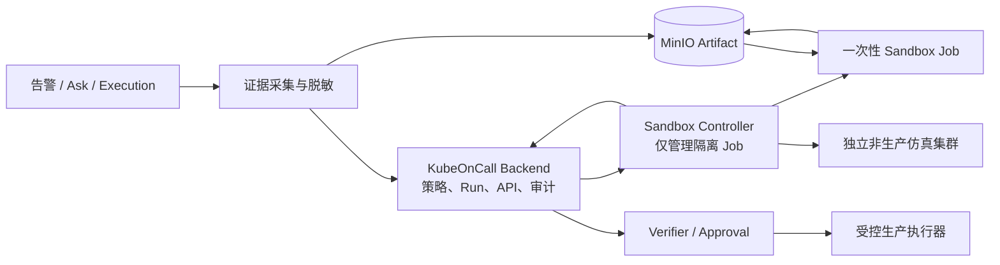

# KubeOnCall Sandbox 重构计划书

## 1. 文档信息

| 项目 | 当前值 |
| --- | --- |
| 文档版本 | 1.0 |
| 制定日期 | 2026-07-27 |
| 目标项目 | KubeOnCall |
| 实施状态 | IN_PROGRESS |
| 代码实现进度 | 8% |
| 自动化验证进度 | 8% |
| 真实环境验收进度 | 0%，按阶段单独记录 |
| 计划提交数 | 24 个，`SBX-00`～`SBX-23` |

本文用于指导 KubeOnCall 从零建设独立的 Sandbox 能力。KubeOnCall 与 AgentSpace Sandbox
保持完全解耦，只参考其异步生命周期、幂等、资源限制、默认拒绝网络和自动清理等设计经验，
不依赖 AgentSpace API、SDK、数据库或部署环境。

本计划的首要目标不是建设通用云开发环境，而是为 Kubernetes 运维 Agent 提供四类能力：

1. 在隔离环境执行固定诊断工具。
2. 在隔离环境执行 Agent 临时生成的 Python 或 Shell。
3. 在隔离环境校验 YAML、Helm、Patch 和 Runbook。
4. 在独立仿真环境验证修复方案。

## 2. 总体判断

KubeOnCall 当前通过固定 `ToolExecutor` 查询 Kubernetes、Prometheus 等外部系统，并由
Verifier、审批和权限控制生产变更。现有链路没有在 Backend 或 Worker 本机直接执行 Agent
生成代码，因此当前系统不存在“必须先有 Sandbox 才能运行”的阻塞。

但是，当产品目标从“分析和建议”升级为“Agent 主动编写诊断程序、验证修复并尝试解决问题”
后，Sandbox 应成为正式安全边界。其职责限定为：

- 隔离不可信代码、复杂工具链和高资源消耗任务。
- 把日志、指标、Events 和资源快照转换为结构化诊断证据。
- 在生产变更前验证配置、补丁和 Runbook。
- 在无生产凭据的仿真环境中验证修复方案。

Sandbox 不负责绕过 KubeOnCall 的生产执行策略。生产集群的重启、扩缩容和 Patch 仍必须由
现有受控执行器完成，并继续经过 RBAC、策略校验、审批、审计、执行后验证和回滚控制。

## 3. 当前可复用基础

以下能力已经存在，应直接复用，不重复建设：

| 现有能力 | 复用方式 |
| --- | --- |
| `koc_async_task` | 承载短时派发任务，不用于长时间阻塞轮询 Sandbox Job |
| Worker lease、heartbeat、fencing | 复用其并发与所有权模型，Sandbox Run 采用同类 fencing 约束 |
| MySQL/Flyway | 保存 Sandbox Run、Artifact 和生命周期事实 |
| MinIO | 保存输入证据包、脚本、输出、报告和受限日志 |
| Audit + Outbox | 记录创建、取消、状态变化、策略拒绝和清理失败 |
| requestId/traceId | 贯穿告警、Execution、Task、Sandbox Run 和审计 |
| SSE | 向 Console 推送 Sandbox Run 和关联 Execution 状态 |
| Verifier/Approval | 保持生产变更最终控制权 |
| Dependency Circuit Breaker | 保护 Backend 到 Sandbox Controller 的调用 |
| OpenAPI Client | 生成 Console 使用的 Sandbox API 类型 |

当前通用 `AsyncTaskWorker` 由定时任务同步调用，长时间等待 Kubernetes Job 会占用 Worker
执行线程。因此本计划只使用异步任务完成“派发”这类短操作；运行状态由独立
`SandboxRunReconciler` 通过短轮询、租约和 fencing 收敛。

## 4. 建设范围

### 4.1 本轮范围

- Sandbox Run 领域模型、状态机、权限、API 和审计。
- 独立 Sandbox Controller 服务。
- 一次性 Kubernetes Job 运行时。
- 输入输出 Artifact 与内容校验。
- 固定诊断工具目录。
- Agent 生成 Python/Shell 的隔离执行。
- YAML、Helm、Patch、Runbook 校验。
- 独立非生产集群中的修复方案仿真。
- Planner、Workflow、Verifier 与 Sandbox 的异步衔接。
- Console、指标、告警、部署和清理 Runbook。

### 4.2 明确不做

- 不接入或调用 AgentSpace Sandbox。
- 不提供 Web Terminal、SSH 或任意交互式终端。
- 不提供长期 Session、暂停/恢复、用户工作区或 IDE。
- 不建设快照市场、模板市场和通用镜像市场。
- 不允许调用方提交任意容器镜像。
- 不把生产 kubeconfig、云 AK/SK、数据库管理密码注入 Sandbox。
- 不允许 Sandbox 输出直接触发生产变更。
- 不把 Kubernetes namespace 隔离误写成完整的强多租户安全边界。
- 首轮不仿真节点宕机、真实流量、云盘、CNI、CSI 等集群底层故障。

## 5. 架构决策

### 5.1 组件边界

采用“Backend 控制面 + 独立 Controller + 一次性 Job + 可选仿真集群”：



组件职责：

- **KubeOnCall Backend**：认证、权限、策略、幂等、Artifact、Run 持久化、Agent 编排、
  审计和结果消费。
- **Sandbox Controller**：按 Run ID 幂等创建、查询、取消和清理 Kubernetes Job；不包含
  LLM、业务策略和生产修复逻辑。
- **Sandbox Job**：执行固定工具或受限代码；Job 完成后销毁，不保留会话。
- **Simulation Runtime**：连接独立非生产验证集群，创建临时 namespace，应用脱敏资源并
  执行健康检查。

### 5.2 Controller 技术选型

默认在仓库新增 `sandbox-controller/`，使用 Go 1.22、`client-go` 和标准 HTTP 服务实现。

选择原因：

- Controller 是轻量 Kubernetes 控制面，适合独立小镜像和独立 ServiceAccount。
- 避免给 KubeOnCall Backend 直接授予创建 Job、读取 Pod 日志的权限。
- 避免 Sandbox 运行故障扩大到主 JVM。
- 后续可以独立扩容、熔断和升级。

如果团队要求保持单语言，必须先新增 ADR 修改该决策，不应在实施中临时把 Kubernetes
Client 权限塞回 Backend。

### 5.3 数据流

1. KubeOnCall 采集日志、Events、指标和资源描述。
2. `DiagnosticEvidenceBuilder` 完成裁剪、脱敏、分类和哈希。
3. 证据、脚本和验证目标写入 `sandbox/{runId}/inputs/`。
4. Backend 创建 `SandboxRun` 与短时派发任务。
5. Controller 以 Run ID 幂等创建一次性 Job。
6. Job 读取指定 Artifact，执行后写入限定对象路径。
7. Backend Reconciler 收敛状态、校验输出大小与 SHA-256。
8. 结构化结果作为不可信证据交给 Verifier。
9. Verifier 重新检查真实集群状态，生成受控动作或进入人工审批。
10. Artifact TTL 与 Job TTL 分别清理，失败进入 `CLEANUP_FAILED` 告警。

## 6. 领域与契约

### 6.1 运行模式

| 模式 | 用途 | 默认审批 | 是否允许生产凭据 |
| --- | --- | ---: | ---: |
| `FIXED_DIAGNOSTIC` | 固定日志/配置诊断工具 | 否 | 否 |
| `GENERATED_CODE` | Agent 生成的 Python/Shell | 否，必须满足自动运行策略 | 否 |
| `MANIFEST_VALIDATION` | YAML/Helm/Patch/Runbook 校验 | 否 | 否 |
| `REMEDIATION_SIMULATION` | 独立仿真集群验证 | 按资源成本策略 | 否 |

调用方不能直接传入镜像地址。运行模式必须解析到服务端工具目录中的固定镜像 digest、
入口、输入 Schema、输出 Schema、资源上限和网络策略。

### 6.2 Run 状态

运行状态与清理状态分离，避免“任务成功但资源泄漏”被误报为完全成功。

`run_status`：

```text
PENDING -> DISPATCHING -> RUNNING -> COLLECTING
                                  -> SUCCEEDED
                                  -> FAILED
                                  -> TIMED_OUT
                                  -> CANCELLED
```

`cleanup_status`：

```text
NOT_REQUIRED -> PENDING -> RUNNING -> SUCCEEDED
                                   -> FAILED
```

规则：

- 每次状态更新都校验 `version` 或 `owner_token + fencing_token`。
- 终态不能被过期 Controller 回调覆盖。
- Run 成功不等于清理成功。
- `CANCELLED` 只表示业务取消已接受，仍需完成资源清理。
- Controller 不可达时保持可恢复状态，不伪造 `FAILED`。

### 6.3 持久化模型

新增下一可用版本的增量 Flyway Migration：

`koc_sandbox_run`：

- `public_id`
- `execution_public_id`
- `alarm_public_id`
- `mode`
- `tool_id`
- `tool_version`
- `runtime_image_digest`
- `run_status`
- `cleanup_status`
- `stage`
- `progress`
- `risk_level`
- `requested_by`
- `request_json`
- `result_json`
- `error_code`
- `error_summary`
- `controller_run_id`
- `owner_token`
- `lease_until`
- `fencing_token`
- `attempt`
- `max_attempts`
- `expires_at`
- `request_id`
- `trace_id`
- `version`
- `started_at`
- `finished_at`
- `created_at`
- `updated_at`

`koc_sandbox_artifact`：

- `public_id`
- `sandbox_run_id`
- `artifact_type`
- `bucket`
- `object_key`
- `content_type`
- `size_bytes`
- `sha256`
- `classification`
- `retention_until`
- `created_at`

正文、脚本、完整日志和大结果不得写入 MySQL JSON 字段。数据库只保存摘要、引用和校验值。

### 6.4 外部 API

新增：

- `POST /api/v1/sandbox-runs`
- `GET /api/v1/sandbox-runs`
- `GET /api/v1/sandbox-runs/{runId}`
- `POST /api/v1/sandbox-runs/{runId}/cancel`
- `GET /api/v1/sandbox-runs/{runId}/artifacts`

约束：

- 创建接口要求 `Idempotency-Key`。
- 列表支持 `mode/status/executionId/alarmId/createdFrom/createdTo`。
- 默认响应不返回脚本正文、预签名地址和完整原始日志。
- Artifact 下载使用短时、单对象授权。
- 取消使用 CAS；终态重复取消返回当前状态。
- Console 只通过生成的 OpenAPI Client 调用。

Controller 内部 API：

- `POST /internal/v1/runs`
- `GET /internal/v1/runs/{runId}`
- `DELETE /internal/v1/runs/{runId}`
- `GET /internal/v1/runs/{runId}/logs`

内部接口使用独立 Service 身份、请求签名、时间戳和重放窗口；同时通过 NetworkPolicy
限制只允许 KubeOnCall Backend 访问。

### 6.5 权限

新增稳定权限码：

- `sandbox:read`
- `sandbox:execute`
- `sandbox:cancel`
- `sandbox:manage`

建议默认角色：

| 角色 | 权限 |
| --- | --- |
| Viewer | `sandbox:read` |
| Operator | `sandbox:read/execute/cancel` |
| Admin | 全部 Sandbox 权限 |
| System actor | 只允许策略批准的自动诊断，不继承 Admin |

Agent 自动创建 Run 必须携带原始用户或系统 actor、关联告警/Execution 和 requestId，不允许
使用模糊的“system=admin”绕过权限与审计。

## 7. 安全基线

### 7.1 Job 安全约束

每个 Sandbox Job 必须满足：

- 独立 `kubeoncall-sandbox` namespace。
- `automountServiceAccountToken: false`。
- `runAsNonRoot: true`。
- `allowPrivilegeEscalation: false`。
- `readOnlyRootFilesystem: true`。
- `seccompProfile.type: RuntimeDefault`。
- `capabilities.drop: ["ALL"]`。
- 禁止 privileged、hostPath、hostNetwork、hostPID、hostIPC。
- 只允许固定 digest 镜像，禁止 tag 和 `latest`。
- CPU、内存、临时磁盘、PID 和最大运行时间均有硬限制。
- 使用带 `sizeLimit` 的 `emptyDir` 作为临时目录。
- 默认拒绝外网，只开放 DNS 和受限 Artifact 通道。
- 不挂载 Backend Secret、生产 kubeconfig 和 Docker Socket。
- Job、Pod 和 Artifact 均带 Run ID、过期时间和数据分类标签。

建议首版默认值：

| 限制 | 默认值 |
| --- | ---: |
| 单 Run CPU | 1 core |
| 单 Run 内存 | 1 GiB |
| 临时存储 | 2 GiB |
| 默认超时 | 5 分钟 |
| 最大超时 | 15 分钟 |
| 输入总量 | 50 MiB |
| 输出总量 | 10 MiB |
| 展示日志 | 2 MiB |
| 生成脚本 | 256 KiB |
| Artifact TTL | 24 小时 |
| 单告警并发 Run | 1 |
| 全局初始并发 | 4 |

所有值必须可配置，但生产配置不得超过服务端硬上限。

### 7.2 数据与提示注入防护

- 不采集 Kubernetes Secret 的 `data/stringData`。
- 对 Token、Cookie、Authorization、私钥和常见 AK/SK 进行二次脱敏。
- 日志和 Sandbox 输出统一标记为“不可信证据”，不能被当成系统指令。
- Sandbox 输出中的命令字符串不能直接进入生产执行器。
- 结构化修复建议必须重新经过 Schema、目标范围和权限校验。
- Agent 在执行生产动作前必须重新查询当前集群状态，不能只依据 Sandbox 快照。

### 7.3 仿真边界

- 默认使用独立非生产 Kubernetes 集群。
- 每个 Run 创建独立临时 namespace。
- 只复制脱敏后的 Deployment、Service、ConfigMap 等必要资源。
- Secret 使用占位值或测试凭据，不复制生产 Secret。
- 不访问生产数据库、消息队列和云账号。
- 仿真结果只能证明语法、依赖、启动和健康检查成立，不能证明生产流量下必然恢复。

## 8. 提交与回滚规则

### 8.1 固定规则

1. 建议在独立分支 `codex/sandbox-refactor` 实施。
2. 严格按 `SBX-00`～`SBX-23` 顺序执行。
3. 一个提交只完成一个计划单元，不混入无关格式化、依赖升级或历史清理。
4. 每个实现提交同时包含该能力的单元测试或契约测试。
5. 每个提交完成测试后，将本计划对应状态改为 `COMPLETED`，与代码一起提交。
6. Commit subject 必须包含对应编号，例如：
   `feat(sandbox): add run policy contracts [SBX-03]`。
7. 已推送的提交不 amend；修正使用新的、明确编号的补充提交，并回写计划原因。
8. 不使用 squash 合并，否则失去逐提交回滚能力。
9. Flyway 只做向前兼容的增量变更；代码回滚时允许新增空表和列继续存在。
10. 功能开关默认关闭，直到该能力所在阶段通过完整质量门。
11. 不自动 push。只有用户明确要求后才推送远端。

### 8.2 单提交完成标准

每个提交必须同时满足：

- 暂存区只包含该 SBX 单元允许的文件。
- 新增接口有权限与错误契约。
- 新增持久化写入有幂等、CAS 或 fencing。
- 新增外部调用有超时、最大响应、重试语义和断路器。
- 日志不包含脚本正文、预签名 URL、Token 或原始 Secret。
- 相关单测通过。
- `git diff --cached --check` 通过。
- 计划状态与实现状态一致。

阶段结束额外执行：

```bash
make test
cd backend && ./mvnw --batch-mode --no-transfer-progress verify -Pintegration-test
cd sandbox-controller && go test ./... && go vet ./...
cd frontend && npm run typecheck && npm run lint && npm run test && npm run build
docker compose config --quiet
helm lint deploy/helm/kubeoncall
```

尚未创建的组件命令从对应 Scaffold 提交开始执行。

### 8.3 回滚原则

- 单提交回滚使用 `git revert <commit>`，不使用 `reset --hard`。
- 有依赖的提交按编号逆序回滚。
- 先关闭 `agent-auto-route`，再关闭单项 Sandbox 能力，最后关闭总开关。
- Controller 回滚不得删除仍在运行的 Job；先停止新建，等待或显式取消后再降级。
- 数据库 Migration 不执行在线 down；保留新增表，应用代码回退。
- Artifact 清理采用 TTL/Janitor，回滚时不批量删除无法确认归属的对象。

## 9. Commit 级实施计划

状态定义：`READY` 表示可以开始；`PLANNED` 表示等待前置提交；`IN_PROGRESS`、
`VALIDATING`、`COMPLETED`、`BLOCKED`、`DEFERRED` 用于后续实施记录。

| 编号 | 预期 Commit | 交付结果 | 状态 |
| --- | --- | --- | --- |
| SBX-00 | `docs(sandbox): define isolated diagnosis refactor plan` | 冻结范围、边界与提交顺序 | COMPLETED |
| SBX-01 | `feat(sandbox): add feature flags and limits` | 默认关闭的配置与能力发现 | COMPLETED |
| SBX-02 | `feat(identity): add sandbox permissions` | Sandbox 权限和角色映射 | COMPLETED |
| SBX-03 | `feat(sandbox): add run policy contracts` | 领域类型、状态机和策略契约 | PLANNED |
| SBX-04 | `feat(sandbox): persist runs and artifacts` | MySQL 事实表与 Repository | PLANNED |
| SBX-05 | `feat(sandbox): add artifact storage boundary` | MinIO Artifact 隔离与校验 | PLANNED |
| SBX-06 | `feat(api): add sandbox run lifecycle endpoints` | 创建、查询、取消 API 与审计 | PLANNED |
| SBX-07 | `feat(sandbox-controller): scaffold internal service` | 独立 Controller 基座 | PLANNED |
| SBX-08 | `feat(sandbox-controller): build hardened jobs` | 安全 JobSpec 生成器 | PLANNED |
| SBX-09 | `feat(sandbox-controller): manage job lifecycle` | 幂等创建、查询和取消 | PLANNED |
| SBX-10 | `feat(sandbox-controller): collect results and cleanup` | 结果收集、超时和 TTL 清理 | PLANNED |
| SBX-11 | `feat(deploy): isolate sandbox runtime` | Namespace、RBAC、Quota、NetworkPolicy | PLANNED |
| SBX-12 | `feat(sandbox): dispatch runs through controller` | Backend Client、短时派发和断路器 | PLANNED |
| SBX-13 | `feat(sandbox): reconcile run convergence` | 多实例安全的状态收敛与清理重试 | PLANNED |
| SBX-14 | `feat(sandbox): build diagnostic evidence packages` | 证据采集、裁剪、脱敏和哈希 | PLANNED |
| SBX-15 | `feat(sandbox): add fixed diagnostic tools` | 固定工具目录与首批工具 | PLANNED |
| SBX-16 | `feat(sandbox): isolate generated code execution` | Python/Shell 受限执行 | PLANNED |
| SBX-17 | `feat(sandbox): validate manifests and runbooks` | YAML、Helm、Patch、Runbook 校验 | PLANNED |
| SBX-18 | `feat(sandbox): simulate remediation plans` | 独立仿真集群验证 | PLANNED |
| SBX-19 | `feat(agent): route diagnostics through sandbox` | Planner/Executor 异步路由 | PLANNED |
| SBX-20 | `feat(verifier): gate remediation with sandbox evidence` | 恢复工作流与生产动作硬边界 | PLANNED |
| SBX-21 | `feat(console): add sandbox run operations` | Run 列表、详情、Artifact 和取消 | PLANNED |
| SBX-22 | `feat(observability): monitor sandbox operations` | 指标、Dashboard 和告警 | PLANNED |
| SBX-23 | `build(sandbox): close ci security and operations gates` | CI、安全契约、部署和运行手册 | PLANNED |

### SBX-00：冻结计划

改动：

- 只提交本计划书。
- 确认 KubeOnCall 与 AgentSpace 完全解耦。
- 冻结“无生产凭据、无任意镜像、无直接生产动作”三条红线。

验证：

- Markdown 结构完整。
- `git diff --check` 通过。

回滚：

- 仅回滚文档，不影响运行系统。

### SBX-01：配置与功能开关

改动：

- 在 `KubeOnCallProperties` 增加 `sandbox` 配置组。
- 增加总开关和四个模式开关：
  `enabled/fixed-diagnostic/generated-code/manifest-validation/remediation-simulation`。
- 增加 `agent-auto-route-enabled` 独立开关。
- 增加硬上限、Controller endpoint、超时和保留期配置。
- `/api/v1/capabilities` 回显部署能力和限制，不回显 Secret。
- 默认全部关闭，现有行为不变。

验证：

- 配置绑定、默认值、非法上限和 Capabilities 契约测试。
- 关闭 Sandbox 时 Spring Context 与现有测试不受影响。

完成记录：

- 新增 `SandboxProperties`：总开关与四模式开关、`agent-auto-route-enabled`、
  Controller endpoint/超时/最大响应、硬上限（超时 5/15 分钟、输入 50MiB、输出 10MiB、
  日志 2MiB、脚本 256KiB、Artifact 保留 24h、单告警并发 1、全局并发 4），CPU/内存/临时存储
  以 Kubernetes 量纲字符串保存，跨资源上限校验留待 SBX-08 JobSpec Builder。
- `KubeOnCallProperties.Sandbox` 组合复用，`application.yml` 增 `sandbox:` 配置块，
  全部经 `KUBEONCALL_SANDBOX_*` 环境变量覆盖，默认全关。
- `CapabilitiesService` 在 `features.sandbox` 回显总开关与四模式开关及自动路由标志；
  总开关开启时在 `limits.sandbox` 回显校验后的限制；Controller endpoint 与 Secret 永不回显。
- `CapabilitiesService` 构造期在总开关开启时调用 `SandboxProperties.validate()` 快速失败，
  收集全部越限字段而非静默裁剪。
- 测试：`KubeOnCallPropertiesTest` 增 6 例（默认全关、绑定覆盖、非法超时上限、非法
  max-timeout 上限、输出/脚本/并发/保留期越限、默认值通过校验）；新增 `CapabilitiesServiceTest`
  3 例（默认回显能力不含敏感字段、启用时回显能力与限制、Controller endpoint 与 Secret 不泄漏）。
- 关闭 Sandbox 时 `KubeOnCallApplicationTests.contextLoads` 与 `V1ApiContractTest` 通过；
  既有失败（`ApiTokensControllerTest`、`LegacyApiDeprecationWebTest`）在父提交已存在，与本单元无关。

Codex 审核补充（提交 `7712ccb` 后审核，补丁提交 `[SBX-01-fix]`、`[SBX-01-fix2]`、`[SBX-01-fix3]`）：

- CPU/内存/临时存储原先仅校验非空，`cpu=2`、`memory=2Gi`、`cpu=banana` 可越过 §7.1 硬上限
  通过启动校验并被回显为已校验限制。新增 Kubernetes 量纲解析（CPU millicores、字节
  二进制/十进制后缀），在 `validate()` 中对 CPU≤1 核、内存≤1Gi、临时存储≤2Gi 强校验，
  越限或畸形（负值、未知后缀）一律收集为违规字段；SBX-08 JobSpec Builder 仍二次校验。
- Controller 调用超时/最大响应原先未校验，零/负超时或无界响应可在总开关开启时启动成功。
  新增 `controllerConnectTimeoutMillis`≤30s、`controllerReadTimeoutMillis`≤60s、
  `controllerMaxResponseBytes`≤16MiB 的硬上限与正数校验。
- 第二轮审核指出解析精度与语法问题：`double`+`Math.round` 会让略超上限的小数向下取整越过
  上限（如 `1.0001` 核），`Double.parseDouble` 接受 `0x1.0p0`/`1f` 等 Kubernetes 不接受的
  Java 数值形式，且校验 trim 但未归一存储。改为 `BigDecimal` 精确运算 + `longValueExact()`
  （非整单位小数一律拒绝而非取整），显式 Kubernetes 十进制语法（拒绝 Java-only 形式），
  并在 `validate()` 中将 CPU/内存/临时存储归一为 trim 后的规范值，避免回显被 K8s 拒绝的串。
- 第三轮审核指出 millicores 分支（`m` 后缀）未走 `QUANTITY_MANTISSA` 语法校验，`1e3m` 会因
  `BigDecimal` 接受指数而被当作 1000 millicores 通过，但 Kubernetes 不允许指数与 `m` 后缀并存。
  补丁对该分支的尾数同样强制 Kubernetes 兼容十进制语法；新增 `1e3m` 拒绝回归测试。
- 测试新增 9 例：K8s 量纲越限、畸形量纲、边界与交替形式（`1000m`/`1024Mi`/`2048Mi`）、
  Controller 调用限制越限、整数单位刚好越上限（`1001m`/`1073741825`）、非整单位小数拒绝、
  Java-only 数值形式拒绝、millicores 指数拒绝、空格归一。`KubeOnCallPropertiesTest` 共 17 例全通过。

回滚：

- 直接 revert；无数据影响。

### SBX-02：权限与角色

改动：

- 增加四个 `PermissionCode`。
- 在下一 Flyway 版本增量写入权限及内置角色映射。
- 扩展 API Token scope 校验和前端权限常量。
- `TaskPermissionPolicy` 识别 Sandbox 任务。

验证：

- Viewer 只能读，Operator 可执行/取消，Admin 可管理。
- 被撤销角色和 Token scope 立即失效。

完成记录：

- `PermissionCode` 增 `sandbox:read/execute/cancel/manage` 四个稳定权限码。
- 新增 `V15__sandbox_permissions.sql`：向前兼容增量插入四条权限，并按 §6.5 映射内置角色
  —— Viewer 仅 `sandbox:read`，Operator `sandbox:read/execute/cancel`，Admin 全部四项；
  无 down 迁移、不触碰既有行。
- API Token scope 校验无需改动：`ApiTokensController.normalizeScopes` 已用
  `actor.hasPermission(scope)` 校验，`ApiTokenAuthenticationService` 取 token scope 与
  owner 当前权限的交集，因此新增权限随 owner 角色自动生效，撤销角色或 scope 立即失效。
- `TaskPermissionPolicy` 识别 Sandbox 任务（资源含 `sandbox` 或任务以 `SANDBOX_` 开头）→
  要求 `sandbox:execute`；取消由 Run 生命周期 API（SBX-06）单独强制。
- 前端 `permissions.ts` 增四个常量；`npm run typecheck` 通过。
- 测试：`TaskPermissionPolicyTest` 增 1 例（Sandbox 任务映射 `sandbox:execute`）；
  `IdentityMySqlIT` 增 1 例（真实 MySQL 容器验证四权限 seeded 且角色映射符合 §6.5），
  Failsafe 通过，V15 迁移成功应用至 v15。

Codex 审核补充（提交 `42c469e` 后审核，补丁提交 `[SBX-02-fix]`）：

- `V1AuthenticationFilter.legacyPermissions()` 未同步四项 sandbox 权限，而 legacy-token
  兼容默认开启，配置的 Viewer/Operator/Admin token 会绕过 §6.5 矩阵。按映射补齐：Viewer
  `sandbox:read`，Operator `sandbox:read/execute/cancel`，Admin 全部四项。
- `TaskPermissionPolicy` 顺序 bug：sandbox 识别排在 skill/knowledge/memory 之后，资源名同时
  含两者的任务（如 `sandbox_skill`）会被降级为 `skill:read`，Viewer 即可越权读取任务/SSE。
  将 sandbox 分类提前到只读域之前，确保 `sandbox:*` 资源恒映射 `sandbox:execute`。
- 测试新增 3 个文件/用例：`V1AuthenticationFilterSandboxPermissionsTest`（3 例验证 legacy
  三角色 §6.5 sandbox 权限）、`ApiTokenAuthenticationServiceSandboxTest`（3 例验证 scope 交集、
  角色撤销后下一请求立即失效、已撤销 token 永不认证）、`TaskPermissionPolicyTest` 增 1 例
  （混合信号资源仍映射 `sandbox:execute` 且非 sandbox 任务不受影响）。

回滚：

- 代码可 revert；数据库中的新增权限保留但不再被应用引用。

### SBX-03：领域与策略契约

改动：

- 新增 `sandbox/domain`、`sandbox/policy`。
- 定义 Run Mode、Run Status、Cleanup Status、Artifact Type、Classification。
- 实现显式状态迁移表，禁止终态倒退。
- 定义 `SandboxToolSpec`、`SandboxResourceLimits`、`SandboxExecutionPolicy`。
- 拒绝任意镜像、超限资源、生产凭据引用和未知工具。

验证：

- 状态机全组合测试。
- 工具 digest、资源上下限、模式开关和风险策略测试。

回滚：

- 纯领域代码，可独立 revert。

### SBX-04：Run 与 Artifact 持久化

改动：

- 新增 `koc_sandbox_run`、`koc_sandbox_artifact`。
- 实现 Repository、分页查询、CAS 更新、租约 claim、heartbeat 和 fencing。
- 创建 Run、Artifact 元数据和短时派发任务保持同事务。
- 添加 `(mode, idempotency_key)` 或等价稳定去重约束。

验证：

- Repository 单测和 MySQL Testcontainers 集成测试。
- 并发 claim、过期 lease reclaim、旧 owner 写拒绝和重复创建测试。

回滚：

- revert Repository；新增表保留。

### SBX-05：Artifact 存储边界

改动：

- 新增独立 `SandboxArtifactStore`，不复用带知识库语义的方法名。
- 固定对象前缀 `sandbox/{runId}/{inputs|outputs|logs|reports}/`。
- 支持流式写入、最大字节数、SHA-256、MIME allowlist 和单对象短时授权。
- 增加结果读取上限、临时 URL 脱敏和 Janitor 查询能力。

验证：

- 对象 key 穿越、超限、哈希不一致、MIME 拒绝和删除幂等测试。
- MinIO 集成测试沿用现有 Testcontainers/真实依赖分层。

回滚：

- 关闭 Sandbox 后 revert；已写对象由 TTL Janitor 清理。

### SBX-06：Run API、审计与事件

改动：

- 实现创建、列表、详情、取消和 Artifact 元数据 API。
- 创建要求 `Idempotency-Key`，取消要求 version/CAS。
- 加入权限、统一错误码、OpenAPI 和生成 Client。
- 状态变化写 Audit + Outbox，SSE 复用现有事件通道。
- API 只创建 Run，不在请求线程调用 Controller。

验证：

- Controller 契约测试、权限矩阵、幂等、并发取消和敏感字段不返回测试。
- OpenAPI 与生成 Client 无差异。

回滚：

- 关闭总开关后 revert API；表和 Artifact 保留。

### SBX-07：Controller 服务基座

改动：

- 新增 `sandbox-controller/` Go module、配置、健康检查和 Dockerfile。
- 提供内部 API 契约、统一错误和 requestId。
- 实现 Backend 身份校验、时间戳、签名与重放窗口。
- 增加优雅关闭、请求大小、并发和超时限制。

验证：

- `go test ./...`、`go vet ./...`。
- 未签名、过期签名、重复 nonce、超大请求和关闭中的请求测试。

回滚：

- 独立目录可 revert，不影响 Backend。

### SBX-08：安全 JobSpec

改动：

- 实现纯函数式 JobSpec Builder。
- 固化 namespace、digest allowlist、资源上限、SecurityContext、TTL 和标签。
- 禁止 hostPath、hostNetwork、privileged、ServiceAccount Token 和任意 env Secret。
- 输入脚本通过 Artifact 传递，不拼接到 shell command。

验证：

- Golden/结构测试覆盖全部安全字段。
- 恶意镜像、命令、env、volume、标签和值超限全部拒绝。

回滚：

- revert Builder；Controller 仍只有健康检查。

### SBX-09：Kubernetes Job 生命周期

改动：

- 按 Run ID 幂等创建 Job。
- 查询 Pod/Job 状态并归一化。
- 支持取消、超时、已存在重放和 Controller 重启恢复。
- 使用 label 和 annotation 绑定 Run ID、工具版本和过期时间。

验证：

- Fake Client 单测。
- create 重放、cancel 重放、终态查询、冲突对象和未知对象测试。

回滚：

- 先关闭 Controller 创建入口，再 revert；不主动删除无法确认归属的 Job。

### SBX-10：结果、日志和清理

改动：

- 收集退出码、终止原因、受限日志和输出 Artifact 引用。
- 区分 OOM、Deadline、ImagePull、PolicyDenied、ToolFailure。
- 增加 Job TTL、孤儿 Job Janitor 和清理失败重试。
- 日志裁剪并过滤 URL、Token 和 Secret。

验证：

- 各终止原因映射测试。
- 超长日志、缺失输出、输出校验失败和孤儿清理测试。

回滚：

- 保留 Job TTL，revert 结果增强；不得关闭已部署的基础 TTL。

### SBX-11：部署隔离

改动：

- Helm 增加可选 Sandbox Controller Deployment/Service。
- 增加独立 namespace、ServiceAccount、最小 RBAC、ResourceQuota、LimitRange。
- 增加 Backend→Controller 和 Sandbox Job 网络策略。
- Secret 只注入 Controller 身份，不注入 Job。
- Compose 仅提供 Mock/开发 Controller，不把 Docker Socket 挂给 Backend。

验证：

- `helm lint`、`helm template`、Schema/快照测试。
- RBAC 规则不允许跨 namespace，不允许读取 Secret。
- `docker compose config --quiet`。

回滚：

- values 关闭 Controller；保留 namespace 中仍需清理的 Run 资源。

### SBX-12：Backend 派发

改动：

- 新增 `SandboxControllerClient`。
- 使用短时 `SANDBOX_DISPATCH` Task 调用 Controller 后立即返回。
- Controller 调用设置连接/读取超时、最大响应、重试预算和断路器。
- 请求以 Run ID 幂等，重试不创建第二个 Job。

验证：

- 成功、超时、断路器打开、重复派发、非重试错误和敏感日志测试。
- AsyncTask handler 不长时间轮询。

回滚：

- 关闭总开关并 revert Client/Handler；已派发 Run 由 Controller TTL 处理。

### SBX-13：状态收敛

改动：

- 新增 `SandboxRunReconciler`，短轮询非终态 Run。
- 使用 run-level lease、heartbeat 和 fencing 支持多 Backend 实例。
- 收敛 Controller 状态、Artifact 状态和 cleanup 状态。
- Controller 不可达时保留可恢复状态并退避，不伪造成功或失败。
- 取消和超时优先于迟到成功结果。

验证：

- 多实例 claim、lease 丢失、迟到响应、Controller 重启、重复终态和清理重试测试。

回滚：

- 停止新建，等待非终态 Run 或显式取消，再 revert Reconciler。

### SBX-14：诊断证据包

改动：

- 新增 `DiagnosticEvidenceBuilder`。
- 统一打包日志、Events、Pod/Deployment 描述、指标窗口和脱敏资源 YAML。
- 限制时间窗口、容器数、日志行数、对象总量和单字段长度。
- 移除 Secret data、ServiceAccount Token、Authorization 和私钥。
- 保存来源、采集时间、requestId、内容哈希和数据分类。

验证：

- Secret、Token、私钥、超大日志、二进制内容和重复证据测试。
- 证据顺序与哈希稳定。

回滚：

- revert Builder；不影响现有日志查询工具。

### SBX-15：固定诊断工具

改动：

- 新增版本化工具目录，例如 `sandbox-tools/*.yaml`。
- ToolSpec 固定 image digest、entrypoint、Schema、资源和网络。
- 首批提供日志模式分析、Kubernetes 资源一致性检查和配置差异分析。
- 输出统一为 `diagnosis.json`，包含发现、证据引用、置信度和建议，不包含可直接执行命令。

验证：

- 工具目录 Schema、重复 ID、digest、输入输出契约测试。
- 固定样例回归，结果可重放。

回滚：

- 关闭 `fixed-diagnostic` 开关并 revert 工具目录。

### SBX-16：Agent 生成代码

改动：

- 支持 `python3` 和受限 POSIX shell 两种固定 runtime。
- 代码作为 Artifact 保存并记录模型、prompt 版本、SHA-256 和生成原因。
- 运行容器无生产凭据、无 ServiceAccount Token、默认无外网。
- 强制超时、输出路径、最大进程数和结构化结果 Schema。
- 静态检查只作为提前拒绝，不作为主要安全边界。

验证：

- 无限循环、fork bomb 特征、超内存、超输出、路径穿越、网络尝试和异常退出测试。
- 确认代码永不在 Backend/Worker 进程执行。

回滚：

- 单独关闭 `generated-code`，固定工具仍可工作。

### SBX-17：YAML、Helm、Patch、Runbook 校验

改动：

- 提供 YAML 解析、Kubernetes Schema、kubeconform、Helm template、Conftest/OPA 校验。
- JSON Patch/Strategic Merge Patch 先应用到快照，再输出差异。
- Runbook 校验步骤、工具引用、参数 Schema、危险动作和回滚段落。
- 校验工具版本与规则集版本写入结果。

验证：

- 合法/非法 YAML、未知 CRD、Helm 渲染失败、策略拒绝、危险 Runbook 和差异快照测试。

回滚：

- 关闭 `manifest-validation`；不影响固定诊断和生成代码。

### SBX-18：修复方案仿真

改动：

- 抽象 `SimulationRuntime`，默认连接独立非生产验证集群。
- 每个 Run 创建临时 namespace 和受限 ServiceAccount。
- 应用脱敏资源、测试 ConfigMap/Secret 占位和最小依赖。
- 执行 readiness、startup、资源状态和预期恢复信号检查。
- 无论成功失败都进入 namespace 清理流程。

验证：

- Fake Runtime 单测和可选 Kind/K3s 集成测试。
- namespace 冲突、配额不足、启动失败、超时和清理失败测试。

回滚：

- 先关闭 `remediation-simulation` 并清理临时 namespace，再 revert。

### SBX-19：Agent 路由

改动：

- 新增明确任务类型，不复用当前设备侧 `EXECUTE_SCRIPT` 语义。
- Planner 只在证据不足且工具匹配时选择 Sandbox。
- Executor 创建 Sandbox Run 后挂起当前 Workflow，不同步等待。
- 防止相同告警循环创建 Run；受 `max-loops`、并发和预算限制。
- 普通日志查询和 Prometheus 查询继续走现有只读工具。

验证：

- 不需要 Sandbox 的请求不被错误路由。
- 固定诊断、生成代码、Manifest 校验和仿真选择测试。
- 同一告警去重与循环上限测试。

回滚：

- 关闭 `agent-auto-route-enabled`，独立 Sandbox API 仍可使用。

### SBX-20：Workflow 恢复与生产动作硬边界

改动：

- Sandbox Run 终态通过 Outbox 恢复关联 Workflow。
- Verifier 将结果视为不可信证据，重新查询当前生产状态。
- Sandbox 输出转换为结构化 Remediation Proposal，不直接执行命令。
- 生产 restart/scale/patch 仍走原有 ToolExecutor、审批和审计。
- 加入执行前置条件、成功信号、停止条件和回滚建议。

验证：

- Sandbox 成功/失败/超时/取消后的 Workflow 恢复测试。
- 提示注入、伪造工具结果、越权目标和输出命令直通均被拒绝。
- 中高风险生产动作仍要求审批。

回滚：

- 关闭 Agent 自动路由；恢复现有 Planner→Executor→Verifier 行为。

### SBX-21：Console

改动：

- 新增 Sandbox Run 列表和详情页。
- 展示模式、状态、进度、关联告警/Execution、工具版本、资源用量和清理状态。
- 提供取消、受限日志和 Artifact 下载。
- 权限控制与 SSE/轮询降级复用现有框架。
- 不提供任意脚本编辑器、Terminal 和任意镜像输入。

验证：

- TypeScript、Vitest、权限矩阵和 Mock API E2E。
- 页面不持久化预签名 URL，不展示被脱敏字段。

回滚：

- 移除路由和菜单；Backend API 不受影响。

### SBX-22：可观测性

改动：

- 增加 Run 创建、排队、运行、成功、失败、超时、取消和清理指标。
- 增加按 mode/tool/error 的时延和结果分布。
- 增加 Controller 调用、Job 调度、ImagePull、OOM、PolicyDenied 和 Artifact 指标。
- Grafana 增加 Sandbox 运营 Dashboard。
- Prometheus 增加积压、失败率、清理泄漏、Controller 不可用和超时告警。

验证：

- Micrometer 指标测试、规则语法测试和 Dashboard JSON 契约测试。
- 指标标签禁止 runId、alarmId 等高基数字段。

回滚：

- 可独立 revert Dashboard/规则；不影响运行事实。

### SBX-23：CI、安全与运维收口

改动：

- CI 增加 Controller test/vet/build、镜像扫描和 SBOM。
- 增加 JobSpec 安全契约、Controller API fuzz、Artifact 边界和提示注入回归。
- 补充 Helm values、安装、升级、关闭、回滚、泄漏清理和故障处理 Runbook。
- 增加独立开关的 `00/10/01/11` 组合测试。
- 输出代码验收清单与真实集群验收清单，二者分开标记。

验证：

- Backend、Controller、Frontend、OpenAPI、Helm、Compose、扫描和 SBOM 全部通过。
- 默认关闭 Sandbox 时原部署行为不变。
- 开关降级不丢 Run 事实，不绕过生产审批。

回滚：

- 按 `SBX-23` → `SBX-01` 逆序回滚，Migration 保留。

## 10. 分阶段退出条件

| 阶段 | Commit | 代码退出条件 | 真实环境退出条件 |
| --- | --- | --- | --- |
| A：控制面事实 | SBX-00～06 | Run/API/权限/Artifact 单测与 MySQL IT 通过 | 无 |
| B：隔离运行时 | SBX-07～13 | Controller、JobSpec、派发和收敛测试通过 | 测试集群 Job 生命周期与 NetworkPolicy |
| C：诊断能力 | SBX-14～17 | 四类输入输出契约和恶意样例通过 | 固定工具与生成代码真实 Job |
| D：仿真与 Agent | SBX-18～20 | 仿真 adapter、挂起恢复、Verifier 门禁通过 | 独立仿真集群与一次受控生产审批链路 |
| E：交付 | SBX-21～23 | Console、指标、CI、安全和文档通过 | Dashboard、告警、清理和容量演练 |

某阶段的代码完成不能代替真实环境验收；真实环境暂未执行时应标记为
`VALIDATING` 或“代码完成、环境待验收”，不得标记为生产完整交付。

## 11. 最终业务验收

### 11.1 固定诊断工具

- [ ] 告警触发后能生成脱敏证据包。
- [ ] 固定工具在一次性 Job 内执行。
- [ ] Backend/Worker 不加载工具依赖、不执行工具进程。
- [ ] 输出可以定位到原始证据。
- [ ] 超时、OOM、失败和取消均有明确状态。

### 11.2 Agent 生成 Python/Shell

- [ ] Agent 代码只进入 Artifact，不进入 Backend command line。
- [ ] Job 无生产凭据、无 ServiceAccount Token。
- [ ] 网络、CPU、内存、磁盘、PID、时间和输出均有限制。
- [ ] 恶意或失控代码不会影响 Backend/Worker。
- [ ] 结果不能直接触发生产命令。

### 11.3 YAML、Helm、Patch、Runbook

- [ ] 返回语法、Schema、策略和差异四类结果。
- [ ] 记录校验工具与规则版本。
- [ ] 未知 CRD 和缺少依赖时明确降级，不伪造通过。
- [ ] 危险 Runbook 必须指出审批和回滚缺口。

### 11.4 修复仿真

- [ ] 使用独立非生产集群和临时 namespace。
- [ ] 不复制生产 Secret。
- [ ] 能验证资源应用、启动、健康和预期恢复信号。
- [ ] 成功失败后均能清理。
- [ ] 仿真通过不会自动绕过生产审批。

### 11.5 全链路

- [ ] `alarmId → executionId → sandboxRunId → taskId → auditId → requestId` 可关联。
- [ ] 同一告警不会无限创建 Sandbox Run。
- [ ] Controller 故障不拖垮主告警链路。
- [ ] Sandbox 关闭后回退到现有只读诊断和人工建议。
- [ ] 生产动作始终由受控 ToolExecutor 执行。

## 12. 风险与应对

| 风险 | 应对 |
| --- | --- |
| 把容器隔离误认为生产权限隔离 | Sandbox 永不持有生产写凭据，生产动作走独立受控执行器 |
| Agent 输出被日志提示注入 | 输入输出标记不可信，结构化 Schema + Verifier 二次校验 |
| 长任务占用现有 Worker | 派发任务短执行，Run Reconciler 独立收敛 |
| Controller 重试创建重复 Job | Run ID 幂等、Kubernetes label、CAS 和 fencing |
| Job 或 namespace 泄漏 | TTL + Janitor + cleanup 独立状态 + 告警 |
| MinIO URL 或原始日志泄漏 | 单对象短授权、日志脱敏、大小限制、默认不返回 URL |
| 工具镜像供应链风险 | digest 固定、allowlist、镜像扫描和 SBOM |
| 仿真环境与生产差异 | 明确结果边界，生产执行前重新查询真实状态 |
| Sandbox 能力拖累主链路 | 全局及分模式开关、断路器、超时和降级 |

## 13. 当前停止点

SBX-02 已完成：`PermissionCode` 增四个 sandbox 权限码，`V15__sandbox_permissions.sql`
向前兼容增量写入权限与内置角色映射（Viewer 只读、Operator 读/执行/取消、Admin 全部），
API Token scope 校验随 owner 权限自动识别新权限，`TaskPermissionPolicy` 将 Sandbox 任务
映射到 `sandbox:execute`，前端权限常量同步。`TaskPermissionPolicyTest` 与真实 MySQL 容器
下的 `IdentityMySqlIT`（V15 迁移 + 角色映射）通过；前端 typecheck 通过。尚未触碰 Sandbox
业务代码（Run/Artifact/Controller）、部署或 CI。

此后每次只提交一个 SBX 单元，验证通过并产生本地 commit 后再进入下一个单元；远端推送
仍需用户单独授权。下一个单元为 `SBX-03`。
