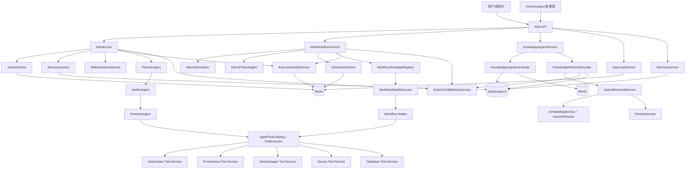
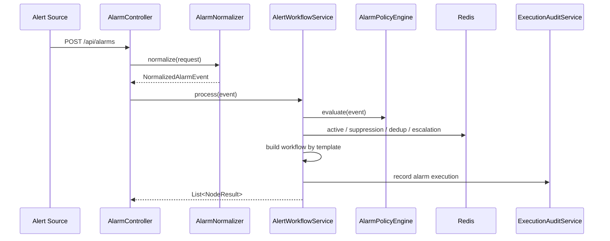
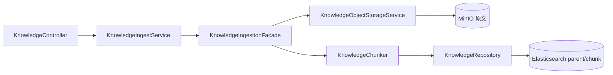
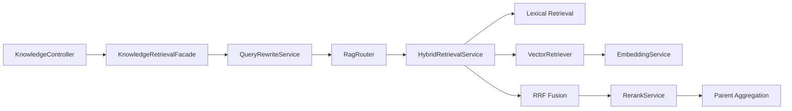

# KubeOnCall 项目架构文档

> 更新时间：2026-07-09
> 范围：基于当前仓库 `kubeoncall` 的源码、配置和重构计划落地状态整理。本文描述当前后端真实架构，不包含外部未入仓的前端、部署仓或平台侧实现。

---

## 1. 项目概述

KubeOnCall 是一个面向 Kubernetes / 基础设施运维场景的智能运维后端平台。它不是传统 CRUD 系统，而是围绕“请求理解、告警治理、知识检索、工具执行、人工审批、经验沉淀”组织的一套编排型控制平面。

当前仓库是一个 Spring Boot 单体后端服务，主要承担：

- REST API 暴露
- 多 Agent 运维问答编排
- 告警标准化、策略评估、去重、抑制、恢复与工作流执行
- RAG 知识入库、混合检索、回源与重排序
- 会话记忆、长期记忆、告警历史经验召回
- Skill 自动匹配与 prompt 注入
- 工具目录、外部系统执行适配与高风险审批
- 审计记录与 metrics 输出

当前仓库未发现独立前端工程、应用 Dockerfile、Helm Chart 或 CI/CD 配置。`docker-compose.yml` 只提供本地 Redis / Elasticsearch / MinIO 依赖。

---

## 2. 架构定位

KubeOnCall 的本质定位可以概括为：

> 一个基于 Spring Boot 的智能运维编排平台，通过 Agent 链路和 Alarm Workflow 链路，将知识库、记忆系统、Skill、工具执行和审批治理统一到一个后端控制平面中。

它的核心数据不是普通业务表，而是运行时状态：

- 一次问答执行的 `GraphState`
- 一次告警处理的 `NormalizedAlarmEvent`
- 一条策略评估结果 `AlarmEvaluationResult`
- 一个告警 active 状态 `ActiveAlarmState`
- 一个知识文档或 chunk `KnowledgeDocument`
- 一条长期经验记忆 `MemoryEntry`
- 一个 Skill 激活结果 `SkillActivation`
- 一条执行审计 `ExecutionAuditRecord`

整体上，系统采用“后端控制平面 + 外部执行平面”的方式工作：KubeOnCall 负责计划、校验、审批、编排和记录，具体 Kubernetes / Prometheus / Alertmanager / Device / Database 动作通过统一工具适配器下发到外部服务。

---

## 3. 核心能力地图

| 能力 | 入口 | 当前实现重点 |
| --- | --- | --- |
| 交互式运维问答 | `POST /api/ask` | Planner / Verifier / Executor 多阶段执行，支持 `sessionId`、记忆注入、Skill 注入、审批恢复 |
| 告警治理 | `POST /api/alarms` | 旧/新请求兼容、标准化事件、策略评估、稳定 fingerprint、active 状态、去重、抑制、恢复、升级 |
| Silence 审批 | `POST /api/alarms/silence-approvals` | 只把 silence 作为显式审批动作，写入 Redis 短期授权，工作流节点按授权执行 |
| 知识入库 | `POST /api/knowledge/ingest` | 原文入 MinIO，父文档和 chunk 入 Elasticsearch，标准化 metadata |
| 知识查询 | `POST /api/knowledge/query` | `KEYWORD` / `VECTOR` / `HYBRID` 检索，可选 trace，RRF / rerank / parent 聚合 |
| 记忆清理 | `POST /api/memory/cleanup` | 清理过期长期记忆，按配置控制扫描规模和陈旧阈值 |
| 人工审批 | `GET/POST /api/approvals/{executionId}` | 高风险问答任务暂停、保存 GraphState、审批后恢复执行 |
| 工具目录 | `GET /api/tools*` | 暴露 planner / executor / verifier 能力，支持 Skill 工具白名单 |
| 运行状态 | `GET /api/status`、`GET /api/stats` | 状态与执行统计输出 |
| 可观测性 | Actuator metrics | graph / alarm / rag / memory / skill 关键指标 |

---

## 4. 技术栈与运行依赖

### 4.1 基础技术栈

- Java 17
- Spring Boot 3.3.4
- Maven Wrapper：统一验证命令为 `./mvnw test`
- Spring Web / Validation
- Spring Actuator / Micrometer
- Spring Data Redis
- Spring Data Elasticsearch
- Spring AI OpenAI Starter
- LangGraph4j
- MinIO Java SDK
- Jackson / Lombok / Spring Boot Test

### 4.2 本地依赖

`docker-compose.yml` 提供三类本地依赖：

- Redis：短期状态、会话、审批、告警 active / dedup / suppression / escalation / silence approval、审计记录
- Elasticsearch：知识文档、chunk、长期记忆索引
- MinIO：知识原文对象存储

### 4.3 配置模型

平台级配置集中在 `KubeOnCallProperties`，由 `kubeoncall.*` 绑定。当前主要配置域包括：

- `kubeoncall.agent.*`：Agent 最大循环、Planner LLM 开关
- `kubeoncall.approval.*`：审批开关和回调超时
- `kubeoncall.rag.*`：topK、索引名、chunk 策略、向量、embedding、cross-encoder、RRF、rerank
- `kubeoncall.storage.minio.*`：MinIO endpoint、bucket、凭据
- `kubeoncall.mcp.*`：MCP planner 工具入口
- `kubeoncall.integrations.*`：Kubernetes / Prometheus / Alertmanager / Device / Database endpoint
- `kubeoncall.workflow.*`：工作流节点超时、默认告警去重 TTL
- `kubeoncall.alarm.*`：策略文件、severity TTL、active TTL、抑制、升级、silence 审批 TTL
- `kubeoncall.memory.*`：session TTL、最大会话轮次、长期记忆、注入数量、陈旧阈值
- `kubeoncall.skill.*`：Skill 文件位置、激活阈值、最大激活数量、prompt 限制
- `kubeoncall.audit.*`：审计仓库和保留时间

关键资源文件：

- `src/main/resources/application.yml`
- `src/main/resources/application-local.yml`
- `src/main/resources/alarm-policies.yml`
- `src/main/resources/skills/payment-oom-triage.md`

---

## 5. 工程模块划分

源码主包为 `com.kubeoncall`。当前模块边界如下：

| 模块 | 责任 |
| --- | --- |
| `web` | REST 控制器与 DTO，保持外部 API 兼容 |
| `service` | 应用级编排、审计、metrics |
| `agent` | Planner / Verifier / Executor 多 Agent 链路 |
| `alarm` | 告警标准化、领域模型、策略引擎、fingerprint、active/silence 状态 |
| `workflow` | 告警工作流模板、节点定义、节点执行、降级与依赖控制 |
| `rag` | 知识入库 facade、检索 facade、chunk、混合检索、embedding、vector、rerank |
| `memory` | session、多轮上下文、长期记忆、记忆注入/抽取、告警历史召回 |
| `skill` | Skill frontmatter 解析、注册、匹配、激活和 prompt 注入 |
| `approval` | 人工审批请求、仓储、GraphState 暂停/恢复 |
| `state` | GraphState Redis 快照 |
| `storage` | MinIO 原文存储 |
| `tool` | ToolExecutor SPI、工具目录、外部系统 HTTP 适配 |
| `domain` | graph / task / audit / rag / approval / legacy alarm 等领域状态对象 |
| `common` | 配置与通用异常 |

---

## 6. 总体运行架构



---

## 7. Web API 边界

### 7.1 `AskController`

`POST /api/ask`

- 请求：`AskRequest`
- 重要字段：`question`、可选 `sessionId`
- 响应：`AskResponse`
- 重要字段：`executionId`、`status`、`message`、`sessionId`

无 `sessionId` 时仍保持单轮行为；有 `sessionId` 时，`AskService` 会从 Redis session 中读取历史轮次，并在完成后追加本轮结果。

### 7.2 `AlarmController`

`POST /api/alarms`

- 请求：`AlarmRequest`
- 兼容旧字段，同时支持标准字段：`fingerprint`、`alertName`、`resourceType`、`resourceName`、`cluster`、`namespace`、`service`、`metricName`、`currentValue`、`threshold`、`unit`、`duration`、`labels`、`annotations`、`runbookId`、`status`
- 响应：`List<NodeResult>`

控制器不直接处理告警逻辑，而是把请求交给 `AlarmNormalizer` 统一变成 `NormalizedAlarmEvent`，再进入治理链路。

`POST /api/alarms/silence-approvals`

- 请求：`AlarmSilenceApprovalRequest`
- 必填：`fingerprint`、`approvedBy`
- 可选：`reason`、`ttlSeconds`
- 响应：`AlarmSilenceApprovalResponse`

该接口只写入短期 silence 授权，不直接调用 Alertmanager。真正创建 silence 由 `SilenceNode` 在工作流中读取授权后执行。

### 7.3 `KnowledgeController`

`POST /api/knowledge/ingest`

- 入库文档，写 MinIO 原文和 ES parent/chunk 文档。

`POST /api/knowledge/query`

- 支持 `topK`
- 支持 `retrieveMethod=KEYWORD|VECTOR|HYBRID`
- 支持 `includeTrace`
- 默认兼容旧请求，走 HYBRID 逻辑。

### 7.4 `ApprovalController`

- `GET /api/approvals/{executionId}`：查看审批请求与暂停态 GraphState
- `POST /api/approvals/{executionId}`：提交审批决策并触发恢复执行

审批服务会从 Redis 中加载暂停的 GraphState，审批通过后从执行阶段继续，不重新跑完整 Planner。

### 7.5 其他控制器

- `ToolController`：工具目录，区分 planner / executor / verifier 能力
- `MemoryController`：长期记忆清理入口
- `StatsController`：执行统计
- `StatusController`：服务状态

---

## 8. 交互式问答链路

### 8.1 主流程

当前 `AskService` 的主流程为：

1. 创建 `GraphState`
2. 写入用户问题和可选 `sessionId`
3. 从 `SessionStore` 加载最近会话上下文
4. 通过 `MemoryInjector` 注入长期记忆提示
5. 通过 `SkillActivationService` 匹配 Skill，并注入 Skill prompt、工具白名单、最大风险等级
6. 执行 `PlannerAgent`
7. 按任务列表逐个执行：
   - `ExecutorAgent.plan`
   - `VerifierAgent.run`
   - `ExecutorAgent.executePrepared`
8. 生成 `ResponseComposer` 摘要
9. 追加 session turn
10. 异步/容错式抽取长期记忆
11. 记录审计和 metrics

### 8.2 Agent 分层

- `PlannerAgent`：理解问题，生成任务计划，注入知识和 Skill 上下文
- `VerifierAgent`：校验 SOP、风险等级、工具合规性和审批要求
- `ExecutorAgent`：生成可执行计划并调用工具
- `ResponseComposer`：把 GraphState 拼装成结构化文本结果

`ReActAgent` 用于循环式规划/执行，`PipelineAgent` 用于固定流水线校验。

### 8.3 GraphState 的角色

`GraphState` 是问答链路的运行时聚合根，承载：

- `executionId`
- `status`
- `userRequest`
- `taskPlan`
- `currentTask`
- `nodeResults`
- `observations`
- `context`
- `pauseMetadata`
- 审批时间、审批轨迹、最终审批结果
- 当前任务索引与恢复状态

它既是 Agent 间共享上下文，也是暂停/恢复、审计、响应拼装的统一状态来源。

### 8.4 记忆与 Skill 注入

问答链路新增了两类上下文增强：

- 记忆：`MemoryInjector` 只注入适合复用的长期经验，例如 `SERVICE_FACT`、`KNOWN_PITFALL`，并带陈旧提示，避免把实时状态当事实。
- Skill：`SkillActivationService` 根据问题和上下文激活最多若干 Skill，写入 Skill prompt、Skill 摘要、工具白名单和最大风险等级。

当前 Skill 第一版不做真实 tool-calling，只做匹配、约束和 prompt 注入。

---

## 9. 告警治理链路

### 9.1 标准化入口

告警入口从 `AlarmController` 开始：



`AlarmNormalizer` 负责：

- 兼容旧 `AlarmRequest`
- 提升 metadata 中的常用字段
- 归一化 severity、status、resourceType
- 生成或保留标准字段

### 9.2 Fingerprint 与去重

`AlarmFingerprintService` 优先使用请求中的 `fingerprint` / `dedupKey`。如果没有，则基于稳定字段生成指纹：

- `alertName`
- `cluster`
- `namespace`
- `resourceType`
- `resourceName`
- `service`
- `metricName`
- 排序后的稳定 labels

去重 key 使用 `alarm-dedup:{fingerprint}`，不会再产生 `alarm-dedup:null`。

### 9.3 策略引擎

策略来源固定为：

- `src/main/resources/alarm-policies.yml`

当前策略覆盖：

- Host CPU
- Host memory
- Host disk
- Host inode
- Kubernetes NodeNotReady
- Pod CrashLoopBackOff
- Pod OOMKilled
- DeploymentUnavailable

`AlarmPolicyEngine` 产出 `AlarmEvaluationResult`，其中包含：

- 是否匹配策略
- 最终 severity
- policy id / reason
- workflow template
- PromQL / window / runbook / action 信息

`StateCompareNode` 会使用策略中的 PromQL 和窗口信息构造诊断上下文。

### 9.4 Active 状态、抑制、恢复、升级

`ActiveAlarmStore` 使用 Redis 记录 active alarm：

- `firstSeen`
- `lastSeen`
- `count`
- `status`
- `severity`
- `fingerprint`

治理逻辑包括：

- 按 severity 配置 dedup TTL
- `NodeNotReady` 期间抑制同节点 Pod 噪声
- `RESOLVED` 事件走恢复确认路径
- P0 / P1 未确认且重复达到阈值时生成升级结果
- 告警处理结果写入审计 metadata

### 9.5 工作流模板

`WorkflowTemplateRegistry` 目前支持：

- `default`
- `host-resource`
- `k8s-pod`
- `k8s-node`
- `workload`
- `control-plane`

`AlertWorkflowFactory.buildWorkflow(workflowTemplate)` 根据模板生成节点序列。核心节点包括：

- `LogCollectionNode`
- `DeviceInfoNode`
- `StateCompareNode`
- `KnowledgeRetrieveNode`
- `NotificationNode`
- `TicketNode`
- `SilenceNode`
- `ResultPushNode`

节点执行由 `WorkflowNodeExecutor` 包装，统一处理耗时、超时、异常、依赖缺失、降级状态和 payload 增强。

### 9.6 Silence 安全边界

`ResultPushNode` 默认只输出结构化诊断 summary，不自动创建 silence。

`SilenceNode` 的执行前提是：

- 策略允许相关动作
- 告警上下文存在 `silenceApproved=true`
- Redis 中存在 `alarm-silence-approval:{fingerprint}` 短期授权

因此，Alertmanager `createSilence` 不再是默认自动动作，而是审批后的显式动作。

---

## 10. RAG 架构

### 10.1 Facade 分层

`KnowledgeIngestService` 当前是兼容 facade，对外保持旧接口，内部委托：

- `KnowledgeIngestionFacade`
- `KnowledgeRetrievalFacade`

这样既保留 API 兼容，又把入库和检索职责拆开。

### 10.2 入库链路



入库 metadata 标准化字段包括：

- `doc_id`
- `chunk_id`
- `chunk_index`
- `total_chunks`
- `parent_document_id`
- `document_type`
- `source_type`
- `dataset_version`
- `chunk_enable`
- `file_hash`

原始文档写入 MinIO；父文档和 chunk 文档写入 ES，便于检索后回源。

### 10.3 检索链路



当前检索能力：

- 支持 `KEYWORD` / `VECTOR` / `HYBRID`
- 向量检索可关闭、mock 或使用外部 endpoint / ES kNN
- embedding 通过 `EmbeddingClient` / `EmbeddingService` 抽象
- vector 通过 `VectorRetriever` 抽象
- rerank 失败时回退到 RRF 或原始排序，不中断查询
- 默认查询会过滤 `source_type=memory` 的长期记忆，避免污染 SOP 检索
- `includeTrace` 可返回检索诊断信息

---

## 11. 记忆系统

### 11.1 Session 记忆

`SessionStore` 当前使用 Redis。`AskService` 在有 `sessionId` 时：

- 加载历史 turn
- 生成 `sessionHistory` 和 `sessionContext`
- 执行结束后追加当前 turn

这让 `/api/ask` 支持多轮追问，但无 `sessionId` 时仍保持单轮兼容。

### 11.2 长期记忆

长期记忆模型包括：

- `MemoryEntry`
- `MemoryType`
- `MemoryScope`

长期记忆写入 Elasticsearch，使用 `source_type=memory` 与知识 SOP 隔离。默认知识查询不会混入长期记忆，只有显式 memory 查询或 `MemoryInjector` / `AlertMemoryService` 才会召回。

### 11.3 记忆注入与抽取

- `DefaultMemoryInjector`：注入高可信经验，并提示陈旧信息需要先验证当前状态
- `HeuristicMemoryExtractor`：从 Ask / Alarm 结果中抽取经验，排除 kubectl 命令、实时状态、SOP 全文等可派生内容
- `AlertMemoryService`：按 fingerprint / service / resource 召回历史处置经验
- 记忆失败不影响主流程，只写 warning 和 metrics

---

## 12. Skill 底座

Skill 模块当前包含：

- `Skill`
- `SkillFrontmatterParser`
- `SkillRegistry`
- `SkillMatcher`
- `SkillActivationService`
- `SkillActivation`

默认 Skill 资源：

- `src/main/resources/skills/payment-oom-triage.md`

运行方式：

1. 启动时加载 `classpath*:skills/*.md`
2. 解析 frontmatter 和正文
3. 按问题、告警上下文、关键词和阈值匹配
4. 选取最多 `kubeoncall.skill.max-active-skills`
5. 写入 `skillPrompt`、`activatedSkillIds`、`activatedSkillToolWhitelist`、`activatedSkillMaxRisk`
6. Planner / Verifier / Executor 使用这些上下文做计划和风险控制

当前版本只做 Skill 匹配和 prompt 注入，不做真实工具调用编排。

---

## 13. 工具执行架构

`ToolExecutor` 是外部工具统一 SPI：

- `getExecutorKind()`
- `supportedTools()`
- `execute(action, parameters)`

当前执行器包括：

- `KubernetesToolExecutor`
- `PrometheusToolExecutor`
- `AlertmanagerToolExecutor`
- `DeviceToolExecutor`
- `DatabaseToolExecutor`

`AgentToolCatalog` 承担能力目录职责：

- planner tools 来自 MCP
- executor tools 来自 `ToolExecutor`
- verifier capabilities 固定描述校验能力
- 支持按 Skill 工具白名单过滤 executor tools
- 支持按 `executorKind.action` 查找工具

安全边界：

- Planner 工具原则上偏只读
- Executor 工具才执行外部动作
- 高风险工具在 `ToolDefinition` 中标识 `requiresApproval`
- `alertmanager.createSilence` 保留，但只应在审批后的 `SilenceNode` 中使用

---

## 14. 审批、状态与恢复

### 14.1 问答审批

问答链路中，Verifier 发现高风险操作时会：

1. 将 `GraphState` 置为 `PAUSED`
2. 写入 `pauseMetadata`
3. 创建 `ApprovalRequest`
4. 将 GraphState 保存到 Redis：`graph-state:{executionId}`
5. 等待 `/api/approvals/{executionId}` 提交决策
6. 审批通过后从执行阶段恢复

### 14.2 告警 Silence 审批

告警 silence 使用独立短期授权：

- Redis key：`alarm-silence-approval:{fingerprint}`
- TTL：`kubeoncall.alarm.silence-approval-ttl-seconds`
- 写入者：`AlarmController.approveSilence`
- 消费者：`AlertWorkflowService.attachSilenceApproval` 和 `SilenceNode`

这条审批链路与问答审批分开，原因是 silence 是告警处置动作，不依赖 `GraphState` 暂停/恢复。

---

## 15. 存储分工

| 存储 | 用途 |
| --- | --- |
| Redis | GraphState 快照、审批请求、session turn、active alarm、dedup、NodeNotReady 抑制、P0/P1 升级、silence approval、执行审计 |
| Elasticsearch | 知识 parent/chunk、长期记忆、检索索引 |
| MinIO | 知识原文对象 |
| 内存实现 | 部分仓储保留 in-memory fallback，主要用于测试或降级 |

这种多存储分工适合运维控制平台：

- Redis 保存短生命周期运行态
- ES 保存可检索知识与经验
- MinIO 保存不可丢的原文

---

## 16. 审计与可观测性

### 16.1 ExecutionAuditService

系统把新增主流程都纳入执行审计：

- Ask 执行
- Approval resume
- Alarm 执行
- 告警 dedup / suppression / recovery / escalation

告警审计 metadata 包含：

- fingerprint
- alarmId / alertName / resource / cluster / namespace / service
- policyId / severity / workflowTemplate
- active count / firstSeen / lastSeen
- memory recall 信息
- failed / skipped nodes
- silence approval 信息

### 16.2 Metrics

`KubeOnCallMetricsService` 当前记录：

- `kubeoncall.graph.executions`
- `kubeoncall.alarm.executions`
- `kubeoncall.alarm.silence_approvals`
- `kubeoncall.rag.retrievals`
- `kubeoncall.rag.result_count`
- `kubeoncall.rag.latency_ms`
- `kubeoncall.memory.operations`
- `kubeoncall.memory.operation_count`
- `kubeoncall.skill.activations`
- `kubeoncall.skill.activated_count`

Actuator 默认暴露：

- `health`
- `info`
- `metrics`

---

## 17. 测试与验证边界

当前默认验证命令：

```bash
./mvnw test
```

测试分层原则：

- 默认单测不依赖 Redis / ES / MinIO
- 需要中间件的集成测试应在本地启动依赖后单独运行
- RAG 向量能力通过 disabled / mock / failed 路径保证可测
- 告警治理覆盖旧请求兼容、fingerprint、策略阈值、去重、抑制、silence 审批
- Memory / Skill 覆盖主流程容错，不因注入、抽取或匹配失败阻断主执行

本地依赖启动方式：

```bash
docker compose up -d redis elasticsearch minio
```

---

## 18. 当前架构优点

1. 模块边界比早期更清晰
   告警、RAG、记忆、Skill 已从泛 service / workflow 中拆出独立模块。

2. 告警治理闭环更完整
   已具备标准化、策略、fingerprint、active 状态、去重、抑制、恢复、升级、审批 silence。

3. RAG 不再被真实 embedding 阻塞
   向量、embedding、rerank 都有抽象与 fallback，适合先验收后增强。

4. 记忆系统默认隔离 SOP
   长期记忆用 `source_type=memory` 隔离，避免污染知识库默认检索。

5. Skill 与工具白名单开始联动
   Skill 不只提供文本经验，也能影响 Planner 上下文和可用工具边界。

6. 安全边界更明确
   自动 silence 被收紧为审批后的显式动作，高风险问答仍走 GraphState 审批恢复。

---

## 19. 当前能力边界与后续建议

以下是当前仓库仍可继续增强的方向：

- 真实 embedding 模型接入和 ES dense_vector / kNN 映射迁移
- 更完整的 cross-encoder rerank 服务接入
- RAG 离线评测集和命中率/召回率评估脚本
- 更多生产级 Skill，尤其是按业务服务、故障类型、历史事故沉淀
- 告警策略的灰度、版本化和热加载能力
- 结构化 Ask 响应，便于前端或平台系统消费 plan / verification / execution / audit
- 应用 Dockerfile、Helm Chart、GitHub Actions 等交付资产
- 更完整的 Grafana dashboard / alert rules

---

## 20. 新同学阅读顺序

建议按以下顺序理解项目：

1. `pom.xml`、`mvnw`、`application.yml`
2. `KubeOnCallProperties`
3. `AskController`、`AskService`
4. `PlannerAgent`、`VerifierAgent`、`ExecutorAgent`
5. `GraphState`、`ApprovalService`、`GraphStateStore`
6. `AlarmController`、`AlarmNormalizer`
7. `AlarmPolicyEngine`、`YamlAlarmPolicyRepository`、`alarm-policies.yml`
8. `AlertWorkflowService`、`WorkflowTemplateRegistry`、`AlertWorkflowFactory`
9. `workflow.node.*`
10. `KnowledgeIngestService`、`KnowledgeIngestionFacade`、`KnowledgeRetrievalFacade`
11. `HybridRetrievalService`、`EmbeddingService`、`VectorRetriever`、`RerankService`
12. `MemoryService`、`DefaultMemoryInjector`、`HeuristicMemoryExtractor`、`AlertMemoryService`
13. `SkillRegistry`、`SkillMatcher`、`SkillActivationService`
14. `ToolExecutor`、`AgentToolCatalog`、各具体执行器
15. `ExecutionAuditService`、`KubeOnCallMetricsService`

---

## 21. 关键源码清单

### 配置与资源

- `pom.xml`
- `mvnw`
- `docker-compose.yml`
- `src/main/resources/application.yml`
- `src/main/resources/alarm-policies.yml`
- `src/main/resources/skills/payment-oom-triage.md`
- `src/main/java/com/kubeoncall/common/config/KubeOnCallProperties.java`

### Web 层

- `src/main/java/com/kubeoncall/web/AskController.java`
- `src/main/java/com/kubeoncall/web/AlarmController.java`
- `src/main/java/com/kubeoncall/web/ApprovalController.java`
- `src/main/java/com/kubeoncall/web/KnowledgeController.java`
- `src/main/java/com/kubeoncall/web/MemoryController.java`
- `src/main/java/com/kubeoncall/web/ToolController.java`
- `src/main/java/com/kubeoncall/web/StatsController.java`
- `src/main/java/com/kubeoncall/web/StatusController.java`

### 应用服务

- `src/main/java/com/kubeoncall/service/AskService.java`
- `src/main/java/com/kubeoncall/service/ExecutionAuditService.java`
- `src/main/java/com/kubeoncall/service/KubeOnCallMetricsService.java`

### Agent 与审批

- `src/main/java/com/kubeoncall/agent/planner/PlannerAgent.java`
- `src/main/java/com/kubeoncall/agent/verifier/VerifierAgent.java`
- `src/main/java/com/kubeoncall/agent/executor/ExecutorAgent.java`
- `src/main/java/com/kubeoncall/agent/base/ReActAgent.java`
- `src/main/java/com/kubeoncall/agent/base/PipelineAgent.java`
- `src/main/java/com/kubeoncall/agent/composer/ResponseComposer.java`
- `src/main/java/com/kubeoncall/approval/ApprovalService.java`
- `src/main/java/com/kubeoncall/state/GraphStateStore.java`

### 告警治理

- `src/main/java/com/kubeoncall/alarm/ingest/AlarmNormalizer.java`
- `src/main/java/com/kubeoncall/alarm/policy/AlarmFingerprintService.java`
- `src/main/java/com/kubeoncall/alarm/policy/AlarmPolicyEngine.java`
- `src/main/java/com/kubeoncall/alarm/policy/YamlAlarmPolicyRepository.java`
- `src/main/java/com/kubeoncall/alarm/state/ActiveAlarmStore.java`
- `src/main/java/com/kubeoncall/alarm/state/AlarmSilenceApprovalStore.java`
- `src/main/java/com/kubeoncall/workflow/AlertWorkflowService.java`
- `src/main/java/com/kubeoncall/workflow/WorkflowTemplateRegistry.java`
- `src/main/java/com/kubeoncall/workflow/AlertWorkflowFactory.java`
- `src/main/java/com/kubeoncall/workflow/WorkflowNodeExecutor.java`
- `src/main/java/com/kubeoncall/workflow/node/SilenceNode.java`

### RAG、记忆与 Skill

- `src/main/java/com/kubeoncall/rag/KnowledgeIngestService.java`
- `src/main/java/com/kubeoncall/rag/KnowledgeIngestionFacade.java`
- `src/main/java/com/kubeoncall/rag/KnowledgeRetrievalFacade.java`
- `src/main/java/com/kubeoncall/rag/HybridRetrievalService.java`
- `src/main/java/com/kubeoncall/rag/EmbeddingService.java`
- `src/main/java/com/kubeoncall/rag/VectorRetriever.java`
- `src/main/java/com/kubeoncall/rag/RerankService.java`
- `src/main/java/com/kubeoncall/memory/MemoryService.java`
- `src/main/java/com/kubeoncall/memory/DefaultMemoryInjector.java`
- `src/main/java/com/kubeoncall/memory/HeuristicMemoryExtractor.java`
- `src/main/java/com/kubeoncall/memory/AlertMemoryService.java`
- `src/main/java/com/kubeoncall/skill/SkillRegistry.java`
- `src/main/java/com/kubeoncall/skill/SkillMatcher.java`
- `src/main/java/com/kubeoncall/skill/SkillActivationService.java`

### 存储与工具

- `src/main/java/com/kubeoncall/storage/KnowledgeObjectStorageService.java`
- `src/main/java/com/kubeoncall/storage/MinioDocumentStore.java`
- `src/main/java/com/kubeoncall/tool/ToolExecutor.java`
- `src/main/java/com/kubeoncall/tool/AgentToolCatalog.java`
- `src/main/java/com/kubeoncall/tool/k8s/KubernetesToolExecutor.java`
- `src/main/java/com/kubeoncall/tool/monitoring/PrometheusToolExecutor.java`
- `src/main/java/com/kubeoncall/tool/alerting/AlertmanagerToolExecutor.java`

---

## 22. 总结

当前 KubeOnCall 已经从早期“Agent + 简单告警工作流 + 基础 RAG”的骨架，演进为一个更完整的智能运维后端控制平面：

- Ask 链路支持多轮 session、长期记忆和 Skill 注入
- Alarm 链路具备策略化治理、稳定去重、active 状态、抑制、恢复、升级和 silence 审批
- RAG 链路完成 facade 拆分、标准 metadata、parent 回源、向量抽象和 fallback
- Memory / Skill 成为独立底座能力
- 审计和 metrics 已覆盖主要新增流程

后续重点不再是“把模块拆出来”，而是继续补齐生产化：真实 embedding、更多 Skill、策略运维化、部署资产、可观测 dashboard 和结构化 API 输出。
