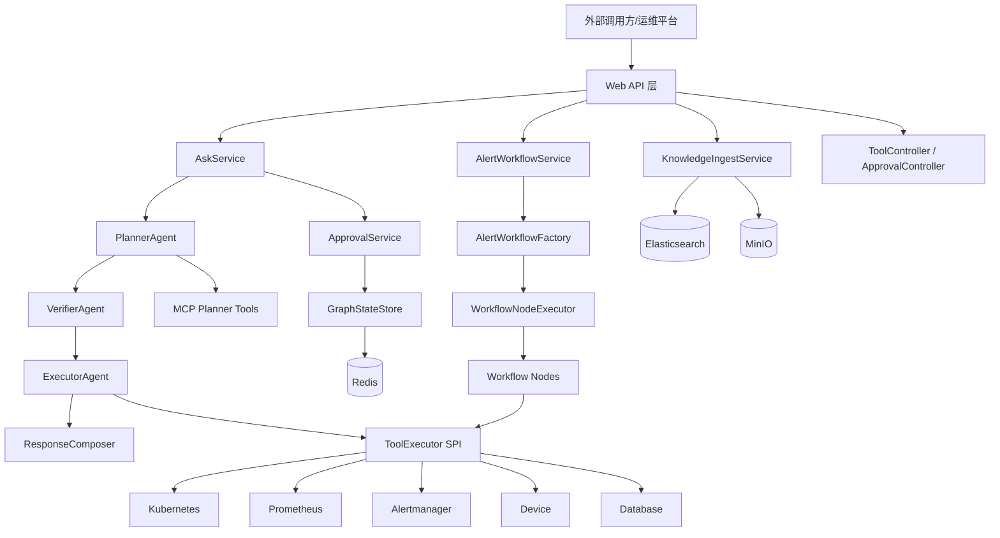
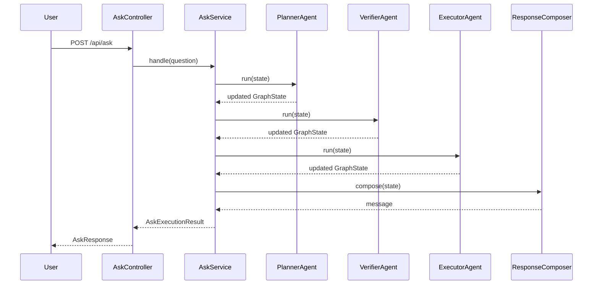
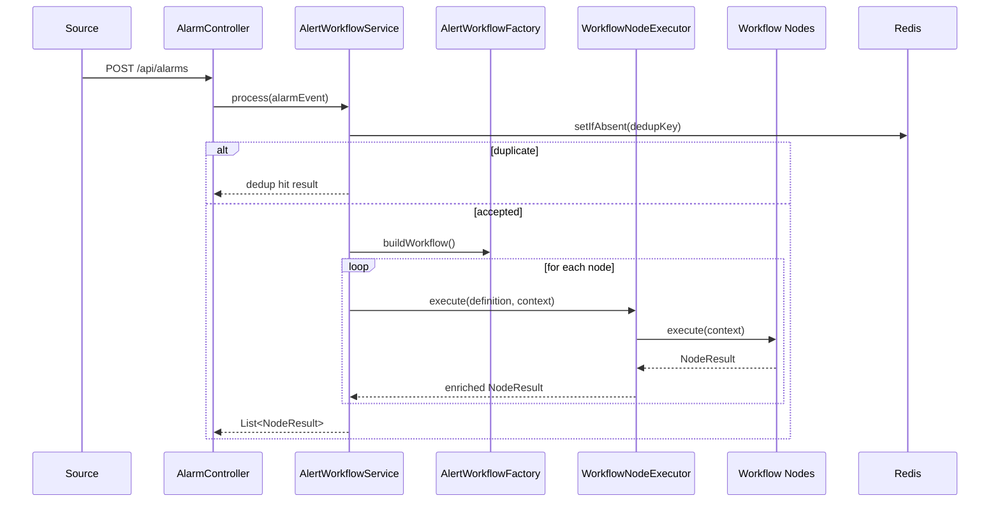

# KubeOnCall 项目架构文档

## 1. 项目概述

KubeOnCall 是一个面向实验室基础设施与运维场景的智能运维后端平台。从代码结构与配置来看，它不是传统的 CRUD 业务系统，而是一个围绕“运维请求理解、告警处置、知识检索增强、工具编排执行、人工审批”展开的编排型平台。

项目的 Maven 描述中将其定义为：`Multi-Agent intelligent operations platform for laboratory infrastructure`，这与源码呈现出的整体设计是一致的：

- 面向自然语言/人工请求的交互式处理链路
- 面向告警事件的自动化工作流链路
- 面向 SOP/知识库的检索增强（RAG）能力
- 面向外部系统的统一工具执行抽象
- 面向高风险操作的人工审批闭环

从仓库内容看，当前项目是一个单体式后端服务，主要负责 API 暴露、流程编排、状态管理与外部系统集成；当前仓库范围内未发现独立前端工程，也未发现完整的容器化部署清单或 CI/CD 配置。

---

## 2. 项目定位与核心能力

### 2.1 项目定位

KubeOnCall 的本质定位可以概括为：

> 一个基于 Spring Boot 构建的智能运维编排平台，通过多 Agent 规划/校验/执行机制与告警工作流机制，将知识库、运维工具与审批流程统一起来。

它的核心不是“保存业务数据”，而是“接收请求、形成计划、执行动作、记录状态、沉淀知识”。

### 2.2 当前源码中可见的核心能力

结合 `web`、`service`、`agent`、`workflow`、`rag`、`tool`、`approval` 等包，可以明确看到系统至少具备以下能力：

1. **交互式运维问答能力**
   - 入口：`/api/ask`
   - 处理方式：AskService 驱动 Planner / Verifier / Executor 三段式链路

2. **告警驱动的自动化处置能力**
   - 入口：`/api/alarms`
   - 处理方式：AlertWorkflowService 驱动预定义工作流节点执行

3. **知识库文档入库与查询能力**
   - 入口：`/api/knowledge/ingest`、`/api/knowledge/query`
   - 处理方式：文档切分、Elasticsearch 检索、可选向量检索融合、父文档聚合

4. **人工审批能力**
   - 入口：`/api/approvals/{executionId}`
   - 处理方式：高风险任务可暂停，等待审批后恢复执行

5. **运维工具目录与执行能力**
   - 入口：`/api/tools`
   - 处理方式：统一 ToolExecutor SPI + 各类执行器适配外部系统

6. **执行审计与状态输出能力**
   - 可见控制器：`StatsController`、`StatusController`
   - 可见服务：`ExecutionAuditService`

---

## 3. 技术栈与框架说明

## 3.1 基础技术栈

依据 `pom.xml` 可确认项目采用如下基础技术栈：

- **Java 17**
- **Spring Boot 3.3.4**
- **Maven** 单模块构建

`pom.xml` 中的关键配置包括：

- `spring-boot-starter-parent:3.3.4`
- `java.version=17`
- `spring-boot-maven-plugin`
- `maven-compiler-plugin`

这表明项目采用标准 Spring Boot 应用打包与启动方式，适合作为单体 API 服务运行。

## 3.2 主要框架与依赖

### 1）Web 与接口层
- `spring-boot-starter-web`
- `spring-boot-starter-validation`

用于提供 REST API 与参数校验能力。

### 2）运维与可观测性基础
- `spring-boot-starter-actuator`

用于暴露健康检查、信息与 metrics 等基础运维端点。

### 3）缓存/状态存储
- `spring-boot-starter-data-redis`

当前主要用于：
- GraphState 暂停状态存储
- 告警去重
- 审计相关存储（从配置可见 audit.repository=redis）

### 4）知识检索与索引
- `spring-boot-starter-data-elasticsearch`
- `spring-data-elasticsearch`

用于知识文档的保存、检索、过滤与父文档聚合。

### 5）对象存储
- `io.minio:minio`

用于保存知识文档原始内容，而非仅保存切片索引。

### 6）智能能力与 Agent 编排
- `org.springframework.ai:spring-ai-openai-spring-boot-starter`
- `org.bsc.langgraph4j:langgraph4j-core`

这说明项目具备接入大模型与构建图/Agent 编排的基础能力。

需要注意的是，从 `application-local.yml` 的已有探索结果看，本地 profile 中配置了基于 Spring AI 的模型接入参数；而从整体实现看，代码更关注编排状态与工具执行，而不是直接将 LLM 输出作为最终业务结果。

### 7）辅助依赖
- Jackson（JSON 序列化/反序列化）
- Lombok
- Spring Boot Configuration Processor
- Spring Boot Test

---

## 4. 运行依赖与本地环境

## 4.1 application.yml 中的运行配置

`src/main/resources/application.yml` 展示了系统的默认运行环境：

- 应用名：`kubeoncall`
- 默认 profile：`local`
- Web 端口：`8080`
- 暴露 Actuator 端点：`health,info,metrics`

### 中间件配置
- Redis：`localhost:6379`
- Elasticsearch：`http://localhost:9200`
- MinIO：`http://localhost:9000`

### 平台配置域
`kubeoncall.*` 下存在多个一级配置域：
- `agent`
- `approval`
- `rag`
- `storage`
- `mcp`
- `integrations`
- `workflow`
- `audit`

这些配置会映射到 `KubeOnCallProperties.java` 中的强类型配置对象。

## 4.2 KubeOnCallProperties 的结构含义

`KubeOnCallProperties.java` 通过 `@ConfigurationProperties(prefix = "kubeoncall")` 绑定平台级配置，并且定义了以下子域：

- `Agent`：最大循环次数 `maxLoops`
- `Approval`：审批开关与回调超时时间
- `Rag`：默认 topK、索引名、是否启用向量、RRF 参数等
- `Storage.Minio`：MinIO endpoint/accessKey/secretKey/bucket
- `Mcp`：MCP 服务名、endpoint、超时
- `Workflow`：告警去重 TTL、节点超时
- `Audit`：审计仓库类型与保留时长
- `Integrations`：Kubernetes/Prometheus/Alertmanager/device/database 等外部系统的 endpoint 与 timeout

这说明项目采用的是**平台配置中心式设计**：各模块通过一个统一配置对象完成注入，而不是在各处散落配置常量。

## 4.3 docker-compose 提供的本地依赖

`docker-compose.yml` 当前只定义了三个基础服务：

1. **Redis**
   - 镜像：`redis:7`
   - 端口：`6379`

2. **Elasticsearch**
   - 镜像：`docker.elastic.co/elasticsearch/elasticsearch:8.14.3`
   - 单节点模式
   - 关闭安全功能
   - 端口：`9200`

3. **MinIO**
   - 镜像：`minio/minio:RELEASE.2024-08-03T04-33-23Z`
   - API 端口：`9000`
   - Console 端口：`9001`

由此可见，当前仓库主要提供**本地开发/联调所需中间件**，而不是完整应用容器部署方案。

---

## 5. 工程结构与模块划分

项目源码主包为：`com.kubeoncall`。

从当前源码结构可以将系统拆分为以下几个核心模块：

- `agent`：多 Agent 编排执行体系
- `approval`：审批状态与审批服务
- `common`：通用配置与异常
- `domain`：领域模型
- `rag`：知识入库与检索增强
- `service`：应用级服务编排
- `state`：图状态持久化
- `storage`：对象存储能力
- `tool`：工具目录与外部系统执行适配
- `web`：REST API 控制器与 DTO
- `workflow`：告警工作流编排与节点执行

下面分别展开说明。

## 5.1 web：接口适配层

`web` 包是系统的 HTTP 入口层，主要职责是：

- 接收外部请求
- 做参数转换与校验
- 调用 service 层或应用编排层
- 返回 DTO 或领域对象

当前明确可见的控制器包括：

- `AskController`
- `AlarmController`
- `ApprovalController`
- `KnowledgeController`
- `ToolController`
- 此外，从仓库探索结果中还可见：`StatsController`、`StatusController`

它们共同构成平台 API 边界。

## 5.2 service：应用服务层

`service` 包不是传统 CRUD 的“业务服务层”，而更接近**应用编排服务层**。

其中最重要的类是：

- `AskService`
- `ExecutionAuditService`

`AskService` 负责交互式请求的主链路编排；`ExecutionAuditService` 则承担执行记录与统计输出职责。

## 5.3 agent：多 Agent 链路编排层

`agent` 是项目最核心的部分之一，当前可见的结构包括：

- `agent.base`
- `agent.planner`
- `agent.verifier`
- `agent.executor`
- `agent.node`
- `agent.composer`

它们共同实现了一条“规划 → 校验 → 执行 → 汇总响应”的智能运维链路。

## 5.4 workflow：告警工作流层

`workflow` 负责处理告警事件，不同于 `agent` 的交互式链路，它更像一条预定义的工作流：

- `AlertWorkflowService`
- `AlertWorkflowFactory`
- `WorkflowNodeExecutor`
- `workflow.node.*`

这部分负责告警接入、去重、依赖控制、节点执行与降级处理。

## 5.5 approval：人工审批层

该模块负责将高风险执行纳入人工审批闭环。

关键类包括：
- `ApprovalService`
- `ApprovalRepository`
- `InMemoryApprovalRepository`

结合 `GraphStateStore` 一起，形成暂停/恢复执行机制。

## 5.6 state：执行状态持久化层

`state` 包当前最关键的类是：
- `GraphStateStore`

它将 GraphState 序列化后写入 Redis，实现暂停后的状态恢复。

## 5.7 rag：知识检索增强层

`rag` 模块包含：
- 知识入库
- 查询改写
- 路由
- 混合检索
- 重排序
- 父文档聚合

当前关键类包括：
- `KnowledgeIngestService`
- `HybridRetrievalService`
- `QueryRewriteService`
- `RagRouter`
- `RerankService`
- `KnowledgeChunker`
- `rag.repository.ElasticsearchKnowledgeRepository`

## 5.8 storage：对象存储层

这一层主要负责将原始知识文档写入 MinIO，而不是只保存在 Elasticsearch 中。

关键类：
- `KnowledgeObjectStorageService`
- `MinioDocumentStore`

## 5.9 tool：外部工具与执行适配层

这一层是平台“连接外部世界”的关键边界。

关键类：
- `ToolExecutor`
- `AgentToolCatalog`
- `tool.http.ToolHttpClient`
- `tool.k8s.KubernetesToolExecutor`
- `tool.monitoring.PrometheusToolExecutor`
- `tool.alerting.AlertmanagerToolExecutor`
- `tool.device.DeviceToolExecutor`
- `tool.database.DatabaseToolExecutor`
- `tool.mcp.McpClient`
- `tool.mcp.McpToolRegistry`

## 5.10 domain：领域模型层

`domain` 不是数据库实体层，而是整个平台的核心状态模型层。根据探索结果，该包下包括：

- `domain.alarm`
- `domain.approval`
- `domain.audit`
- `domain.graph`
- `domain.rag`
- `domain.task`

这说明项目采用的是“围绕执行过程建模”的方式，而不是围绕表结构建模。

---

## 6. 总体架构说明

如果用一句话描述 KubeOnCall 的总体架构，可以概括为：

> Web API 作为统一入口，交互请求走多 Agent 执行链路，告警事件走工作流执行链路，二者共享知识检索层、工具执行层、状态持久化层与审计能力。

### 6.1 分层视图

可将系统理解为以下分层：

1. **接口层**
   - web controllers
   - DTO

2. **应用编排层**
   - AskService
   - AlertWorkflowService
   - ApprovalService
   - ExecutionAuditService

3. **智能执行层 / 工作流层**
   - PlannerAgent / VerifierAgent / ExecutorAgent
   - workflow nodes
   - WorkflowNodeExecutor

4. **领域状态层**
   - GraphState
   - Task / TaskPlan
   - ApprovalRequest
   - AlarmEvent
   - RetrievalResult

5. **基础设施与适配层**
   - Redis
   - Elasticsearch
   - MinIO
   - ToolExecutor SPI
   - MCP
   - 外部集成 endpoint

### 6.2 总体架构图（Mermaid）

### 6.3 两条核心执行主线

KubeOnCall 当前代码中并存两条非常重要的执行主线：

1. **交互式主线**
   - 由 AskController 触发
   - 面向人工请求/自然语言问题
   - 更强调规划、风险评估、审批与工具执行

2. **告警工作流主线**
   - 由 AlarmController 触发
   - 面向告警事件
   - 更强调固定节点编排、依赖关系、自动处置与结果推送

这是一种比较鲜明的架构特点：**Agent 流与 Workflow 流并存**。

---

## 7. Web API 层设计

## 7.1 AskController：交互请求入口

`AskController` 暴露接口：

- `POST /api/ask`

实现非常薄，只做两件事：
- 接收 `AskRequest`
- 调用 `AskService.handle(request.question())`

这一设计说明控制器层保持轻量，主业务逻辑被下沉到应用服务与 Agent 层。

## 7.2 AlarmController：告警事件入口

`AlarmController` 暴露接口：

- `POST /api/alarms`

控制器逻辑包括：
- 将 `AlarmRequest` 转换为 `AlarmEvent`
- 为缺失的 `occurredAt` 填充当前时间
- 调用 `alertWorkflowService.process(event)`

这一层的职责依然是协议适配，而不是处理工作流逻辑。

## 7.3 ApprovalController：审批查询与审批决策入口

`ApprovalController` 暴露接口：

- `GET /api/approvals/{executionId}`：查看审批详情
- `POST /api/approvals/{executionId}`：提交审批结果并恢复执行

POST 接口的核心行为：
- 从请求体解析 `decision`
- 调用 `AskService.decideAndResume(...)`
- 由 AskService 继续串联 ApprovalService 与 resume 逻辑

这表明审批并不是独立流程，而是交互式执行链路中的一个暂停/恢复节点。

## 7.4 KnowledgeController：知识库入口

`KnowledgeController` 暴露接口：

- `POST /api/knowledge/ingest`
- `POST /api/knowledge/query`

分别对应：
- 文档入库
- 知识检索

这说明 RAG 能力既可被其他流程内部使用，也可以直接通过 API 独立使用。

## 7.5 ToolController：工具能力目录入口

`ToolController` 暴露接口：

- `GET /api/tools`
- `GET /api/tools/planner`
- `GET /api/tools/executor`
- `GET /api/tools/verifier`

它通过 `AgentToolCatalog` 暴露三类能力：
- 规划阶段工具
- 执行阶段工具
- 校验阶段能力

这表明 KubeOnCall 对“工具能力”有显式建模，而不是把外部系统调用散落在各业务类里。

---

## 8. 交互式问答主链路设计

## 8.1 AskService 是交互式编排核心

`AskService` 是交互式链路的核心协调者。它注入了：

- `PlannerAgent`
- `VerifierAgent`
- `ExecutorAgent`
- `ApprovalService`
- `ResponseComposer`
- `ExecutionAuditService`

这说明 AskService 并不做底层执行，而是负责串联多个子系统。

## 8.2 handle 方法的执行顺序

`AskService.handle(String question)` 的执行顺序非常清晰：

1. 创建 `GraphState`
2. 写入用户请求 `state.setUserRequest(question)`
3. 调用 `plannerAgent.run(state)`
4. 若 Planner 阶段状态不是 SUCCESS，则直接记录审计并返回
5. 调用 `verifierAgent.run(state)`
6. 若 Verifier 阶段状态不是 SUCCESS，则记录审计并返回
7. 调用 `executorAgent.run(state)`
8. 记录审计
9. 通过 `ResponseComposer.compose(state)` 组织响应

可以用下图描述：

## 8.3 交互式链路中的 GraphState

`GraphState` 是整条链路的共享状态对象，字段包括：

- `executionId`
- `status`
- `userRequest`
- `taskPlan`
- `currentTask`
- `currentLoop`
- `observations`
- `nodeResults`
- `context`
- `pauseMetadata`
- `resumeAttempts`
- `finalApprovalDecision`
- `approvalAuditTrail`
- `approvalRequestedAt`
- `approvalDecidedAt`
- `createdAt`
- `updatedAt`

这说明系统不是把每一步结果都拆成独立表，而是用一个聚合型状态对象承载整个运行过程。

其中最重要的三个容器是：

1. `nodeResults`
   - 保存每个节点执行结果
2. `observations`
   - 保存中间观察信息与重试轨迹
3. `context`
   - 保存跨节点共享上下文，例如 plannerSummary、executionPlan、executorPayload 等

## 8.4 PlannerAgent：规划阶段

`PlannerAgent` 继承自 `ReActAgent`，其循环节点为：

- `PlannerQueryToolNode`
- `PlannerThinkNode`

并且最大循环次数来自：
- `properties.getAgent().getMaxLoops()`

这意味着规划阶段采用了一种简化的 ReAct 风格机制：

- 先查询环境/上下文/知识
- 再做任务规划与分析
- 如有必要可重试多轮

### 规划阶段的特点
- 支持循环执行
- 规划工具与执行工具分离
- 规划工具原则上偏只读
- 状态与重试轨迹写回 GraphState

## 8.5 ReActAgent：循环式执行基类

`ReActAgent.run(GraphState state)` 的核心逻辑是：

- 在 `maxLoops()` 范围内循环
- 逐个执行 `loopNodes()`
- 若某节点返回 `RETRY`，则记录 observation 与 retryTrace，进入下一轮
- 若节点返回 `FAILURE`，则设置 `GraphStatus.FAILED`
- 若节点返回 `WAITING`，则设置 `GraphStatus.PAUSED`
- 若本轮不需要重试，则置为 `GraphStatus.SUCCESS`
- 若超过最大循环次数，则置为 `GraphStatus.REPLAN_REQUIRED`

这说明系统对“不确定性执行”做了显式建模，尤其适合规划与执行阶段。

## 8.6 VerifierAgent：校验与审批判断阶段

`VerifierAgent` 继承自 `PipelineAgent`，顺序执行：

- `VerifierThinkNode`
- `VerifierApprovalNode`

它不走循环，而是固定线性流水线。

### PipelineAgent 的行为
`PipelineAgent.run(...)` 的逻辑是：
- 顺序执行每个 `AgentNode`
- `FAILURE` 则 GraphStatus=FAILED
- `WAITING` 则 GraphStatus=PAUSED
- 全部通过则 GraphStatus=SUCCESS

这说明 Verifier 阶段的目标不是“探索”，而是“做确定性判定”。

## 8.7 ExecutorAgent：执行阶段

`ExecutorAgent` 同样继承 `ReActAgent`，其循环节点为：

- `ExecutorThinkNode`
- `ExecutorExecuteNode`

这表明执行阶段也允许：
- 先做执行计划绑定
- 再做外部调用
- 出现缺参/可恢复错误时重试

## 8.8 ResponseComposer：响应不是原始模型输出

`ResponseComposer.compose(state)` 会生成结构化文本摘要，内容包括：

- `executionId`
- `status`
- `requestSummary`
- `planSummary`
- `verifierSummary`
- `approvalSummary`
- `executionSummary`
- `toolSummary`
- `auditSummary`

这说明最终返回给调用方的结果，并不是简单的“模型自然语言回答”，而是**由执行状态拼装而成的结构化总结**。

这也是该项目很关键的一个设计取向：

> 强调“执行过程可解释”和“状态可追踪”，而不是只关注最后一句自然语言回答。

---

## 9. 审批与暂停/恢复机制

## 9.1 审批机制在架构中的位置

审批并不是控制器层临时拼接的附加逻辑，而是交互链路中的正式组成部分。

在执行路径中，当 Verifier 判断任务有风险或需要人工确认时，系统会：

1. 进入 `GraphStatus.PAUSED`
2. 持久化当前 `GraphState`
3. 生成 `ApprovalRequest`
4. 等待用户通过 `/api/approvals/{executionId}` 提交决策
5. 再恢复执行

## 9.2 ApprovalService 的职责

`ApprovalService` 注入了：
- `ApprovalRepository`
- `GraphStateStore`
- `KubeOnCallProperties`

其核心方法包括：
- `createPending(...)`
- `decide(...)`
- `getApproval(...)`
- `loadState(...)`
- `clearState(...)`

### createPending 的关键行为
- 检查是否已有未处理审批
- 从 `state.getPauseMetadata()` 中提取风险原因
- 创建 `ApprovalRequest`
- 向 `approvalAuditTrail` 写入审计信息
- 设置 `approvalRequestedAt`
- 将 GraphState 保存到 Redis
- 将审批请求保存到 ApprovalRepository

### decide 的关键行为
- 校验审批请求是否存在且未处理
- 从 Redis 中加载 GraphState
- 校验当前状态必须是 `PAUSED`
- 记录审批结果和审计信息
- 更新 `finalApprovalDecision`
- 若审批通过，则：
  - `resumeAttempts + 1`
  - `status = RUNNING`
- 若审批拒绝，则：
  - `status = REJECTED`
  - 清空 pauseMetadata
- 再次将更新后的 GraphState 保存回 Redis

## 9.3 GraphStateStore：状态持久化实现

`GraphStateStore` 的实现非常直接：

- 基于 `StringRedisTemplate`
- 使用 `ObjectMapper` 将 `GraphState` 序列化为 JSON
- Redis key 格式：`graph-state:{executionId}`
- 保存时带 TTL

其关键方法包括：
- `save(state, ttl)`
- `find(executionId)`
- `delete(executionId)`

由此可以确认：

> 交互执行链路的暂停/恢复能力是建立在 Redis 中的 GraphState 快照之上的。

## 9.4 AskService 中的恢复逻辑

`AskService.resumeAfterApproval(executionId)` 的逻辑说明了恢复机制的闭环：

- 从 ApprovalService 加载 GraphState
- 若状态是 `REJECTED`，则直接结束
- 若不是 `RUNNING`，则报错
- 若最终审批结果不是 `APPROVED`，则报错
- 若已恢复过多次，则报错
- 清理 pauseMetadata
- 调用 `executorAgent.run(state)` 继续执行
- 记录审计
- 清理 Redis 中状态

这证明恢复动作不是从头再跑 Planner/Verifier，而是**从已批准状态直接恢复到执行阶段**。

---

## 10. 告警工作流架构

## 10.1 AlertWorkflowService：告警主编排器

`AlertWorkflowService` 负责整条告警链路，它依赖：

- `StringRedisTemplate`
- `KubeOnCallProperties`
- `AlertWorkflowFactory`
- `WorkflowNodeExecutor`
- `ExecutionAuditService`

### process 方法的关键阶段
1. 生成告警去重 key：`alarm-dedup:{dedupKey}`
2. 使用 Redis `setIfAbsent` 做 TTL 去重
3. 若命中重复告警，直接返回 dedup 结果并记录审计
4. 创建 `AlertWorkflowContext`
5. 从 `AlertWorkflowFactory.buildWorkflow()` 获取工作流定义
6. 逐个检查节点依赖是否满足
7. 通过 `WorkflowNodeExecutor.execute(...)` 执行节点
8. 汇总结果、失败节点、跳过节点、工具名称
9. 写入告警执行审计

这表明告警流强调：
- 幂等/去重
- 节点依赖关系
- 可降级执行
- 节点级审计

## 10.2 AlertWorkflowFactory：工作流定义注册中心

`AlertWorkflowFactory.buildWorkflow()` 当前返回的工作流节点顺序为：

1. `logCollectionNode`
2. `deviceInfoNode`
3. `stateCompareNode`
4. `knowledgeRetrieveNode`
5. `resultPushNode`

其中依赖关系如下：

- `deviceInfoNode` 依赖 `logCollectionNode`
- `stateCompareNode` 依赖 `deviceInfoNode`
- `knowledgeRetrieveNode` 依赖 `logCollectionNode` 和 `stateCompareNode`
- `resultPushNode` 依赖 `knowledgeRetrieveNode` 和 `stateCompareNode`

并且每个节点都配置了 `continueOnFailure` 标记，这意味着工作流具备显式的“失败后是否继续”策略。

## 10.3 WorkflowNodeExecutor：节点执行包装器

`WorkflowNodeExecutor.execute(...)` 的职责包括：

- 记录节点开始时间
- 调用真实节点执行逻辑
- 计算耗时
- 若超时则将节点视为 FAILURE
- 若异常则包装成 FAILURE
- 在上下文中记录 failed/completed/skipped/terminated 状态
- 给 NodeResult 的 payload 注入统一扩展信息：
  - `durationMs`
  - `degraded`
  - `failedNodes`
  - `skippedNodes`
  - `completedNodes`
  - `terminated`

这说明工作流节点本身只需关心业务执行，而通用的超时、降级、终止与结果增强由执行器统一处理。

## 10.4 告警工作流的架构特征

与 Ask 链路相比，告警工作流有以下特点：

- 更偏固定编排，而非智能探索
- 更强调节点依赖与条件执行
- 更强调去重与降级策略
- 节点失败不一定导致整条流程立即终止
- 最终结果以节点执行结果数组形式返回

可以用如下时序简化表示：

---

## 11. RAG 架构设计

## 11.1 RAG 模块定位

KubeOnCall 的知识能力并不是附属功能，而是平台主能力之一。它既可以通过 `/api/knowledge/*` 独立使用，也可以被工作流与规划链路复用。

从 `KnowledgeIngestService` 和 `HybridRetrievalService` 可见，当前 RAG 模块覆盖了较完整的链路：

- 文档入库
- 文档切分
- 原文对象存储
- 词法检索
- 可选向量检索
- 融合排序
- 重排序
- 父文档聚合

## 11.2 KnowledgeIngestService：入库与检索总入口

`KnowledgeIngestService` 同时承担两类职责：

1. `ingest(...)`：知识入库
2. `retrieve(...)`：知识检索

### ingest 流程
`ingest(title, content, source, metadata)` 的步骤：

1. 合并 metadata
2. 调用 `KnowledgeObjectStorageService.store(...)` 将原始文档写入 MinIO
3. 将 `objectKey`、`bucket`、`storageStatus`、`storageMessage` 写入 metadata
4. 构造 `KnowledgeDocument`
5. 调用 `KnowledgeChunker.chunk(document)` 进行切片
6. 将每个 chunk 保存到 `KnowledgeRepository`

这说明：

- **MinIO 保存原始文档**
- **Elasticsearch 保存切片后的检索文档**

这种设计兼顾了“原文留存”与“检索效率”。

### retrieve 流程
`retrieve(question, filters)` 的步骤：

1. `QueryRewriteService.rewrite(question)` 改写查询
2. `RagRouter.route(rewritten)` 做查询路由
3. 构建 `RetrievalRequest`
4. `HybridRetrievalService.retrieveWithTrace(request)` 做候选召回
5. `RerankService.rerank(...)` 做重排序
6. `aggregateParents(...)` 将 child chunk 合并为 parent 文档
7. 生成 `RetrievalResult`

由此可见，项目中的 RAG 已经不是“简单 ES 查一下”，而是一条相对完整的检索增强链。

## 11.3 HybridRetrievalService：混合检索实现

`HybridRetrievalService` 负责候选召回与融合。

其逻辑主要包括：

1. 先做 lexical retrieval
   - `knowledgeRepository.searchLexical(...)`

2. 若配置启用向量检索，则尝试：
   - `knowledgeRepository.searchVector(...)`

3. 若向量检索异常，则自动 fallback 到 lexical

4. 若 lexical + vector 都成功，则按 RRF（Reciprocal Rank Fusion）融合排序

5. 若向量功能关闭、异常或为空，则直接使用 lexical 结果

6. 生成 trace 信息：
   - reasons
   - diagnostics
   - 候选数量、耗时、文档 ID 等

这表明当前项目中的“向量检索”是**可配置增强项**，而非强制依赖。

## 11.4 ElasticsearchKnowledgeRepository：知识持久化实现

`ElasticsearchKnowledgeRepository` 是 `KnowledgeRepository` 的主实现（`@Primary`）。

### 关键职责
- `save(KnowledgeDocument)`：写入 ES
- `searchLexical(...)`：词法检索
- `searchVector(...)`：向量检索接口形态
- `loadParents(...)`：批量加载父文档

### 当前实现特征
- 通过 `ElasticsearchTemplate` 执行查询
- 索引名取自 `properties.getRag().getKnowledgeIndex()`
- lexical 查询使用 `title/content matches`
- vector 查询当前同样基于 `content matches` 的查询形态
- 检索结果按创建时间倒序再处理

这里有一个很重要的架构判断：

> 从现有代码看，RAG 的“混合检索框架”已经设计好了，但真正意义上的语义向量检索后端能力仍可能处于占位或简化实现阶段。

也就是说，架构上支持混合检索，但当前仓库实现未充分体现完整向量数据库/embedding 搜索逻辑。

## 11.5 MinIO 的角色

`KnowledgeObjectStorageService` 与 `MinioDocumentStore` 共同构成对象存储能力：

- `MinioDocumentStore` 负责构建 `MinioClient`
- `KnowledgeObjectStorageService.store(...)` 负责真正上传文档内容

上传逻辑特点：
- bucket 从配置读取
- objectKey 形如 `knowledge/{timestamp}-{title}.txt`
- contentType 为 `text/plain; charset=UTF-8`
- 上传失败不会直接抛出，而是返回 `StoredDocumentReference` 记录状态与消息

这说明对象存储在当前设计中是“增强型能力”，其失败并不一定阻断整个入库过程，而是会以状态写入 metadata。

---

## 12. Tool 执行架构与外部系统集成

## 12.1 ToolExecutor：统一执行 SPI

`ToolExecutor` 是整个外部执行体系的核心接口：

- `String getExecutorKind()`
- `List<ToolDefinition> supportedTools()`
- `Map<String, Object> execute(String action, Map<String, Object> parameters)`

这说明项目把所有对外执行器都统一抽象成一种 SPI，而不是在业务代码中直接写 HTTP 请求。

## 12.2 AgentToolCatalog：能力目录中心

`AgentToolCatalog` 的职责包括：

- `plannerTools()`：返回规划阶段工具
- `executorTools()`：返回执行阶段工具
- `verifierCapabilities()`：返回校验器能力
- `allToolsByName()`：按名称索引全部工具
- `toolsByExecutorKind()`：按执行器类型分组
- `findExecutorTool(executorKind, action)`：按 kind + action 查找工具
- `taskTypesFor(toolName)`：返回工具支持的任务类型
- `isPlannerReadOnly()`：校验规划工具是否全只读

从设计上看，它相当于一个**能力注册表 + 查询中心**。

## 12.3 Planner 工具与 Executor 工具的分离

`AgentToolCatalog` 中显式区分：

- Planner tools：来自 `McpToolRegistry`
- Executor tools：来自 `List<ToolExecutor>`

这意味着平台架构中有一个重要原则：

> 规划阶段关注“观察环境、检索上下文、辅助决策”，执行阶段才真正进行运维动作。

这对风险控制非常关键。

## 12.4 KubernetesToolExecutor：执行器样例

`KubernetesToolExecutor` 是一个典型实现，说明了整套执行器的设计风格。

### 其声明的工具包括
- `kubernetes.queryLogs`
- `kubernetes.queryMetricsContext`
- `kubernetes.rolloutRestart`
- `kubernetes.scaleWorkload`
- `kubernetes.patchConfig`
- `kubernetes.getPods`
- `kubernetes.describeWorkload`

### ToolDefinition 中可见的元信息
每个工具定义都包含：
- 工具名
- executorKind
- 描述
- 是否只读
- 是否需要审批
- 支持的 TaskType
- 必填参数
- 目标系统列表

这表明工具并不是黑盒函数，而是有完整元信息的能力对象。

### execute 的行为
`execute(action, parameters)` 会：
- 构造标准请求对象：executor/action/parameters
- 构造 metadata
- 通过 `ToolHttpClient.post(...)` 发到配置里的 Kubernetes endpoint

说明项目当前采用的是：

> 平台统一编排，具体对外动作通过 HTTP 适配器转发给外部工具服务。

这是一种典型的“控制平面 / 执行平面”分离思路。

## 12.5 当前可见的外部系统集成范围

根据配置和探索结果，当前系统集成了以下类型的外部系统：

- Kubernetes
- Prometheus
- Alertmanager
- Device
- Database
- MCP Server

每个集成项都在 `application.yml` 中拥有独立 endpoint 与 timeout 配置。

---

## 13. 领域模型与状态对象设计

## 13.1 领域模型的总体特征

KubeOnCall 的 `domain` 层更像“流程与状态建模层”，而非数据库实体层。当前代码中未看到典型的：

- `@Entity`
- `JpaRepository`
- `@Transactional` 主导的关系型事务建模

说明该系统主要围绕“运维执行态”设计数据模型。

## 13.2 GraphState：核心状态聚合根

GraphState 是交互式流程的状态中心，承载：

- 请求信息
- 当前任务
- 当前计划
- 当前循环次数
- 节点执行结果
- 审批信息
- 观察与审计信息
- 上下文扩展数据

它的地位相当于整个交互式执行图的“运行时聚合根”。

## 13.3 NodeResult 与 GraphStatus

虽然当前未逐文件展开，但从已有代码引用可知：

- `NodeResult` 表达单个节点的执行结果
- `NodeStatus` 包括 SUCCESS / FAILURE / WAITING / RETRY 等状态
- `GraphStatus` 表达整条图状态，例如 RUNNING / PAUSED / FAILED / SUCCESS / REJECTED / REPLAN_REQUIRED

这样的建模方式非常适合编排型平台，因为它能把每一步执行决策都显式记录下来。

## 13.4 Task / TaskPlan / ExecutionPlan

从 ResponseComposer 与 AskService 等调用关系看，交互式流程至少涉及三类计划对象：

- `Task`：当前任务
- `TaskPlan`：规划阶段产出的整体计划
- `ExecutionPlan`：执行阶段产出的可执行计划

这三层对象意味着系统将“意图 → 任务 → 执行”做了显式分层。

---

## 14. 关键架构模式分析

## 14.1 编排型架构，而非 CRUD 架构

KubeOnCall 的最突出特点，是它不像典型管理后台那样围绕“增删改查 + 数据库表”组织，而是围绕：

- 请求编排
- 节点执行
- 状态流转
- 外部系统调用
- 审批恢复
- 检索增强

因此它更接近：

- Orchestration Engine
- Agent Platform
- Ops Control Plane

而不是传统 MIS 系统。

## 14.2 双引擎并存：Agent + Workflow

系统同时存在两类执行机制：

1. **Agent 引擎**
   - 用于 Ask 交互式请求
   - 支持重试、推理、审批、执行

2. **Workflow 引擎**
   - 用于 Alarm 告警流
   - 支持固定节点、依赖检查、超时、降级

这是一种非常鲜明的架构选择，说明系统希望同时覆盖：
- 灵活问题处理
- 稳定自动化处置

## 14.3 人工审批是一级能力

审批并不是“旁路逻辑”，而是：
- 被纳入状态对象
- 被纳入控制器 API
- 被纳入 Redis 状态恢复机制
- 被纳入审计轨迹

这说明系统设计者非常重视高风险运维动作的可控性。

## 14.4 Polyglot Persistence（多存储角色分工）

当前系统已经形成了明显的多存储角色分工：

- Redis：流程态状态、去重、短期审计
- Elasticsearch：知识索引与检索
- MinIO：原始文档对象存储

这比单一数据库更适合运维编排平台的需求。

## 14.5 适配器模式 / SPI 模式

`ToolExecutor` 和多个具体执行器体现了明显的适配器模式与 SPI 思想：

- 统一定义抽象能力
- 每类外部系统实现自己的 executor
- 上层通过目录和元数据完成选择
- 实际调用通过 HTTP 客户端下发到外部服务

这使系统具备很好的扩展性。

---

## 15. 当前仓库中的能力边界与缺失项

以下判断基于当前仓库范围内可见文件：

## 15.1 已明确存在的部分
- Spring Boot 后端工程
- 交互式问答 API
- 告警工作流 API
- 审批 API
- 知识入库/查询 API
- 工具目录 API
- Redis / Elasticsearch / MinIO 本地依赖
- 多 Agent 编排基础
- ToolExecutor 扩展点

## 15.2 当前仓库范围内未发现的部分
- 独立前端工程
- 静态资源页面或模板页面
- 应用自身的 `Dockerfile`
- Kubernetes/Helm 部署清单
- CI/CD 流水线配置（如 GitHub Actions、GitLab CI、Jenkinsfile 等）

这里要强调表述边界：

> 这是“当前仓库范围内未发现”，并不等于项目在其他私有仓库或部署仓中不存在这些内容。

---

## 16. 架构优点分析

从当前代码实现看，KubeOnCall 的架构有以下明显优点：

### 16.1 结构边界清晰
- web、service、agent、workflow、rag、tool、approval、state、storage 各自职责明确
- 控制器薄，应用编排居中，适配器在边界外侧

### 16.2 执行状态可追踪
- GraphState 聚合执行全过程
- NodeResult 保留节点级结果
- ResponseComposer 能输出完整执行摘要

### 16.3 风险控制机制完善
- Planner 与 Executor 工具分离
- Verifier 独立存在
- 审批机制可暂停并恢复执行

### 16.4 外部集成扩展性强
- ToolExecutor SPI 易于新增执行器
- AgentToolCatalog 提供统一注册中心

### 16.5 知识能力架构完整
- 从入库到检索到重排到父文档聚合链路较完整
- MinIO + ES 分工合理

### 16.6 对运维场景建模较贴合
- 告警去重
- 风险审批
- 工具调用
- SOP 知识引用
- 结果汇总与审计

这些都高度贴合实际智能运维平台需求。

---

## 17. 潜在问题与改进建议

以下是基于当前源码结构可提出的改进建议，属于架构层观察，不代表当前系统一定存在缺陷。

## 17.1 向量检索能力可能仍处于简化阶段

虽然配置与流程中存在 `vectorEnabled`、`searchVector(...)`、RRF 融合等设计，但当前 `ElasticsearchKnowledgeRepository` 中的“向量检索”实现形态仍与词法检索非常接近。

建议后续明确：
- embedding 生成策略
- 向量字段映射
- 真正的 ANN / kNN 查询方式
- 向量回源与重排序链路

## 17.2 审批仓库实现与配置可能需要进一步统一验证

从配置可见：
- `kubeoncall.approval.repository: redis`

但当前已直接读到的审批仓储实现是：
- `InMemoryApprovalRepository`

这意味着：
- 要么存在 Redis 审批仓储实现但尚未读取到
- 要么当前配置与实现尚未完全对齐

建议后续文档或代码中明确审批仓储策略与默认实现。

## 17.3 应用容器化与生产部署资产不足

当前仓库没有应用自身的：
- Dockerfile
- K8s 部署 YAML
- Helm Chart
- CI/CD 工作流

如果项目要走向更成熟的交付形态，这些资产需要补齐。

## 17.4 工作流定义当前较静态

`AlertWorkflowFactory` 当前直接在代码中写死节点序列和依赖关系。这种方式简单直接，但在节点变更频繁、需要多套流程模板时，扩展性有限。

后续可以考虑：
- 配置化工作流定义
- DSL 化节点编排
- 多工作流模板支持

## 17.5 结果表达仍偏文本摘要

ResponseComposer 目前输出的是结构化文本串，适合人读，但不一定最适合下游系统集成。

后续可以考虑：
- 同时输出结构化 JSON 视图
- 将 plan / verifier / execution / audit 分字段返回
- 更利于前端展示和自动化分析

---

## 18. 适合新同学快速理解项目的阅读顺序

如果是第一次接手 KubeOnCall，建议按下面顺序阅读源码：

1. `pom.xml`
   - 先了解技术栈与外部依赖

2. `application.yml` + `KubeOnCallProperties.java`
   - 理解配置模型

3. `AskController` + `AskService`
   - 先抓住交互式主链路

4. `PlannerAgent` / `VerifierAgent` / `ExecutorAgent`
   - 理解 Agent 编排框架

5. `PipelineAgent` / `ReActAgent`
   - 理解执行框架基类

6. `ResponseComposer`
   - 理解最终结果如何汇总

7. `ApprovalService` + `GraphStateStore` + `GraphState`
   - 理解暂停/恢复闭环

8. `AlarmController` + `AlertWorkflowService` + `AlertWorkflowFactory`
   - 理解告警工作流主链路

9. `KnowledgeIngestService` + `HybridRetrievalService` + `ElasticsearchKnowledgeRepository`
   - 理解知识体系

10. `ToolExecutor` + `AgentToolCatalog` + 具体执行器
   - 理解外部集成和扩展点

---

## 19. 总结

综合当前仓库中的源码与配置，可以对 KubeOnCall 得出如下总结：

### 19.1 架构本质
KubeOnCall 是一个以智能运维编排为核心的 Spring Boot 后端平台，而不是传统 CRUD 业务系统。

### 19.2 核心架构特征
它包含两套主要执行机制：
- 面向人工请求的多 Agent 链路
- 面向告警事件的工作流链路

并通过以下基础能力为两条链路提供支撑：
- GraphState 状态聚合
- Redis 状态持久化/去重
- Elasticsearch + MinIO 的知识底座
- ToolExecutor SPI 的外部系统适配
- ApprovalService 的人工审批闭环
- ExecutionAuditService 的执行审计

### 19.3 当前成熟度判断
从工程结构与模块边界来看，系统的核心架构思路已经非常清晰，尤其是在：
- 编排层次划分
- 工具能力抽象
- 审批与状态恢复
- 知识检索融合
- 告警自动化工作流

这些方面表现出较好的设计完整性。

与此同时，当前仓库更偏向“后端核心能力仓库”，在完整交付形态上仍有继续补齐空间，例如：
- 生产部署资产
- 更完整的向量检索实现
- 更丰富的可观测性与结构化输出

总体而言，KubeOnCall 已经具备一个智能运维控制平台的核心骨架，并且其源码设计对后续扩展比较友好。

---

## 20. 附：关键源码清单

### 项目与配置
- `pom.xml`
- `src/main/resources/application.yml`
- `docker-compose.yml`
- `src/main/java/com/kubeoncall/common/config/KubeOnCallProperties.java`

### Web 层
- `src/main/java/com/kubeoncall/web/AskController.java`
- `src/main/java/com/kubeoncall/web/AlarmController.java`
- `src/main/java/com/kubeoncall/web/ApprovalController.java`
- `src/main/java/com/kubeoncall/web/KnowledgeController.java`
- `src/main/java/com/kubeoncall/web/ToolController.java`

### 应用与 Agent 主链
- `src/main/java/com/kubeoncall/service/AskService.java`
- `src/main/java/com/kubeoncall/agent/planner/PlannerAgent.java`
- `src/main/java/com/kubeoncall/agent/verifier/VerifierAgent.java`
- `src/main/java/com/kubeoncall/agent/executor/ExecutorAgent.java`
- `src/main/java/com/kubeoncall/agent/base/ReActAgent.java`
- `src/main/java/com/kubeoncall/agent/base/PipelineAgent.java`
- `src/main/java/com/kubeoncall/agent/composer/ResponseComposer.java`

### 审批与状态
- `src/main/java/com/kubeoncall/approval/ApprovalService.java`
- `src/main/java/com/kubeoncall/state/GraphStateStore.java`
- `src/main/java/com/kubeoncall/domain/graph/GraphState.java`

### 告警工作流
- `src/main/java/com/kubeoncall/workflow/AlertWorkflowService.java`
- `src/main/java/com/kubeoncall/workflow/AlertWorkflowFactory.java`
- `src/main/java/com/kubeoncall/workflow/WorkflowNodeExecutor.java`

### RAG 与存储
- `src/main/java/com/kubeoncall/rag/KnowledgeIngestService.java`
- `src/main/java/com/kubeoncall/rag/HybridRetrievalService.java`
- `src/main/java/com/kubeoncall/rag/repository/ElasticsearchKnowledgeRepository.java`
- `src/main/java/com/kubeoncall/storage/KnowledgeObjectStorageService.java`
- `src/main/java/com/kubeoncall/storage/MinioDocumentStore.java`

### 工具执行
- `src/main/java/com/kubeoncall/tool/ToolExecutor.java`
- `src/main/java/com/kubeoncall/tool/AgentToolCatalog.java`
- `src/main/java/com/kubeoncall/tool/k8s/KubernetesToolExecutor.java`

